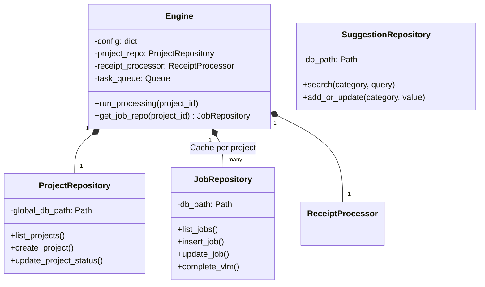
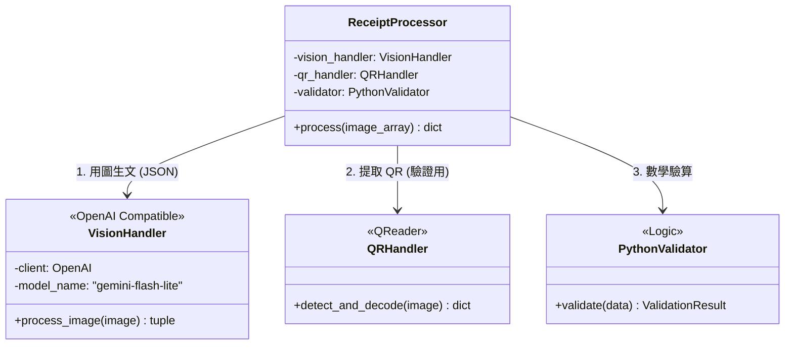
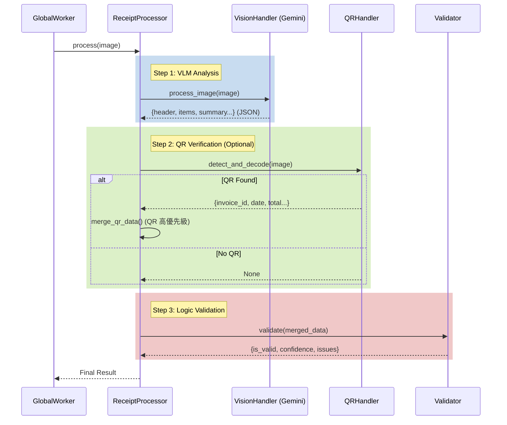
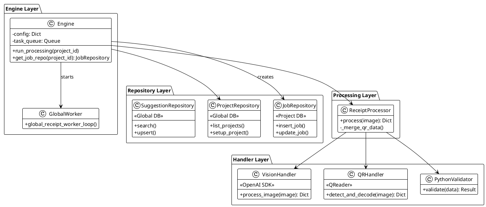

# 後端架構圖 (Backend Architecture) - VLM V2

> **狀態**: 已實作 (Implemented)
> **日期**: 2026-02-17
> **核心策略**: VLM-First (Vision Language Model 優先)，移除傳統 OCR 依賴。

---

## 1. 系統分層架構 (System Layering)

本系統採用四層架構，強調**關注點分離 (Separation of Concerns)** 與 **依賴注入 (Dependency Injection)**。

```mermaid
classDiagram
    direction TB
    
    class API_Layer {
        <<FastAPI Routers>>
        +projects.py (專案管理)
        +jobs.py (任務查詢)
        +config.py (系統設定)
        +suggestions.py (建議詞)
    }
    
    class Engine_Layer {
        <<Core Coordination>>
        +Engine (Singleton Facade)
        +GlobalWorker (背景任務)
        +FileOps (檔案操作)
        +ExportHandler (匯出邏輯)
    }
    
    class Repository_Layer {
        <<Data Access>>
        +ProjectRepository (Global DB)
        +JobRepository (Per-Project DB)
        +SuggestionRepository (Autocomplete)
    }
    
    class Processing_Layer {
        <<Business Logic>>
        +ReceiptProcessor (Main Pipeline)
    }
    
    class Handler_Layer {
        <<External Integration>>
        +VisionHandler (OpenAI/Gemini)
        +QRHandler (QReader/Local)
        +PythonValidator (Pure Logic)
    }
    
    API_Layer --> Engine_Layer : 1. 調用核心功能
    Engine_Layer --> Repository_Layer : 2. 存取資料
    Engine_Layer --> Processing_Layer : 3. 執行識別任務
    Processing_Layer --> Handler_Layer : 4. 調用底層能力
    
    note right of Engine_Layer
        Engine 負責協調 Workers 與 Repositories，
        不再包含業務邏輯。
    end note
```

---

## 2. 核心類別設計 (Core Class Design)

### Engine 與 Repository
`Engine` 作為系統的入口點，管理所有 Repositories 的生命週期。



### Processing Pipeline (VLM-First)
不再使用 RapidOCR 作為主要流程，而是作為 fallback 或被移除。目前流程完全依賴 VLM。



---

## 3. 資料流流程 (Data Flow)

**VLM-First Pipeline**:



---

## 4. PlantUML 原始碼 (Source)


