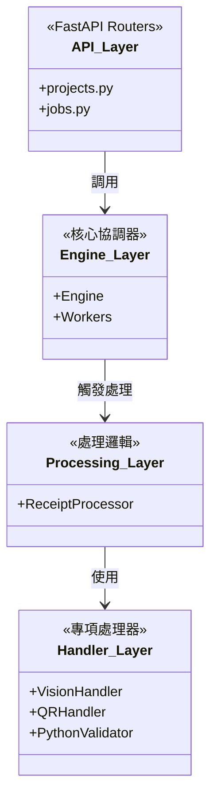
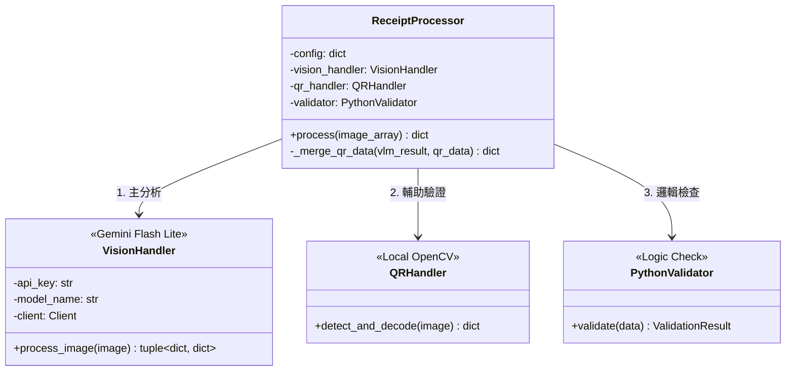
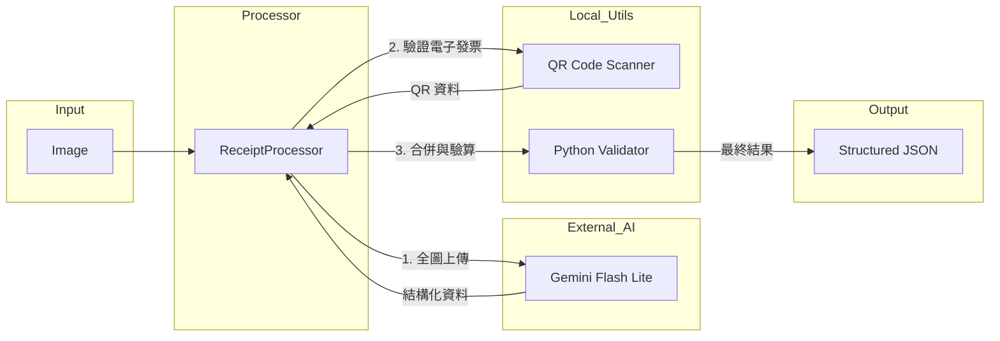
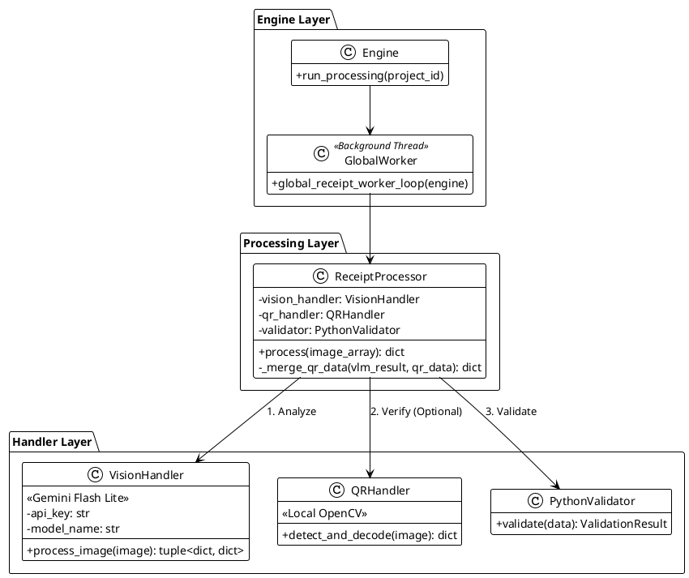

# 後端類別圖 (Backend Class Diagram) - VLM First Architecture

> **狀態**: 規劃中 (Simplified)
> **最後更新**: 2026-02-07
> **目標**: 極端簡化架構，移除本地 OCR 與分流邏輯，全面採用 VLM (Gemini Flash Lite)。

---

## 1. 系統分層架構 (Simplified)



---

## 2. Processing 模組 (核心處理)



---

## 3. 資料流方向 (Data Flow)



---

## 4. 介面契約 (Key Interfaces)

### ReceiptProcessor.process()
```python
def process(self, image_array: np.ndarray) -> dict:
    """
    單一入口，處理所有類型收據。
    
    不需指定模式，不需 OCR 前處理。
    直接將圖片送入 VLM，並嘗試掃描 QR Code 進行輔助驗證。
    
    Returns:
        {
            "success": bool,
            "result": {
                "header": {...},
                "items": [...],
                "summary": {...}
            },
            "metadata": {
                "vlm_model": "gemini-flash-lite",
                "qr_detected": bool,
                "confidence": float
            }
        }
    """
```

---

## 5. PlantUML Source


