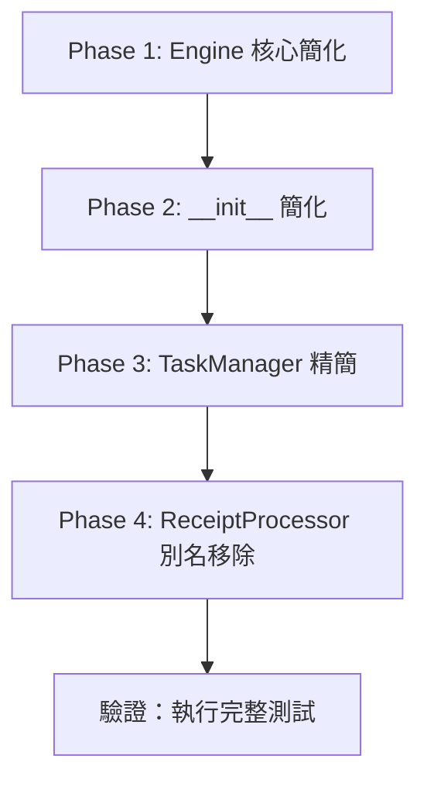

# 後端格式現代化計畫

## 目標

移除所有舊版相容程式碼，統一使用新版架構，降低維護成本。

---

## 現狀分析

### 發現的舊版相容程式碼 (共 27 處)

| 模組 | 檔案 | 問題描述 |
|------|------|----------|
| Engine | `engine/core.py` | 雙軌 Worker 系統：`use_unified_worker` 切換統一/舊版模式，維護 3 個 Queue |
| Engine | `engine/workers.py` | 舊版 `global_ocr_worker_loop` 與 `global_llm_worker_loop` (~160 行) |
| Engine | `engine/__init__.py` | `__getattr__` 動態代理 `engine` 屬性以支援舊版 import |
| Managers | `managers/task_manager.py` | Façade 模式包裝 JobRepository + StateMachine，保留舊 API |
| Processing | `processing/receipt_processor.py` | 類別別名 `ReceiptProcessor = ReceiptProcessorV2` |
| Export | `engine/export.py` | Façade 模式整合 Excel/Archive/Regeneration handlers |

### 舊版 vs 新版架構對照

```
舊版 (Legacy)                         新版 (Unified)
─────────────────────────────────────────────────────────────
Engine.ocr_queue                      Engine.task_queue
Engine.llm_queue                      ↑ (合併)
global_ocr_worker_loop                global_receipt_worker_loop
global_llm_worker_loop                ↑ (合併)
use_unified_worker=False              use_unified_worker=True (強制)
```

---

## 重構計畫

### Phase 1: Engine 核心簡化

**目標：** 移除 `use_unified_worker` 切換邏輯，強制使用統一 Worker

| 檔案 | 變更 |
|------|------|
| [core.py](file:///c:/Users/tange/Desktop/all_project/py%20for%20NKNU%20GA/AI_AGENT_LAB/backend/engine/core.py) | 移除 `ocr_queue`、`llm_queue`；移除 `use_unified_worker` 參數與所有相關分支 |
| [workers.py](file:///c:/Users/tange/Desktop/all_project/py%20for%20NKNU%20GA/AI_AGENT_LAB/backend/engine/workers.py) | 刪除 `global_ocr_worker_loop` 與 `global_llm_worker_loop` |

**預估刪除行數：** ~200 行

**風險評估：** 中等 - 需確保 `run_ocr`、`run_llm` API 正確委派至 unified worker

---

### Phase 2: Engine __init__ 簡化

**目標：** 移除動態模組屬性代理

| 檔案 | 變更 |
|------|------|
| [__init__.py](file:///c:/Users/tange/Desktop/all_project/py%20for%20NKNU%20GA/AI_AGENT_LAB/backend/engine/__init__.py) | 刪除 `__getattr__` 函數 |

**預估刪除行數：** ~5 行

**風險評估：** 低 - 需確認無程式碼使用 `from backend.engine import engine` 語法

---

### Phase 3: TaskManager 精簡

**目標：** 評估是否需移除 Façade，或直接重新導出

| 檔案 | 變更 |
|------|------|
| [task_manager.py](file:///c:/Users/tange/Desktop/all_project/py%20for%20NKNU%20GA/AI_AGENT_LAB/backend/managers/task_manager.py) | 移除 "backward-compatible" 註解；評估是否合併至 JobStateMachine |

**預估刪除行數：** ~20 行（若保留 Façade 結構）

**風險評估：** 低 - Façade 模式本身無害，僅需移除誤導性註解

---

### Phase 4: ReceiptProcessor 類別別名移除

**目標：** 移除 `ReceiptProcessor` 別名，統一使用 `ReceiptProcessorV2`

| 檔案 | 變更 |
|------|------|
| [receipt_processor.py](file:///c:/Users/tange/Desktop/all_project/py%20for%20NKNU%20GA/AI_AGENT_LAB/backend/processing/receipt_processor.py) | 刪除第 648-649 行別名定義 |
| 所有 import 處 | 將 `ReceiptProcessor` 改為 `ReceiptProcessorV2` 或將類別名直接改為 `ReceiptProcessor` |

**建議方案：** 將 `ReceiptProcessorV2` 類別直接重命名為 `ReceiptProcessor`

**預估變更：** 2 行刪除 + 1 行類別名修改

**風險評估：** 低

---

### Phase 5: Export Façade 精簡 (可選)

**目標：** 評估 ExportHandler Façade 是否有存在必要

| 檔案 | 決策 |
|------|------|
| [export.py](file:///c:/Users/tange/Desktop/all_project/py%20for%20NKNU%20GA/AI_AGENT_LAB/backend/engine/export.py) | **建議保留** - Façade 提供簡潔 API，無維護負擔 |

---

## 執行順序



---

## 驗證計畫

### 自動化測試

```bash
conda run -n OCR_GA python -m pytest
```

### 手動驗證

1. 啟動後端服務，確認 Worker 正常運作
2. 上傳測試圖片，驗證 OCR → LLM 流程
3. 確認 WebSocket 事件正確推送

---

## 預估效益

| 指標 | 改善 |
|------|------|
| 刪除程式碼 | ~230 行 |
| 移除分支邏輯 | 15+ 處 if/else |
| 維護成本 | 降低 (單一執行路徑) |

---

## 附錄：舊版程式碼完整清單

<details>
<summary>點擊展開 grep 搜尋結果</summary>

```
engine/core.py:43       ocr_handler = None,  # 保留向後兼容
engine/core.py:44       llm_handler = None,  # 保留向後兼容
engine/core.py:73       # 向後兼容：保存 ocr_handler 和 llm_handler
engine/core.py:78       # 測試模式或舊版模式
engine/core.py:141      # 舊版分離 Worker
engine/core.py:184      # 舊版分離佇列
engine/core.py:217      # 向後兼容：使用舊版 run_ocr
engine/core.py:379      logger.warning("[Single OCR Only] 舊版模式不支援...")
engine/core.py:417      # 舊版模式使用獨立 llm_queue
engine/core.py:494      "mode": "legacy"

engine/workers.py:11    保留舊的 Worker 函數以支援向後兼容
engine/workers.py:165   # 舊版 Worker（保留以支援向後兼容）
engine/workers.py:170   [舊版] 全局 OCR Worker 主迴圈
engine/workers.py:252   [舊版] 全局 LLM Worker 主迴圈

engine/__init__.py:11   # 為向後兼容提供 engine 屬性

managers/task_manager.py:5   backward-compatible facade
managers/task_manager.py:21  backward-compatible interface
managers/task_manager.py:32  for backward compatibility
managers/task_manager.py:152 for backward compatibility

processing/receipt_processor.py:648  # 向後兼容的別名

engine/export.py:3      backward-compatible facade
engine/export.py:21     Maintains backward compatibility
```

</details>
