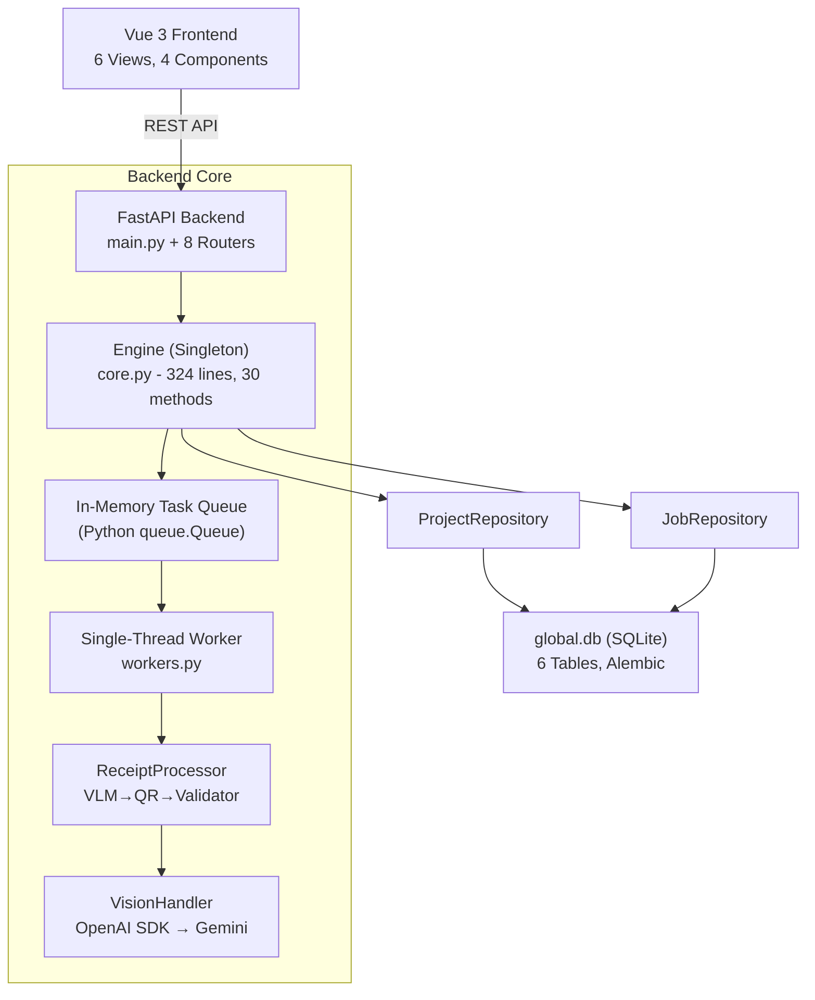
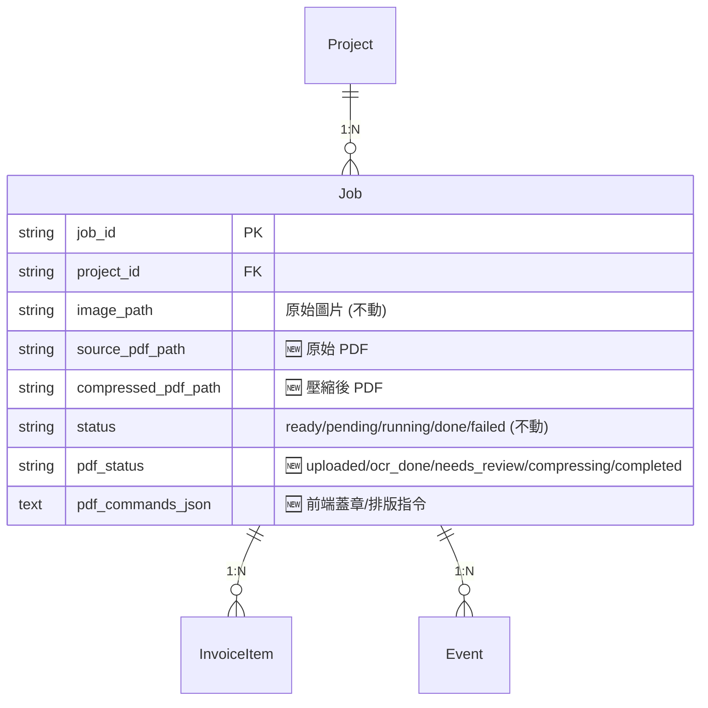

# 📋 自動化發票報帳與 PDF 處理系統：架構審核與實作計畫

> **審核日期**: 2026-03-01
> **審核範圍**: 後端 Engine / Routers / Database / Processing / Workers、前端 Views / Components、Docs、Config
> **審核方法**: 逐檔閱讀原始碼，交叉比對 `docs/` 文件與實際實作

---

## 一、核心哲學

本計畫遵循專案既有的 **"High Trust, Verify Later"** 哲學，並將其**演進**為：

> **"AI commands, Engine executes"**

| 角色 | 負責 | 技術 |
|:---|:---|:---|
| **AI 大腦** | 辨識文字 + 定位座標 (Bounding Boxes) → 產生結構化 JSON 指令 | Gemini VLM |
| **原生引擎雙手** | 在 PDF 物件樹層級直接執行指令 (頁面重排、蓋章、壓縮) | PyMuPDF (`fitz`) |
| **隱形智慧注入** | 將 OCR 結果以透明文字寫回 PDF，讓掃描檔可 `Ctrl+F` 搜尋 | PyMuPDF Text Layer |

---

## 二、現有架構全景 (As-Is)

| 面向 | 現狀 | 評估 |
|:---|:---|:---|
| **資料庫** | 單一 `global.db`，6 張表，Alembic | ✅ |
| **Engine** | Singleton + Task Queue + 狀態機 `ready→pending→running→done/failed` | ✅ |
| **Worker** | 單執行緒，`cv2.imdecode` 讀圖 → VLM 處理 | ⚠️ 僅處理圖片 |
| **VisionHandler** | OpenAI SDK → Gemini，已有 `process_image()` | ✅ |
| **前端** | 6 Views, 4 Components, 無 PDF 相關 | ⚠️ |
| **依賴** | 無 PyMuPDF、pdf.js、fabric.js | ⚠️ |

---

## 三、Gap Analysis (計畫假設 vs 實際)

### ✅ 驗證通過

- `Project` → 活動。`meta_data` (JSON) 已存 `budgetIncome/budgetExpense`
- `Job` → 發票任務。狀態機 + VLM 結果欄位完備
- Gemini VLM 已封裝為 OpenAI SDK，`config.json` 已指向 `gemini-2.5-flash-lite`
- Alembic 遷移系統完善，`alembic/env.py` 動態讀取 DB 路徑

### ⚠️ 7 項關鍵差異

| # | 假設 | 實際 | 解法 |
|:--|:---|:---|:---|
| G1 | 使用 PyMuPDF | **未安裝** | `requirements.txt` 新增 `PyMuPDF>=1.24.0` |
| G2 | Worker 可處理 PDF | Worker 僅接受圖片 (`cv2`) | 建立獨立 PDF Worker Thread |
| G3 | 前端有 PDF 預覽 | 無 pdf.js / fabric.js | npm 新增 `pdfjs-dist`, `fabric` |
| G4 | `image_path` 存 PDF | `cv2.imread(image_path)` 會崩 | **新增欄位** `source_pdf_path` |
| G5 | 蓋章座標有欄位 | 無專用儲存 | **新增欄位** `pdf_commands_json` |
| G6 | Kanban 狀態完整 | 現有 5 狀態為圖片設計 | **新增欄位** `pdf_status` |
| G7 | `doc.select()` 可用 | PyMuPDF v1.24+ API 有變動 | 實作時驗證版本相容性 |

---

## 四、風險評估

### 🔴 高風險

1. **Worker 阻塞死結**
   - 現有 Worker 是單執行緒 `while` 迴圈。PDF 壓縮 (CPU-bound, 數十秒) 會卡死 VLM 佇列。
   - **解法**: 獨立 `pdf_task_queue` + `pdf_worker_loop` Thread。

2. **OpenCV 地雷**
   - `file_ops.py` 大量使用 `cv2.imread_chinese()`。PDF 進入此路徑 → crash。
   - **解法**: 上傳時依副檔名分流。`.pdf` 走 `engine.add_pdf_files()`，繞過 cv2。

### 🟡 中風險

3. **狀態機汙染** — 新增 `pdf_status` 獨立欄位，不動現有 `status`。
4. **座標飄移** — 前端 Canvas px ≠ PDF points。需實作 Affine Transform。
   - 公式: `PDF_Coord = Canvas_Coord / (viewport.scale * devicePixelRatio)`

### 🟢 低風險

5. PyMuPDF 安裝 — 純 Python wheel，`pip install` 即可。
6. Alembic 新增欄位 — 已有成熟流程。

---

## 五、資料庫擴充 (新增欄位)

**核心原則**: 所有新功能都是**加法操作**。絕不修改現有 `image_path`, `status`, Worker 核心邏輯。

---

## 六、分階段執行藍圖

### Phase 1: 地基強化 (1-2 天)

| 動作 | 檔案 |
|:---|:---|
| `requirements.txt` 加入 `PyMuPDF>=1.24.0` | `requirements.txt` |
| `Job` 模型新增 3 欄位 | `backend/database/models.py` |
| 產生並執行 Alembic migration | `alembic/versions/` |
| 更新 DB 文件 | `docs/database.md` |

### Phase 2: PDF 引擎核心 (2-3 天)

| 動作 | 檔案 |
|:---|:---|
| 純函式模組: `reorder_pages()`, `stamp_image()`, `compress()`, `inject_text_layer()` | `backend/processing/pdf_engine.py` **[NEW]** |
| 獨立 Unit Tests | `tests/test_pdf_engine.py` **[NEW]** |

### Phase 3: API 與 Worker 整合 (2-3 天)

| 動作 | 檔案 |
|:---|:---|
| 獨立 PDF Worker Thread | `backend/engine/pdf_worker.py` **[NEW]** |
| Engine 新增 `enqueue_pdf_job()` 等方法 | `backend/engine/core.py` |
| PDF API 路由 (上傳/指令/壓縮/下載) | `backend/routers/pdf.py` **[NEW]** |
| 整合測試 | `tests/test_routers_pdf.py` **[NEW]** |

### Phase 4: 前端雙軌制 UI (5-7 天)

| 動作 | 檔案 |
|:---|:---|
| `npm install pdfjs-dist fabric` | `frontend/package.json` |
| PDF 工作台 (縮圖膠捲 + Fabric.js 畫布 + 校對面板) | `frontend/src/components/PdfWorkbench.vue` **[NEW]** |
| PDF 編輯頁面 | `frontend/src/views/PdfEditorView.vue` **[NEW]** |
| Kanban 看板 (依 `pdf_status` 分群) | `frontend/src/views/KanbanView.vue` **[NEW]** |
| 路由新增 `/project/:id/pdf-editor`, `/kanban` | `frontend/src/router/index.js` |

---

## 七、驗證計畫 (Verification Plan)

### 自動化測試
- `pytest tests/test_pdf_engine.py` — 驗證 PyMuPDF 純函式 (頁面數、壓縮率、印章座標)
- `pytest tests/test_routers_pdf.py` — 驗證 API 狀態碼與回應格式
- 現有測試套件不應受影響 (`pytest tests/` 全數通過)

### 手動驗證
- Swagger UI (`/docs`) 上傳真實掃描 PDF → 觸發 VLM → 確認回傳 JSON 座標
- 前端 PDF 工作台操作蓋章 → 下載壓縮後 PDF → 用 Adobe Reader 驗證印章位置與 `Ctrl+F` 搜尋

### 回歸保護
- Phase 1 完成後立即執行 `pytest tests/` 確認零破壞
- 每個 Phase 結束前都必須通過完整測試套件
