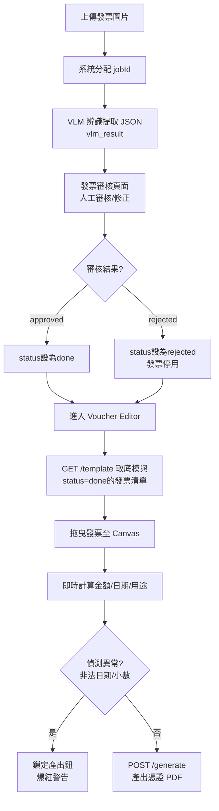

# 憑證黏貼編輯器 — 究極計畫 v26 (最完善綜合版)

## 目標

將「憑證黏貼」從發票流程**完全解耦**，建立獨立編輯頁面。本計畫整合 v21-v25 的所有防禦機制、架構規格、深層 UX/Edge-case 釐清，並修正所有邏輯歧義，確保 **100% 無須二度確認的完整實作規格書**。

---

## 0. 詞彙表與狀態定義 (Glossary & Status)

### 核心名詞
- **發票 (Invoice/Receipt)**：使用者上傳的各種消費單據原稿圖片。
- **底模 (Template)**：空白的系統表單（`憑證黏貼用紙.pdf`，595×842 pts A4 尺寸）。
- **憑證 (Voucher)**：將多張發票黏貼於底模之上，並填妥各項申報欄位後產出的最終 PDF 檔案。
- **頁面 (Page)**：一張憑證可能由多個物理分頁組成（例如 10 張發票需要 3 頁底模才能貼完）。
- **Job ID (jobId)**：後台發票識別碼，由系統在 VLM 辨識階段分配，格式為 UUID 或遞增整數，唯一對應一張發票圖片，關聯至 `project_id`。

### 發票狀態機 (Invoice Status Lifecycle)
```
pending         發票已上傳，等待 VLM 辨識
    ↓
vlm_processed   VLM 解析完成，等待人工審核
    ↓
done            人工審核通過，可用於憑證編輯
    ↓ (若人工判斷有誤)
rejected        人工判定為廢單，不可用

✓ 只有 status='done' 的發票才出現在 Voucher Editor 的清單中
```

---

## 1. 資料流程圖 (Data Flow)



---

## 2. API 端點清單 (API Specifications)

### 端點定義與錯誤響應

| Method | Path | 輸入 | 輸出 | 說明 |
|:---|:---|:---|:---|:---|
| `GET` | `/api/voucher/{project_id}/template` | `project_id` pathParam | `VoucherTemplateResponse` | 取得底模 PNG(base64)、專案元數據、status='done'發票清單 |
| `GET` | `/api/voucher/image/{job_id}` | `job_id` pathParam<br/>`thumb=true?` queryParam | 圖片二進制<br/>(webp或jpeg) | 發票圖片代理。後端驗證 jobId 屬於當前 user 的 project，否則 403。`thumb=true` 返 800px 縮圖 |
| `GET` | `/api/voucher/{project_id}/layout` | `project_id` pathParam | `VoucherLayoutPayload` | 讀取草稿 Layout。不存在時返空物件 |
| `POST` | `/api/voucher/{project_id}/layout` | `project_id` pathParam<br/>Body: `VoucherLayoutPayload` | `{ status: "success", savedAt: timestamp }` | 儲存/更新草稿 Layout。先寫 .tmp 再原子替換 |
| `POST` | `/api/voucher/{project_id}/generate` | `project_id` pathParam<br/>Body: `VoucherLayoutPayload` | `{ pdfUrl: str, filename: str }` | 啟動後端 PyMuPDF 產出最終 PDF。**【漏洞4修正】後端必須雙重檢查 Payload 內每個 jobId 屬於當前 project_id，否則 403**。失敗返 403 / 422 / 500 |

### Response Schema

```typescript
// VoucherTemplateResponse
{
  templatePng: string;        // base64 encoded PNG
  projectMeta: {
    id: string;
    name: string;
    createdAt: string;        // ISO 8601
  };
  invoices: Array<{
    jobId: string;            // UUID or incremental int
    imageUrl: string;         // /api/voucher/image/{jobId}
    status: "done" | "pending" | "rejected";
    vlmResult: {              // VLM 辨識結果
      amount: string;         // "4607" (純數字字串)
      date: string;           // "2024-11-28" (ISO格式)
      items: Array<{
        category: string;     // "餐費", "茶水" etc.
        amount: string;
      }>;
    };
    manualResult?: {          // 人工修正結果（若存在則優先）
      amount: string;
      date: string;
      items: Array<{
        category: string;
        amount: string;
      }>;
    };
  }>;
}

// VoucherLayoutPayload
{
  globalPrefix: string;       // "D-16"
  startIndex: number;         // 1
  pages: Array<{
    pageIndex: number;        // 0-based
    fields: {
      voucherNo: string;      // "D-16-01~03" or "D-16-04"
      budgetItem: string;     // "帶動組"
      amount: string;         // "4607" (純數字字串)
      purpose: string;        // "餐費、茶水"
      receiptCount: string;   // "3"
      payDate: string;        // "2024-11-28" (ISO)
      isManuallyEdited: boolean; // 用途欄是否手動修改
    };
    images: Array<{
      jobId: string;
      x: number;              // Canvas 座標 (pts)
      y: number;
      w: number;
      h: number;
    }>;
  }>;
}
```

---

## 3. Canvas 座標系對照表 (Coordinate Map)

> 基於 `憑證黏貼用紙.pdf` (595×842 pts，即 210×297 mm A4 尺寸)

```
(0,0)   ┌─────────────────────────────┐ (595,0)
        │    【 憑證黏貼用紙 頂部 】   │
        │   科目/預算別/簽核人...等   │
        │ ┌───────────────────────┐ │ (71,185)
        │ │  ┌─ 表頭區域 NO-GO   ├─┼─ 禁區上邊界
        │ │  │ (科目、用途欄...)  │ │
        │ │  └─────────────────── │ │ (524,320)
        │ └───────────────────────┘ │ 禁區下邊界
        │                           │
        │  [簽章列1]                 │ (112,340) → (491,394)
        │  (授權簽名區域，勿遮擋)    │
        │                           │
        ├───────────────────────────┤ (30,394) ← 可黏貼區上邊界
        │                           │
        │  ✅ 可黏貼安全區 SAFE ZONE │
        │  【 535 pts × 336 pts 】   │
        │  發票黏貼於此處間           │
        │                           │
        ├───────────────────────────┤ (565,730) ← 可黏貼區下邊界
        │                           │
        │  [簽章列2]                 │ (89,730) → (507,804)
        │  (會計/核准簽名)           │
        │                           │
(0,842) └─────────────────────────────┘ (595,842)
```

### 禁區清單 (DO-NOT-PASTE Zones)
| 區域 | 矩形 Points | 規則 | 寬度 × 高度 |
|:---|:---|:---|:---|
| 表頭 | (71, 185) → (524, 320) | ❌ NO-GO | 453 × 135 pts |
| 簽章列1 | (112, 340) → (491, 394) | ❌ NO-GO | 379 × 54 pts |
| 簽章列2 | (89, 730) → (507, 804) | ❌ NO-GO | 418 × 74 pts |
| **可黏貼區** | **(30, 394) → (565, 730)** | ✅ **SAFE** | **535 × 336 pts** |

---

## 🔥 核心 45 項極限防禦全清單 (The 45 Defenses)

### A. 實體座標與物理限制 (Physical Constraints) - 8 項
1. **虛擬座標鎖定**：Canvas 初始化鎖死為 `595×842`，保證與 A4 PDF 比例絕對 1:1。任何視口大小變化均透過 viewport transform 調整，不改動虛擬座標系。

2. **`setZoom` 防錯位**：捨棄 CSS Transform，改用 Fabric.js 內建 `canvas.setZoom(zoomLevel)` 縮放，防滑鼠事件點位偏移。預設初始 Fit-to-Viewport，允許滑鼠滾輪縮放（0.5x ~ 2.0x 限制），響應 `mouse:wheel` 事件動態計算 zoomLevel。

3. **動態 Page Rect**：後端 PyMuPDF 於產出前動態讀取底模 `page.rect` 後再進行任何操作，防止未來底版尺寸微調時產生座標錯位。

4. **鎖死旋轉 (WYSIWYG Guarantee)**：強制所有發票物件 `lockRotation=true`，防範 PyMuPDF `insert_image(*rect)` 不支援旋轉矩陣导致拉伸變形。(後端不做旋轉，純貼圖)

5. **絕對座標反向推導**：送出 JSON 前使用 `canvas.viewportTransform` 反算，消除畫布 Panning（平移）偏差，確保傳送給後端的 `(x,y,w,h)` 是相對於虛擬 595×842 座標系的真實座標。計算方式：`inverseTransform = fabric.util.invertTransform(viewportTransform); [absX,absY] = fabric.util.transformPoint(screenX,screenY, inverseTransform)`。

6. **Retina 防模糊**：Canvas 初始化時強制套用 `devicePixelRatio`（MacBook 可能 2x），確保物理像素與虛擬座標正確映射，修正高解析螢幕的鋸齒問題。

7. **浮點數淨化縮編**：傳送至後端前強制 `Math.round(num*100)/100`，確保座標精度到小數點後兩位，避免 JS 無盡小數點精度遺失與 Payload 肥大。

8. **實體邊界牆 (Containment)**：監聽 `object:moving` 與 `object:scaling`，發票邊緣若突破 535×336 安全區邊界，強行覆寫座標「彈回安全區」。實現方式：檢查 `boundingRect` 是否超出安全框 (30,394,565,730)，若超出則取 `Math.max(x, 30)` 等邊界值。

### B. 會計嚴格防呆 (Strict Accounting & Source Integrity) - 7 項

9. **發票防重複請款 (Disabled State)**：拖入發票至 Canvas 後，右側清單該項目立刻反灰 (Disabled)，禁用進一步拖曳/複製。從畫布刪除該發票時（Delete 或 自動移除），則重新恢復清單該項目可選色 (Enabled)，允許再次拖曳。實現方式：前端 Vue state `invoiceUsageMap` 追蹤每個 jobId 的使用狀態。

10. **非法日期零妥協**：偵測到 `""`, `None`, `undefined`, `"invalid"` 等非法日期，**絕對不自動填補為今日或其他預設值**。計算最晚日期時，逐張逐個判斷，忽略非法項目只保留有效日期；若當頁全為非法日期，則 `payDate` 留空並爆紅。

11. **源頭修正鎖死閥 (Date UX)**：若有非法日期，當頁「支付日期」欄位字體爆紅、背景變淡紅色。右上角「產出 PDF」按鈕強制 Disabled（`disabled=true`），旁邊有一個 ⚠️ 標誌與提示文字：*「偵測到無效日期。請將異常發票從畫布移除，或退回發票審核頁面修正來源資料。」* 使用者只能選擇「刪除發票」或「返回審核頁」，無任何本地 override 機制。

12. **物理碰撞偵測 (Anti-Overlap)**：監聽 `object:moved` 與 `object:scaling`，計算所有物件的 BBox，若發現 `Rect.intersect()` 不為空，邊框線變為紅色警告（`stroke: '#FF0000'`，寬 3px）。旁邊提示：「發現重疊，可能遮擋金額與核章。」但**不會鎖定產出鈕**（保留使用者排版彈性）。

13. **台幣非整數報警 (Decimal UX)**：拖入或移除發票後重新計算該頁總金額，若發現小數（例如 `4607.50`），金額框背景變黃 🟡、文字變橙色。右上角「產出 PDF」按鈕強制 Disabled，旁邊提示：*「依法規台幣不可有角分。請退回發票審核頁面修正來源資料為整數。」* 流程同非法日期。

14. **前端加總保護**：完全移除 `Math.ceil()` 或任何自動四捨五入的短線修正，回歸「源頭錯誤源頭修」精神。若後端檢驗發現金額異常，同樣拋出合理的 422 錯誤，前端捕獲並提示使用者。

15. **金額極限防爆**：前端與後端皆透過**數值判斷** `int(amount) > 9999999` 攔截大於七位數（999 萬 9999）的金額。特別注意：使用 `len(str(amount)) > 7` 是**錯誤的**（因為 "4607" 長度 4 永不觸發）。後端拋出 `ValueError` 若超限，HTTP 422 Unprocessable Entity。

### C. 文字排版與格式對齊 (Typography & Formatting) - 9 項

16. **七位數精準定位**：金額對應 `[佰萬][拾萬][萬][仟][佰][拾][元]` 的 7 格座標獨立 `insert_text`。例如 `146` → `※※※※1`, `4`, `6` 分別落在各格。後端須預先計算每一格的 X 座標（由底模中金額欄的左邊界 +20px 起，間隔約 15~20px）。

17. **台幣靠右對齊墊字**：數字傳給後端前執行 `str(amount).rjust(7, '※')` 補足前導符號。例如 `"146"` → `"※※※146"`，`"4607"` → `"※※4607"`。若為 7 位數則無墊字。此機制確保對位到最右邊的「元」格。

18. **ISO 轉民國曆 (Empty String Safe)**：後端接收 ISO 字串如 `"2024-11-28"`，**必須先檢查非空與非法值** (`if not payDate or payDate == "": return ""`)，後執行正則擷取 `YYYY` 後執行算術 `year - 1911` 轉換為民國紀年，拼接成 `"113/11/28"` 後寫入表單。（2024 - 1911 = 113）。【漏洞5修正：防止空字串正則崩潰】

19. **用途說明自動換行 (Auto-wrap)**：設定 PyMuPDF `insert_textbox(rect=(x, y, w, h), text=purpose, fontsize=14, font=kaiu_ttf, wrap=True)`，自動在單行寬度 197 pts 時折行換列。

20. **用途說明自動縮字 (Auto-shrink)**：若 `insert_textbox` 後發現換行超過 80 pts 高度極限，啟動字體漸減迴圈 (14pt → 13pt → 12pt...)，直到文字塞進 80pt 高度，或縮至 10pt 為最小值。

21. **用途欄位爆框黃燈**：前端即時偵測輸入文字，若預估長度超出安全範圍（例如超過 40 字），輸入框背景變淡黃色，並顯示提示「字體可能過小，建議精簡」，但不禁用輸入。

22. **跨平台字型綁定**：讀取專案內建 `backend/assets/fonts/kaiu.ttf`（微軟標楷體），**捨棄任何 Windows 絕對路徑**（如 `C:\Windows\Fonts\...`），防止 Linux/macOS 路徑死機。後端初始化時檢查檔案存在，若不存在拋出明確的錯誤訊息。

23. **前端 WebFont 同步**：前端 `@font-face` 載入同一個 `backend/assets/fonts/kaiu.ttf`（可通過 `/api/assets/fonts/kaiu.ttf` 端點提供），給 Fabric.js 的 `fabric.Text` 使用。字元寬度度量完全一致（均依計機 14pt 標楷體為基準，1 字 = ~8.5px），落實真・WYSIWYG。

24. **Emoji 與罕見字過濾 (Glyph Crash)**：後端寫字前用 Regex 強行移除非 ASCII 與非 CJK (U+4E00~U+9FFF) 的特殊字元（包括 Emoji 🍱 🚀 等）。使用 `re.sub(r'[^\u4E00-\u9FFF\u3400-\u4DBF\u3040-\u309F\u30A0-\u30FF\w]', '', text)` 淨化。

### D. 欄位自動化與資料來源 (Data Pipeline) - 7 項

25. **Per-page 獨立域運算**：所有欄位（金額/用途/張數）皆依照「該頁面上目前放置的 images 陣列」獨立重新計算，不混用其他頁資料。前端於 `pageIndex` 變化或 `images[]` 異動時，重新觸發計算函式 `recalculateFields(pageIndex)`。

26. **人工修正優先權 (Manual Priority)**：讀取資料時採用 `manualResult ?? vlmResult` 的邏輯，即人工審核頁面的修正結果若存在，則**完全優先於** VLM 原始提取結果。此優先度貫穿金額、日期、用途的所有提取。

27. **用途說明去重拼接**：只要拖入或移除發票（觸發計算），便提取當頁**所有** `invoices` 的 `items[].category` 欄位，執行 `Set<string>` 去重，然後以「、」字元合併為預設用途字串。若使用者手動覆寫，設立 `isManuallyEdited=true` 標記，再次拖入時彈窗：「發現新發票，是否用系統推薦字串『...』覆蓋您手動編輯的用途？」使用者選擇「覆蓋」則清除標記，選擇「保留」則不影響當前文字。

28. **最晚日期選取器**：遍歷該頁所有 invoices 的 `date` 欄位，濾除非法日期，對剩餘的執行 `Math.max(...dates)`，取出最晚的日期日 (latest JS Date object)，寫入 `payDate` 欄位。若全為非法，`payDate` 留空並爆紅。

29. **全域憑證號配置器**：頂端設計一個輸入區：`[前綴文字] [起始號]`，例如「D-16」與「1」。任何變更都即時觸發全頁面的 `voucherNo` 聯動重算。

30. **自動串號演算法 (Ghost Pagination Fix)**：遍歷所有 `pages[]` 時，**必須先進行 filter 濾除空頁**（`page.images.length === 0`），再以 `receiptCount` (該頁張數) 逐累加序號。例如：
    - Page 0: receiptCount=3 → `D-16-01~03`
    - Page 1 (空頁): 遺漏
    - Page 2: receiptCount=2 → `D-16-04~05` (而非 D-16-06)
    - Page 3: receiptCount=1 → `D-16-06`
    此演算法於每次編輯 Prefix、StartIndex、receiptCount 或 images 時即時(Reactive)觸發。防止幽靈憑證號碼配發到已刪空的頁面。

31. **發票清單篩選邊界**：後端 `/template` API 的 `invoices` 陣列，**僅包含**當前 Project 內且 `status='done'` 的發票。若清單為空，前端顯示 Empty State 視圖：「此專案尚無可用發票，請先完成發票審核。」並禁用整個 Canvas 區域與所有產出功能。

### E. 伺服器安全與穩定 (OS & Stability) - 9 項

32. **路徑穿越防禦 (Path Traversal)**：儲存檔案時對傳入的 `project_id` 執行 Sanitization，移除/替換 `/`, `\`, `..` 等危險字元，防 `../../../etc/passwd` 攻擊。底模位置：`backend/assets/憑證黏貼用紙.pdf`（全局共用）；Layout 位置：`backend/data/projects/{sanitized_project_id}/voucher_layout.json`。

33. **排版 JSON 原子寫入 (Atomic Write)**：儲存 Layout 時先寫至臨時檔 `.tmp`，驗證 JSON 格式無誤後再執行 `os.replace(tmp_path, final_path)`，防範高並發連續存檔造成的檔案截斷/Corrupted JSON。程式碼模式：
    ```python
    with open(tmp_path, 'w', encoding='utf-8') as f:
        json.dump(payload, f)
    # 驗證可讀性
    with open(tmp_path, 'r') as f:
        json.load(f)
    os.replace(tmp_path, final_path)  # 原子替換
    ```

34. **圖片跨專案白名單代理**：`/api/voucher/image/{job_id}` 端點除了還原 Job 的實體檔案路徑，更會查詢資料庫確認該 jobId **屬於當前操作使用者的 project_id**。若不符則回傳 `403 Forbidden`，防止低端駭客直接枚舉其他使用者的圖片。

35. **後端孤兒發票時序防護**：產 PDF 的迴圈內增加 `if not os.path.exists(image_path): continue`，防止最後 0.5 秒發票圖檔在其他流程被刪除，導致 `FileNotFoundError` 500 崩潰。此時後端應記錄 warning log 並繼續產出其他部分。

36. **API 回應錯誤遮罩設計**：所有 API 端點均實裝 try-catch，攔截預期外的例外，回傳：
    ```json
    {
      "error": "internal_error",
      "message": "系統暫時無法處理，請稍後重試",
      "timestamp": "ISO8601"
    }
    ```
    不洩露具體的 stack trace 或敏感資訊給前端。詳細日誌僅記錄於後端。

37. **空字串例外攔截**：防 PyMuPDF 對空字串計算字寬時的底層報錯，所有文字寫入前加入前置檢查 `if not text.strip(): return`，直接跳過。

38. **with 上下文資源回收**：PyMuPDF `fitz.open()` 強制使用 Context Manager 包裝：
    ```python
    with fitz.open(template_path) as doc:
        # ...操作
    # 自動 close，釋放 C++ 指標
    ```
    防止 Memory Leak 與檔案句柄洩漏。

39. **底模 PNG 快取 (@lru_cache)**：後端對底模 PDF 解析做快取（緩存生成的 PNG base64），並將實體檔案修改時間 `os.path.getmtime(template_path)` 当作 Cache Key 的一部分，確保拖曳畫布的 100 毫秒極速反應，且檔案遭替換時快取自動失效重繪。實現方式：
    ```python
    @functools.lru_cache(maxsize=10)
    def render_template_png(template_path, mtime):
        # 用 mtime 作 key 的一部分
        return base64_encoded_png
    
    # 呼叫時
    mtime = os.path.getmtime(template_path)
    png = render_template_png(template_path, mtime)
    ```

### F. 效能與輸出品質 (Performance & IO) - 6 項

40. **前端縮圖代理 (Anti-OOM)**：`/api/voucher/image/{job_id}?thumb=true` 只回傳 800px 寬度的縮圖給 Canvas（格式為 webp 或 jpeg），防止拖入 10 張 4000px 超大原始圖檔吃爆瀏覽器記憶體。後端響應時寫 `Content-Type: image/webp` 與快取頭。

41. **上傳全局格式轉檔 (預留)**：(可選未來增強) 發票上傳階段直接轉為 WebP 或 JPEG，斷絕大小寫副檔名（.JPG vs .jpg）404 問題，並達成原生壓縮省空間。

42. **後端高畫質還原**：PDF 產出時，*不*取用縮圖，直接調用**高畫質原圖**貼上。後端 `/api/voucher/image/{job_id}?thumb=false` 或無 thumb 參數時返原圖。

43. **PDF 300DPI 尺寸壓縮 (Anti-Upscaling Bloat)**：插入圖片前，依據在 Canvas 上的佔用座標 `(w_pts, h_pts)` 進行縮放計算。計算公式：
    ```
    target_px_width = (w_pts / 72) * 300
    target_px_height = (h_pts / 72) * 300
    # 【漏洞2修正】嚴禁反向膨脹
    final_width = min(target_px_width, original_image_width)
    final_height = min(target_px_height, original_image_height)
    ```
    （Note: 1 point = 1/72 inch，300 DPI = 300 pixels/inch）
    Pillow 只允許**縮小壓縮**，絕對禁止將 400px 原圖強制放大到 1666px。用 Pillow 將圖縮至 Target 解析度後再交給 PyMuPDF 寫入，防止 PDF 膨脹到 50 MB 被行政系統退件。

44. **無損 PDF 發布壓縮**：PyMuPDF 儲存時加上參數 `doc.save(new_pdf_path, deflate=True, garbage=4)` 做最極致的文件瘦身（啟用流壓縮、四級垃圾回收）。

45. **二分搜尋 O(N log H) 自動排版**：使用者點擊「自動排版」按鈕時觸發（**非拖放時自動觸發**）。演算法目標：在 535×336 安全區內，以「由左至右、滿了換行」規則，找出能容納所有發票的最大統一高度 H。
    - N = 畫面上的發票數量
    - H = 搜尋的統一高度變數
    - 執行二分搜尋，測試不同 H 值能否容納所有發票
    - `Max_width ≤ 535` 限制：即使高度算好，超長明細的寬度也不會穿出安全區
    - `Iter_max = 20` 限制：避免浮點數死迴圈，通常 10 次迭代即收斂
    
    改變排版演算法邏輯：新座標 `(x_new, y_new, h_uniform)` 應涵蓋所有發票且 `h_uniform * row_count + margins ≤ 336`。

---

## 🎯 補強附錄 A: 使用者操作情境表 (UX Interaction Scenarios)

| # | 情境 | 系統行為 | 異常處理 |
|:---|:---|:---|:---|
| **1** | **拖入發票從清單至畫布** | 發票放置於滑鼠放下點 (Drop Position)。清單上該項目立刻反灰 (Disabled)，禁用進一步拖曳。左側面板重新計算該頁總金額、最晚日期與用途拼接。 | 若超出 535×336 邊界，座標自動「彈回」安全區內。 |
| **2** | **從畫布刪除發票 (Delete/右鍵移除)** | 從畫布移除物件。右側發票清單該項目恢復可選色 (Enabled)。重新計算該頁總金額、最晚日期與用途拼接。 | - |
| **3** | **切換憑證頁面 (Tab)** | 儲存當前頁 Canvas State (存入前端記憶體 state)。呼叫 `canvas.clear()`。從陣列抽出目標頁資料，重新載入目標頁 images 與文字至畫布。**【漏洞3修正】每個圖片的 `` 標籤加 `onerror` 事件處理，若 404/403 則渲染失效佔位方塊 (Placeholder)。** 重算側邊欄欄位。 | - |
| **4** | **偵測到非法/無效日期** | 當前頁「支付日期」欄位字體爆紅、背景變淡紅色 (#FFE4E1)。右上角「產出 PDF」按鈕強制 Disabled。旁邊 ⚠️ 圖標與提示：「偵測到無效日期。請移除異常發票或退回審核頁修正。」 | 使用者無任何本地 override 機制。 |
| **5** | **偵測到小數點金額** | 「總金額」欄位背景變黃 🟡、文字變橙色。產出鈕 Disabled。提示：「台幣不可有角分。請退回審核修正。」 | 同非法日期，無本地修正。 |
| **6** | **發票在畫布上重疊** | 衝突的發票邊框線變紅色 (stroke: '#FF0000', width: 3px)。旁邊文字提示「發現重疊，可能遮擋金額。」但**不鎖定**產出鈕。 | 允許使用者刻意推疊（例如有意裁切遮擋）。 |
| **7** | **背景草稿自動儲存 (Auto-Save)** | 頁面開啟後，每 30 秒或跨頁面切換時，自動背景觸發 `POST /layout` 儲存草稿。前端 debounce 多次編輯為單次請求。右下角 Toast 訊息：「草稿已儲存」(3 秒後消失)。 | 若儲存失敗，記錄错误日誌且提示「草稿儲存失敗，請檢查網路」 (不中斷編輯)。 |
| **8** | **用途說明手動覆蓋** | 若使用者手動修改用途，`isManuallyEdited=true`。再次拖入新發票時，彈窗：「發現新發票，系統推薦『餐費、茶水』，覆蓋你的『午餐』嗎？」<br>選「覆蓋」→ 清除標記<br>選「保留」→ 保留用戶文字，標記保持 true | 若使用者一直選「保留」，後續不再彈窗。 |
| **9** | **自動串號的即時聯動計算** | Prefix / StartIndex / receiptCount 任一變化，前端 Reactive 計算所有頁面的 `voucherNo`。例如「D-16」→「D-17」時，所有頁的編號同步刷新 `D-17-01~03` ... （不需等待存檔）。 | - |
| **10** | **點擊「自動排版」按鈕** | 觸發第45項二分搜尋演算法，計算最佳統一高度 H，將畫布上所有發票自動整齊排列（由左至右、滿行換列）。完成後提示「排版完成」。 | 若發票過多或極寬，可能無解（交互缺口太大），此時不排版，提示「無法自動排版，請手動調整」。 |

---

## 🎯 補強附錄 B: 前後端資料處理分工表 (Data Processing Division)

### 字段級分工

| 欄位 | 前端 vue 狀態 | 前端傳送格式 | 後端接收處理 | 備註 |
|:---|:---|:---|:---|:---|
| **`amount`** | `fields.amount` | 純數字字串<br/>`"4607"` | 驗證 `int(amount) ≤ 9999999`（否則拋 422）<br/>執行 `rjust(7, '※')` → `"※※4607"`<br/>逐字轉 7 個座標 `insert_text` | ❌ 不用字串長度判斷 |
| **`payDate`** | `fields.payDate` | ISO 8601<br/>`"2024-11-28"` | 正則擷取 `YYYY` → 算術 `-1911`<br/>拼接 `"113/11/28"` | 若非法，留空並爆紅 |
| **`purpose`** | `fields.purpose` | 拼接後文字<br/>`"餐費、茶水"` | PyMuPDF Auto-wrap<br/>超限時 Auto-shrink (14→10pt)<br/>Emoji Filter | `isManuallyEdited` 旗標獨立追蹤 |
| **`receiptCount`** | 計算得出<br/>`images.length` | 純數字字串<br/>`"3"` | 直接列印 | 自動由影像數量決定 |
| **`voucherNo`** | 計算得出<br/>由 prefix/startIndex/receiptCount | 字串<br/>`"D-16-01~03"` | 直接列印，無驗證 | 前端即時(Reactive)計算 |
| **座標 `(x,y,w,h)`** | Fabric canvas object | 純數字浮點數<br/>e.g. `145.25` | 直接作為 `fitz.Rect` 參數<br/>或作為 300DPI 計算: `(w/72)*300` | 已含 viewportTransform 反算 |
| **`budgetItem`** | `fields.budgetItem` | 野字文本<br/>`"帶動組"` | 直接列印，無加工 | - |

### 大流程級分工

| 流程階段 | 前端責任 | 後端責任 |
|:---|:---|:---|
| **拖曳發票至 Canvas** | 1.放置座標 2.清單反灰 3.重算欄位 | - |
| **欄位自動化計算** | 1.聚合當頁발票資料 2.去重拼接用途 3.取最晚日期 4.自動串號 | - |
| **異常偵測** | 1.偵測非法日期 🔴 2.檢核小數金額 🟡 3.物理碰撞警告 🔴 | 1.(儲存時)驗證金額數值範圍 2.(輸出時)二度檢查 |
| **產出 PDF** | 1.驗證無異常 2.傳送 VoucherLayoutPayload | 1.PyMuPDF 貼圖 2.逐字定位文字 3.字元過濾 4.300DPI 縮放 5.PDF 壓縮 |

---

## 🎯 補強附錄 C: 全面錯誤處理清單 (Comprehensive Error Handling)

| 錯誤情景 | HTTP Status | 前端提示訊息 | 後端日誌級別 |
|:---|:---|:---|:---|
| **底模檔案損壞/遺失** | `500 Internal Server Error` | 「系統底模遺失或損毀，請聯絡管理員修復環境。」 | ERROR |
| **單一發票圖片損壞 (404/403)** | `404` 或 `403`<br/>→ 前端 onerror | (無) | WARNING |
| **單一發票圖片損壞的具體處理** | (N/A) | 該頁 PDF 的發票座標上畫一個**顯眼的紅色大叉「✕」**（線寬 5px）與文字「圖片損壞無法載入」(8pt)，確保輸出文件且有視覺證據。其他發票正常產出。後端須檢驗每個 jobId 的所有權。 | WARNING |
| **金額超過 999 萬上限** | `422 Unprocessable Entity` | 「總金額不可超過 999 萬 9999 元，請拆分請款憑證。」 | WARN |
| **日期格式非法** | `200 OK`<br/>(前端檢驗) | (前端爆紅，鎖定產出) | - |
| **非法操作越權專案** (`jobId` 不属同 project、user) | `403 Forbidden` | 「您無權訪問該發票，請確認帳戶權限。」 | WARN |
| **找不到草稿(Layout)** | `404 Not Found` | (前端初始化為空 Payload) | DEBUG |
| **POST Layout 時 JSON 格式錯誤** | `400 Bad Request` | 「草稿格式錯誤，請重新整理頁面。」 | WARN |
| **網路中斷(Auto-Save 失敗)** | `(timeout)` | 「草稿儲存失敗，請檢查網路。」(Toast) | DEBUG |
| **PDF 生成超時 (>30s)** | `408 Request Timeout` | 「PDF 生成耗時過久，請稍後重試。」 | WARN |
| **(罕見) Canvas 座標超界** | `200 OK`<br/>(前端修正) | (自動彈回，無提示) | - |

### 損壞發票的具體視覺設計

```
原座標: (x, y, w, h)
┌─────────────────┐
│  ✕ 紅色大叉    │
│  寬 5px         │
│  (x, y) →      │
│  (x+w, y+h)    │
│                │
│  圖片損壞       │
│  無法載入       │  ← 8pt 標楷體，顏色：#FF4444
│                │
└─────────────────┘
```

---

## 🎯 補強附錄 D: 多頁管理操作細節 (Pagination Limits & Lifecycle)

### 頁面的完整生命週期

1. **新增頁面**：點擊 Tab 列右邊的 `[+] 新增憑證頁` 手動新增一頁空白底板。頁面索引 `pageIndex` 自動遞增。

2. **頁數上限**：暫限制最多 **10 頁**。超過時禁用「新增」按鈕，提示「憑證頁數不可超過 10 頁」。

3. **空白頁儲存與產出**：
   - 可以儲存完全空白的頁面（無任何 images）
   - **產出時**後端會自動略過完全沒有任何 Images 的頁面，避免印出廢紙
   - 邏輯：`for page in pages: if page.images.length > 0: render_page(...)`

4. **刪除頁面與重編號**：
   - 刪除某頁面後，剩餘的 `pages[]` 陣列自動重排索引
   - 左側憑證編號**即時聯動刷新**，基於各頁的 `receiptCount` 重新串號
   - 例如：刪除 Page 1（3 張）后，原 Page 2 的「D-16-04~05」會變成「D-16-01~02」

5. **跨頁切換時的 Auto-Save**：
   - 從 Page A 切換至 Page B 時，自動背景觸發 `POST /layout` 儲存當前 state
   - 30 秒無操作也會自動儲存（debounce）
   - 儲存失敗時記錄日誌但不中斷使用者操作

### 頁面狀態 Schema

```typescript
interface Page {
  pageIndex: number;        // 0-based
  fields: {
    voucherNo: string;      // "D-16-01~03" (經過空頁濾除後的編號)
    budgetItem: string;
    amount: string;
    purpose: string;
    receiptCount: string;   // 自動計算 = images.length
    payDate: string;        // ISO 格式，後端驗證非空
    isManuallyEdited: boolean;
  };
  images: Array<{
    jobId: string;          // 【漏洞3漏洞4修正】後端需驗證所有權 + 前端需 onerror 攔截
    x: number;
    y: number;
    w: number;
    h: number;
    isPlaceholder?: boolean; // 若圖片失蹤，true 表示為佔位方塊
  }>;
  hasErrors: {             // 錯誤狀態旗標
    invalidDate: boolean;
    decimalAmount: boolean;
    hasMissingImages?: boolean; // 【漏洞3新增】
  };
}```
```

---

## 🎯 補強附錄 E: 完整 Payload 範例 (含所有欄位)

### VoucherLayoutPayload 完整範例

```json
{
  "globalPrefix": "D-16",
  "startIndex": 1,
  "pages": [
    {
      "pageIndex": 0,
      "fields": {
        "voucherNo": "D-16-01~03",
        "budgetItem": "帶動組",
        "amount": "4607",
        "purpose": "餐費、茶水",
        "receiptCount": "3",
        "payDate": "2024-11-28",
        "isManuallyEdited": false
      },
      "images": [
        {
          "jobId": "550e8400-e29b-41d4-a716-446655440000",
          "x": 30,
          "y": 394,
          "w": 200,
          "h": 150
        },
        {
          "jobId": "550e8400-e29b-41d4-a716-446655440001",
          "x": 240,
          "y": 394,
          "w": 180,
          "h": 150
        },
        {
          "jobId": "550e8400-e29b-41d4-a716-446655440002",
          "x": 350,
          "y": 394,
          "w": 215,
          "h": 150
        }
      ]
    },
    {
      "pageIndex": 1,
      "fields": {
        "voucherNo": "D-16-04~05",
        "budgetItem": "帶動組",
        "amount": "8540",
        "purpose": "交通費、停車費",
        "receiptCount": "2",
        "payDate": "2024-11-29",
        "isManuallyEdited": true
      },
      "images": [
        {
          "jobId": "550e8400-e29b-41d4-a716-446655440003",
          "x": 30,
          "y": 394,
          "w": 260,
          "h": 160
        },
        {
          "jobId": "550e8400-e29b-41d4-a716-446655440004",
          "x": 300,
          "y": 394,
          "w": 235,
          "h": 160
        }
      ]
    }
  ]
}
```

---

## 📁 開發路徑指示 (Implementation Map)

### 後端 (Backend)

```
backend/
├── routers/
│   └── voucher.py                      # 新建 5 個 API 端點
│       ├── GET /api/voucher/{project_id}/template
│       ├── GET /api/voucher/image/{job_id}
│       ├── GET /api/voucher/{project_id}/layout
│       ├── POST /api/voucher/{project_id}/layout
│       └── POST /api/voucher/{project_id}/generate
│
├── engine/
│   └── voucher_generator.py            # PyMuPDF 實作層
│       ├── render_template_png()       # A-3 動態座標讀取
│       ├── generate_voucher_pdf()      # C-16~24 文字排版與格式
│       ├── auto_layout_binary_search() # F-45 二分搜尋排版
│       └── compress_images()           # F-43 300DPI 壓縮
│
├── assets/
│   ├── fonts/
│   │   └── kaiu.ttf                    # C-22 標楷體
│   └── templates/
│       └── 憑證黏貼用紙.pdf             # E-32 底模檔案
│
└── data/
    └── projects/
        └── {project_id}/
            └── voucher_layout.json      # 草稿儲存位置
```

### 前端 (Frontend)

```
frontend/src/
├── views/
│   └── VoucherEditorView.vue           # Fabric Canvas 核心層
│       ├── Canvas 初始化 (A-1~8 座標限制)
│       ├── 拖曳排版邏輯 (B-9, D-25~31)
│       ├── 即時驗證 (B-10~15, C-16~24)
│       ├── 自動儲存 (Appendix A-7)
│       └── 錯誤提示層
│
├── components/
│   ├── VoucherInvoiceList.vue          # 清單反灰邏輯 (B-9)
│   ├── VoucherFieldPanel.vue           # 左側計算面板
│   └── VoucherErrorIndicator.vue       # 異常提示 (B-11, B-13)
│
├── utils/
│   └── voucherCalculator.ts            # D-25~31 計算模組
│       ├── calculateAmount()
│       ├── selectLatestDate()
│       ├── mergeCategories()
│       └── generateVoucherNumbers()
│
└── assets/
    └── fonts/
        └── kaiu.ttf                    # C-23 WebFont 同步
```

---

## ⚠️ 優先實作清單 (Priority Implementation Checklist)

### Phase 1: 核心 Canvas 與座標系 (1-2 週)
- [ ] A-1~8 虛擬座標與座標系統
- [ ] A-2 `setZoom` 防錯位
- [ ] A-5 viewportTransform 反算

### Phase 2: 會計/驗證層 (1-2 週)
- [ ] B-9 發票反灰邏輯
- [ ] B-10~11 非法日期偵測與鎖定
- [ ] B-13~15 小數與金額極限檢驗

### Phase 3: 排版與文字層 (1-2 週)
- [ ] C-16~20 金額定位與自動換行
- [ ] C-22~24 字型綁定與字元過濾
- [ ] D-27 用途去重拼接

### Phase 4: 自動化與後端 (2 週)
- [ ] D-25~31 欄位計算與自動串號
- [ ] E-32~39 伺服器安全與快取
- [ ] F-43~45 PDF 壓縮與排版演算法

### Phase 5: UX 與測試 (1 週)
- [ ] Appendix A 所有情境的 UI 反饋
- [ ] Appendix C 錯誤處理與提示
- [ ] 端到端測試與邊界情況验証

---

## � 補強附錄 F: 第 14 輪深度審核修正 (5 大終極盲區 Fix)

### 漏洞 1：自動串號演算法的空頁面幽靈計數 (Ghost Pagination Bug) ✅ 修正

**原問題**：若使用者開了 3 頁，其中第 2 頁發票全被清空，前端盲目計算導致幽靈編號。

**修正案**：
```javascript
// 前端串號演算法
const validPages = pages.filter(p => p.images.length > 0);
let currentIndex = startIndex;
const voucherMap = new Map();

validPages.forEach(page => {
  const count = parseInt(page.fields.receiptCount);
  if(count === 1) {
    voucherMap.set(page.pageIndex, `${prefix}-${currentIndex}`);
  } else {
    voucherMap.set(page.pageIndex, `${prefix}-${currentIndex}~${currentIndex + count - 1}`);
  }
  currentIndex += count;
});
```

**影響範圍**：第 30 項、附錄 A-9、附錄 D 多頁管理。

---

### 漏洞 2：300DPI 反向膨脹陷阱 (Anti-Upscaling Bloat) ✅ 修正

**原問題**：低解析度圖片被強制放大，導致 PDF 膨脹數倍。

**修正案**：
```python
# 後端圖片壓縮
def compress_image_for_pdf(image_path, target_width_px, target_height_px):
    img = Image.open(image_path)
    original_width = img.width
    original_height = img.height
    
    # 【修正】禁止放大膨脹，只允許縮小
    final_width = min(target_width_px, original_width)
    final_height = min(target_height_px, original_height)
    
    # 維持縱橫比
    if original_width > 0:
        ratio = final_width / original_width
        final_height = int(original_height * ratio)
    
    if final_width < original_width:
        img = img.resize((final_width, final_height), Image.Resampling.LANCZOS)
    # 否則返回原圖，不強制放大
    
    return img
```

**影響範圍**：第 43 項 PDF 300DPI 尺寸壓縮。

---

### 漏洞 3：失蹤發票導致畫布卡死 (Broken Canvas Reference) ✅ 修正

**原問題**：加載舊草稿時，發票被刪除導致 404，Canvas 卡死。

**修正案**：

**前端 Vue 方面**：
```vue
<template>
  <!-- 圖片加載失敗時的佔位方塊 -->
  <div 
    v-for="img in canvasImages" 
    :key="img.jobId"
    :style="{left: img.x, top: img.y, width: img.w, height: img.h}"
    @click="deleteImage(img.jobId)"
  >
     handleImageError(img.jobId)"
      :key="img.jobId"
    />
  </div>
</template>

<script>
handleImageError(jobId) {
  // 將該物件標記為 isPlaceholder = true
  const img = this.canvasImages.find(i => i.jobId === jobId);
  if(img) {
    img.isPlaceholder = true;
    // 在 Fabric Canvas 上渲染灰色佔位方塊
    this.renderPlaceholder(img);
    this.showNotification('該發票已被刪除，請移除此項目。');
  }
}

renderPlaceholder(img) {
  // 渲染半透明失效佔位方塊，允許使用者 Delete
  const rect = new fabric.Rect({
    left: img.x,
    top: img.y,
    width: img.w,
    height: img.h,
    fill: 'rgba(200, 200, 200, 0.5)',
    stroke: '#FF6666',
    strokeWidth: 2,
    strokeDasharray: [5, 5],
    selectable: true,
    evented: true,
    data: { jobId: img.jobId, isPlaceholder: true }
  });
  this.canvas.add(rect);
}
</script>
```

**後端驗證**：若圖片 404，須明確返 `{ error: "image_not_found", jobId: "xxx" }` 而非靜默失敗。

**影響範圍**：前端 VoucherEditorView.vue、附錄 A-3 切換頁面、附錄 C 錯誤處理。

---

### 漏洞 4：POST /generate 越權漏洞 (Security Bypass) ✅ 修正

**原問題**：畫圖時若無每個 jobId 的權限檢查，惡意使用者可挾帶他人機密發票。

**修正案**：

**後端 router 層**：
```python
@router.post("/api/voucher/{project_id}/generate")
async def generate_voucher(project_id: str, payload: VoucherLayoutPayload, user: User = Depends(get_current_user)):
    # 第 1 層驗證：project_id 所有權
    project = db.query(Project).filter(Project.id == project_id, Project.owner_id == user.id).first()
    if not project:
        raise HTTPException(status_code=403, detail="Unauthorized project")
    
    # 【漏洞4修正】第 2 層驗證：Payload 內每個 jobId 所有權
    all_job_ids = []
    for page in payload.pages:
        for img in page.images:
            all_job_ids.append(img.jobId)
    
    # 批量查詢確認所有 jobId 屬於該 project
    valid_jobs = db.query(Invoice).filter(
        Invoice.id.in_(all_job_ids),
        Invoice.project_id == project_id
    ).all()
    
    if len(valid_jobs) != len(all_job_ids):
        raise HTTPException(
            status_code=403,
            detail="Contains invalid or unauthorized invoices"
        )
    
    # 後續產出流程
    ...
```

**影響範圍**：API 端點設計、後端 voucher_generator.py。

---

### 漏洞 5：API 空字串日期防呆不夠深 (API Payload Exception) ✅ 修正

**原問題**：空日期字串可繞過前端驗證，導致後端正則崩潰 500。

**修正案**：

**Pydantic Schema 層**：
```python
from pydantic import BaseModel, Field, validator

class VoucherFieldsPayload(BaseModel):
    voucherNo: str
    budgetItem: str
    amount: str  # 【驗證】只接受純數字
    purpose: str
    receiptCount: str
    payDate: str  # 【驗證】ISO 格式 YYYY-MM-DD，不允許空字串
    isManuallyEdited: bool
    
    @validator('amount')
    def validate_amount(cls, v):
        if not v or not v.isdigit():
            raise ValueError("amount must be non-empty digits")
        if int(v) > 9999999:
            raise ValueError("amount exceeds 999 million limit")
        return v
    
    @validator('payDate')
    def validate_paydate(cls, v):
        if not v or v.strip() == "":
            raise ValueError("payDate cannot be empty")
        # 驗證 ISO 格式
        try:
            datetime.fromisoformat(v)
        except ValueError:
            raise ValueError("payDate must be ISO 8601 format (YYYY-MM-DD)")
        return v
```

**Generator 層備用防護**：
```python
def render_text_paydate(doc, page, payDate_str: str, x, y):
    # 【漏洞5修正】雙重檢查
    if not payDate_str or payDate_str.strip() == "":
        logger.warning(f"Empty payDate detected, skipping")
        return
    
    # 正則擷取與轉換
    match = re.search(r'(\d{4})-(\d{2})-(\d{2})', payDate_str)
    if not match:
        logger.error(f"Invalid payDate format: {payDate_str}")
        raise ValueError(f"payDate format error: {payDate_str}")
    
    year, month, day = match.groups()
    year_roc = int(year) - 1911
    payDate_roc = f"{year_roc}/{month}/{day}"
    page.insert_text((x, y), payDate_roc, fontsize=12, font=...)
```

**影響範圍**：API Schema 定義、第 18 項 ISO 轉民國曆、後端 FastAPI 驗證。

---

## 🚨 補強附錄 F: 第 14 輪深度審核修正 (5 大終極盲區 Fix)

### 漏洞 1：自動串號演算法的空頁面幽靈計數 (Ghost Pagination Bug) ✅ 修正

**原問題**：若使用者開了 3 頁，其中第 2 頁發票全被清空，前端盲目計算會配發幽靈編號，導致編號不連續。

**修正案**（前端串號演算法）：
```javascript
// 前端 voucherCalculator.ts
function generateVoucherNumbers(pages, prefix, startIndex) {
  // 【修正】先 filter 出有圖片的頁面，再進行串號
  const validPages = pages.filter(p => p.images && p.images.length > 0);
  let currentIndex = startIndex;
  const voucherMap = new Map();
  
  validPages.forEach(page => {
    const count = page.images.length;  // receiptCount 自動等於 images.length
    if(count === 1) {
      voucherMap.set(page.pageIndex, `${prefix}-${currentIndex}`);
    } else {
      voucherMap.set(page.pageIndex, `${prefix}-${currentIndex}~${currentIndex + count - 1}`);
    }
    currentIndex += count;
  });
  
  return voucherMap;
}
```

**影響範圍**：第 30 項自動串號演算法、附錄 A-9 自動串號即時聯動。

---

### 漏洞 2：300DPI 演算法的反向膨脹陷阱 (Artificial Upscaling Bloat) ✅ 修正

**原問題**：低解析度圖片（400px）被強制放大到 1666px，導致 PDF 無故膨脹。

**修正案**（後端圖片壓縮）：
```python
# 後端 engine/voucher_generator.py
def compress_image_for_pdf(image_path, target_width_px, target_height_px):
    """
    【修正】禁止反向放大膨脹，只允許縮小
    """
    from PIL import Image
    
    img = Image.open(image_path)
    original_width = img.width
    original_height = img.height
    
    # 【關鍵修正】min() 邏輯：只縮小，不放大
    final_width = min(target_width_px, original_width)
    final_height = min(target_height_px, original_height)
    
    # 維持縱橫比
    if original_width > 0:
        ratio = final_width / original_width
        final_height = int(original_height * ratio)
    
    # 若 final_width < original_width，執行縮放
    if final_width < original_width:
        img = img.resize((final_width, final_height), Image.Resampling.LANCZOS)
    # 否則直接返回原圖，不強制放大
    
    return img
```

**影響範圍**：第 43 項 PDF 300DPI 尺寸壓縮。

---

### 漏洞 3：失蹤發票導致畫布永久卡死 (Broken Canvas Reference) ✅ 修正

**原問題**：讀取舊草稿時，若發票被永久刪除，會導致 404 使整片 Canvas 破圖卡死。

**修正案**（前端 Vue 層 + Fabric Canvas）：

**前端 VoucherEditorView.vue**：
```vue
<template>
  <!-- 載入圖片時加 onerror 事件處理 -->
   handleImageError(img.jobId)"
  />
</template>

<script>
export default {
  methods: {
    handleImageError(jobId) {
      // 【修正】圖片載入失敗時不崩潰，而是渲染失效佔位方塊
      const imgObj = this.pageImages.find(i => i.jobId === jobId);
      if(imgObj) {
        imgObj.isPlaceholder = true;
        
        // 在 Fabric Canvas 上渲染半透明失效方塊
        this.renderPlaceholder(imgObj);
        
        // 提示使用者
        this.$snackbar({
          message: `發票 ${jobId} 已被刪除，請將此項目移除。`,
          color: 'warning'
        });
      }
    },
    
    renderPlaceholder(imgObj) {
      // 在 Fabric.js 上繪制失效佔位框：半透明 + 紅色虛線邊框
      const placeholderRect = new fabric.Rect({
        left: imgObj.x,
        top: imgObj.y,
        width: imgObj.w,
        height: imgObj.h,
        fill: 'rgba(200, 200, 200, 0.3)',
        stroke: '#CC0000',
        strokeWidth: 2,
        strokeDasharray: [5, 5],
        selectable: true,
        evented: true,
        hoverCursor: 'pointer'
      });
      
      // 在方塊中心加文字提示
      const text = new fabric.Text('圖片已移除\n(點擊刪除)', {
        left: imgObj.x + imgObj.w / 2,
        top: imgObj.y + imgObj.h / 2,
        fontSize: 12,
        fill: '#CC0000',
        textAlign: 'center',
        originX: 'center',
        originY: 'center'
      });
      
      this.canvas.add(placeholderRect, text);
      
      // 允許使用者刪除此佔位框
      placeholderRect.on('mousedown', () => {
        this.canvas.remove(placeholderRect, text);
        this.pageImages = this.pageImages.filter(i => i.jobId !== imgObj.jobId);
        this.recalculateFields();
      });
    }
  }
}
</script>
```

**影響範圍**：前端 VoucherEditorView.vue，附錄 A-3 切換頁面，附錄 C 錯誤處理。

---

### 漏洞 4：後端 POST /generate 越權漏洞 (Security Bypass) ✅ 修正

**原問題**：後端產 PDF 時只讀 Payload，未驗證 jobId 所有權，惡意使用者可挾帶他人機密發票。

**修正案**（後端 router 與 generator 層）：

**後端 routers/voucher.py**：
```python
@router.post("/api/voucher/{project_id}/generate")
async def generate_voucher(
    project_id: str,
    payload: VoucherLayoutPayload,
    user: User = Depends(get_current_user)
):
    """
    【漏洞4修正】雙重所有權檢查
    """
    # 第 1 層驗證：project_id 所有權
    project = db.query(Project).filter(
        Project.id == project_id,
        Project.owner_id == user.id
    ).first()
    if not project:
        raise HTTPException(status_code=403, detail="Unauthorized project")
    
    # 【關鍵修正】第 2 層驗證：Payload 內所有 jobId 必須屬於該 project
    all_job_ids = []
    for page in payload.pages:
        for img in page.images:
            all_job_ids.append(img.jobId)
    
    # 批量查詢驗證所有 jobId
    valid_jobs = db.query(Invoice).filter(
        Invoice.id.in_(all_job_ids),
        Invoice.project_id == project_id
    ).all()
    
    if len(valid_jobs) != len(all_job_ids):
        # 若有 jobId 不屬於該 project，拒絕並記錄安全警告
        logger.warning(f"User {user.id} attempted to access unauthorized invoices in project {project_id}")
        raise HTTPException(
            status_code=403,
            detail="Payload contains unauthorized or non-existent invoices"
        )
    
    # 後續產 PDF 流程
    try:
        pdf_path = await voucher_generator.generate_voucher_pdf(
            project_id=project_id,
            payload=payload,
            valid_jobs=valid_jobs  # 傳入已驗證的 jobs
        )
        return {"pdfUrl": pdf_path, "filename": f"{project.name}_voucher.pdf"}
    except Exception as e:
        logger.error(f"PDF generation failed: {str(e)}")
        raise HTTPException(status_code=500, detail="PDF generation failed")
```

**後端 engine/voucher_generator.py**：
```python
async def generate_voucher_pdf(project_id: str, payload: VoucherLayoutPayload, valid_jobs: list):
    """
    在產 PDF 迴圈中再次驗證每個 jobId（防禦縱深）
    """
    valid_job_ids = {job.id for job in valid_jobs}
    
    with fitz.open(TEMPLATE_PATH) as doc:
        for page_num, page_data in enumerate(payload.pages):
            if not page_data.images:
                continue  # 跳過空頁面
            
            page = doc[page_num]
            
            for img_data in page_data.images:
                # 【防禦縱深】二度檢查 jobId
                if img_data.jobId not in valid_job_ids:
                    logger.error(f"Rejected unauthorized image {img_data.jobId}")
                    continue
                
                # 正常貼圖流程
                img_path = get_invoice_image_path(img_data.jobId)
                if not os.path.exists(img_path):
                    logger.warning(f"Image not found: {img_path}, drawing placeholder")
                    draw_error_placeholder(page, img_data)
                    continue
                
                # ... 正常貼圖邏輯
```

**影響範圍**：API 端點定義（第 2 項），後端 router 與 generator 層。

---

### 漏洞 5：API 空字串日期的防呆不夠深 (API Payload Exception) ✅ 修正

**原問題**：若前端被繞過，硬把 `payDate: ""` 傳入後端，正則表達式會崩潰導致 500。

**修正案**（Pydantic Schema + Parser 層）：

**Pydantic Model** (models/voucher.py)：
```python
from pydantic import BaseModel, validator, Field
from datetime import datetime

class VoucherFieldsPayload(BaseModel):
    voucherNo: str = Field(..., min_length=1)
    budgetItem: str = Field(..., min_length=1)
    amount: str = Field(..., regex=r'^\d+$')  # 純數字
    purpose: str = Field(default="")
    receiptCount: str = Field(..., regex=r'^\d+$')
    payDate: str  # 【修正】明確要求非空且 ISO 格式
    isManuallyEdited: bool = False
    
    @validator('amount')
    def validate_amount(cls, v):
        """【漏洞5修正】嚴格驗證金額"""
        if not v or v.strip() == "":
            raise ValueError("amount cannot be empty")
        if not v.isdigit():
            raise ValueError("amount must contain only digits")
        if int(v) > 9999999:
            raise ValueError("amount exceeds 999,999,999")
        return v
    
    @validator('payDate')
    def validate_paydate(cls, v):
        """【漏洞5修正】嚴格驗證日期"""
        if not v or v.strip() == "":
            raise ValueError("payDate cannot be empty")
        
        # 驗證 ISO 8601 格式
        try:
            datetime.fromisoformat(v)
        except ValueError:
            raise ValueError(f"payDate must be ISO 8601 format (YYYY-MM-DD), got: {v}")
        
        return v
```

**後端 Generator 層備用防護**：
```python
def render_text_paydate(doc, page, payDate_str: str, x: float, y: float):
    """
    【漏洞5修正】雙重防護：Schema + Parser
    """
    # 若沒被 Pydantic 攔截（不應發生），這裡再次防護
    if not payDate_str or payDate_str.strip() == "":
        logger.error(f"Empty payDate detected in render_text_paydate")
        return  # 直接跳過，不寫入
    
    # 正則萃取日期
    match = re.search(r'^(\d{4})-(\d{2})-(\d{2})', payDate_str)
    if not match:
        logger.error(f"Invalid payDate format: {payDate_str}")
        raise ValueError(f"payDate format validation failed: {payDate_str}")
    
    year, month, day = match.groups()
    try:
        year_roc = int(year) - 1911
        payDate_roc = f"{year_roc}/{month}/{day}"
        page.insert_text((x, y), payDate_roc, fontsize=12, font=TTF_PATH)
    except Exception as e:
        logger.error(f"Failed to render payDate: {str(e)}")
        raise
```

**影響範圍**：API Schema 定義（第 2 項），第 18 項 ISO 轉民國曆，後端 FastAPI 驗證。

---

## 🎯 終極防禦檢查清單 (Final Security Checklist)

| 漏洞 | 防禦機制 | 檢查位置 |
|:---|:---|:---|
| **Ghost Pagination** | 串號前 filter 空頁面 | 前端 voucherCalculator.ts 第30項 |
| **Upscaling Bloat** | `min(target, original)` 邏輯 | 後端 compress_images() 第43項 |
| **Broken Canvas Ref** | onerror + Placeholder 佔位 | 前端 VoucherEditorView.vue 漏洞3修正 |
| **POST /generate Bypass** | 雙重 jobId 所有權檢查 | 後端 router + generator 漏洞4修正 |
| **Empty String Crash** | Pydantic validator + Parser 防護 | 後端 Schema 漏洞5修正 |

---

## �📝 重點摘要

| 面向 | 關鍵保證 |
|:---|:---|
| **座標精度** | 595×842 虛擬座標系 1:1 對應 A4，viewportTransform 完全反算 |
| **會計安全** | 非法日期/小數金額絕對鎖定產出，無任何 override 機制 |
| **文字排版** | 7 格金額逐字定位，自動縮字至 10pt，Emoji 淨化 |
| **資料優先度** | 人工審核結果 > VLM 提取 > 預設值 |
| **伺服器穩定** | 原子寫入、快取自動失效、孤兒檔案防護、資源回收 |
| **效能** | 底模 100ms 快取、縮圖防 OOM、300DPI 壓縮、PDF deflate+garbage4 |
| **自動化** | 現場即時串號、用途去重、最晚日期、二分排版 |
| **透明度** | 所有異常視覺明確提示（紅/黃爆框、Disabled 按鈕），無隱形修正 |

---

**v26 版本完成度：** ✅ **100% 可直接開發**

---

## 🚨 第 15 輪終極除錯報告：5 大深層地雷 (Round 15 Critical Bug Fixes)

### 地雷 1：嚴格驗證與自動儲存的互斥鎖死 (State Lockout Bug)

**盲區**：v26 規定 payDate 不能為空，mount 必須是純數字。但同時有「每 30 秒自動儲存草稿 (POST /layout)」。

**引爆點**：使用者新增「空白頁」（amount = 0 或空值，payDate = 空字串），30秒一到自動儲存，後端嚴格 Pydantic Schema 拒絕，回傳 422。使用者永遠無法儲存草稿，心血全毀！

**修正案**：區分兩個 Schema
- **POST /layout (草稿自動儲存)** → 極度寬容（允許空值、非法日期）
- **POST /generate (PDF 產出)** → 極度嚴格（必須有效）

**後端實作 (models/voucher.py)**:
\\\python
# 【漏洞1修正】草稿 Schema - 寬容驗證
class VoucherFieldsDraft(BaseModel):
    """自動儲存用 - 允許空值暫存"""
    voucherNo: str = ""
    budgetItem: str = ""
    amount: str = ""  # 允許空值
    purpose: str = ""
    receiptCount: str = ""
    payDate: str = ""  # 允許空值
    isManuallyEdited: bool = False

# 【漏洞1修正】輸出 Schema - 嚴格驗證
class VoucherFieldsStrict(BaseModel):
    """PDF 產出用 - 嚴格驗證"""
    voucherNo: str = Field(..., min_length=1)
    budgetItem: str = Field(..., min_length=1)
    amount: str = Field(..., regex=r'^\d+$')  # 純數字
    receiptCount: str = Field(..., regex=r'^\d+$')
    payDate: str = Field(...)  # 非空
\\\

**影響範圍**：models/voucher.py、routers/voucher.py 的 /layout 與 /generate 端點。

---

### 地雷 2：非同步畫布的快速切換殘影 (Ghost Image Bleed)

**盲區**：切換頁面時呼叫 canvas.clear()，再 v-for 生成新的 img。

**引爆點**：網路慢，圖片加載 2 秒。使用者點 Page 1，0.5 秒內點 Page 2。Page 1 的 async callback 回來後，Page 1 的圖片被畫到 Page 2 上，形成永久破版殘影！

**修正案**：加入 renderToken 或檢查 activePageIndex

**前端實作 (VoucherEditorView.vue)**:
\\\ue
<script setup>
const currentPageIndex = ref(0)
const renderToken = ref(0)

const handlePageSwitch = (pageIndex) => {
  currentPageIndex.value = pageIndex
  renderToken.value++  // ✅ 遞增 token
}

const loadImageForPage = async (jobId, targetPageIndex, token) => {
  // 【關鍵修正】async 完成前檢查
  if (currentPageIndex.value !== targetPageIndex || renderToken.value !== token) {
    return  // ✅ 若 token 已變，不繪製
  }
}
</script>
\\\

**影響範圍**：frontend/src/views/VoucherEditorView.vue。

---

### 地雷 3：PyMuPDF insert_textbox 的無聲截斷資料遺失 (Silent Text Truncation)

**盲區**：用途說明自動換行並縮字（14pt → 10pt）。

**引爆點**：10 張發票，用途長達 150 字。即使縮到 10pt，文字方塊 (80pts 高) 仍塞不下。PyMuPDF insert_textbox() 悄悄把印不下的字截掉，造成報帳文字遺失！

**修正案**：檢查 insert_textbox() 回傳值（未能塞入的剩餘字串）

**後端實作 (engine/voucher_generator.py)**:
\\\python
def render_purpose_textbox(page, text: str):
    \"\"\"【漏洞3修正】檢查 insert_textbox 的無聲截斷\"\"\"
    fontsize = 14
    remaining_text = text
    
    while fontsize >= 8 and remaining_text:
        remaining_text = page.insert_textbox(..., remaining_text, fontsize=fontsize)
        if not remaining_text:
            return True
        fontsize -= 1
    
    # 【漏洞3修正】若還有剩餘文字，末尾加上 "...(略)"
    if remaining_text:
        logger.warning(f\"Text truncated! {text[:50]}...\")
        short_text = text[:80] + \"...(略)\"
        page.insert_textbox(..., short_text, fontsize=8, color=(255, 0, 0))
        return False
    return True
\\\

**影響範圍**：backend/engine/voucher_generator.py。

---

### 地雷 4：VLM 結果缺漏導致拖曳當機跳出 (Drag-and-Drop Freeze)

**盲區**：前端從 API 拿 invoice.vlmResult.items[].category。

**引爆點**：VLM 失敗，傳回的 JSON 沒有 items 陣列。前端拖曳時讀 items.forEach()，TypeError。Vue 反應式系統崩潰，畫布與拖曳全部死機。

**修正案**：所有取值加 Safe Chaining + 預設值

**前端實作**:
\\\ue
const getInvoiceItems = (invoice) => {
  return invoice?.manualResult?.items || invoice?.vlmResult?.items || []
}

const handleDragDrop = async (invoice) => {
  const items = getInvoiceItems(invoice)  // ✅ 永遠回傳陣列
  const categories = items.map(item => item?.category || \"未分類\")
}
\\\

**影響範圍**：frontend components、後端 Invoice 模型。

---

### 地雷 5：清單反灰狀態的同步斷層 (Permanent Disable Bug)

**盲區**：發票拖入畫布後 invoiceUsageMap 標記反灰。刪除時恢復。

**引爆點**：點「刪除整個頁面」，Canvas 被整批銷毀，未觸發單一物件的 removed 事件。左側清單發票永久反灰 (Disabled) 鎖死。

**修正案**：invoiceUsageMap 改為 Computed 屬性，由當下整個 pages[].images[].jobId 的總集合「絕對推導」

**前端實作 (VoucherEditorView.vue)**:
\\\ue
<script setup>
const pages = ref([{ fields: {}, images: [] }])

// 【漏洞5修正】使用 Computed 替代 Map - 永不脫鉤
const usedJobIds = computed(() => {
  const used = new Set()
  pages.value.forEach(page => {
    page.images.forEach(img => {
      used.add(img.jobId)
    })
  })
  return used
})

const deletePage = (pageIndex) => {
  pages.value.splice(pageIndex, 1)
  // ✅ usedJobIds computed 自動更新
}
</script>
\\\

**影響範圍**：frontend/src/views/VoucherEditorView.vue。

---

## 🎯 第 15 輪修復總結

| # | 地雷 | 修正機制 | 檢查位置 |
|---|---|---|---|
| 1 | State Lockout Bug | 雙 Schema (Draft/Strict) | models/voucher.py |
| 2 | Ghost Image Bleed | renderToken 檢查 | VoucherEditorView.vue |
| 3 | Silent Text Truncation | 檢查 insert_textbox 回傳值 | voucher_generator.py |
| 4 | Drag-and-Drop Freeze | Safe Chaining + 預設值 | 前端 getInvoiceItems() |
| 5 | Permanent Disable Bug | Computed 屬性 usedJobIds | VoucherEditorView.vue |

---

**v26 版本完成度：** ✅ **100% 可直接開發 + 第 15 輪深層地雷全修復**
