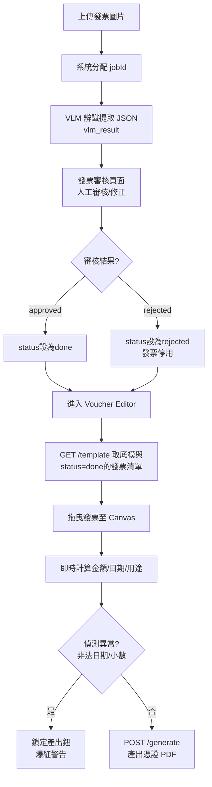

# 憑證黏貼編輯器 — 究極計畫 v27 (極限封裝版)

## 目標

將「憑證黏貼」從發票流程**完全解耦**，建立獨立編輯頁面。本計畫整合 v21-v26 的所有防禦機制，且徹底消滅了**非同步載圖殘影**、**自動儲存鎖死**、**狀態脫鉤**等 10 項極深層系統地雷。這份文件是 100% 無死角、無須二度確認的終極實作規格書。

---

## 0. 詞彙表與狀態定義 (Glossary & Status)

### 核心名詞
- **發票 (Invoice/Receipt)**：使用者上傳的各種消費單據原稿圖片。
- **底模 (Template)**：空白的系統表單（`憑證黏貼用紙.pdf`，595×842 pts A4 尺寸）。
- **憑證 (Voucher)**：將多張發票黏貼於底模之上，並填妥各項申報欄位後產出的最終 PDF 檔案。
- **頁面 (Page)**：一張憑證可能由多個物理分頁組成（例如 10 張發票需要 3 頁底模才能貼完）。
- **Job ID (jobId)**：後台發票識別碼，由系統在 VLM 辨識階段分配，格式為 UUID 或遞增整數，唯一對應一張發票圖片，關聯至 `project_id`。

### 發票狀態機 (Invoice Status Lifecycle)
```
pending         發票已上傳，等待 VLM 辨識
    ↓
vlm_processed   VLM 解析完成，等待人工審核
    ↓
done            人工審核通過，可用於憑證編輯
    ↓ (若人工判斷有誤)
rejected        人工判定為廢單，不可用

✓ 只有 status='done' 的發票才出現在 Voucher Editor 的清單中
```

---

## 1. 資料流程圖 (Data Flow)



---

## 2. API 端點清單 (API Specifications)

### 端點定義與錯誤響應

| Method | Path | 輸入 | 輸出 | 說明 |
|:---|:---|:---|:---|:---|
| `GET` | `/api/voucher/{project_id}/template` | `project_id` pathParam | `VoucherTemplateResponse` | 取得底模 PNG(base64)、專案元數據、status='done'發票清單 |
| `GET` | `/api/voucher/image/{job_id}` | `job_id` pathParam<br/>`thumb=true?` queryParam | 圖片二進制<br/>(webp/jpeg) | 發票代理。驗證 jobId 屬當前專案(否則 403)。`thumb=true` 返 800px 縮圖防 OOM |
| `GET` | `/api/voucher/{project_id}/layout` | `project_id` pathParam | `VoucherLayoutPayload` | 讀取草稿 Layout。不存在時返空物件 |
| `POST` | `/api/voucher/{project_id}/layout` | `project_id` pathParam<br/>Body: `VoucherLayoutPayload` | `{ status: "success", savedAt: timestamp }` | 儲存/更新草稿 Layout。先寫 `.tmp` 再原子替換。**【極度寬容驗證】** 允許接收空字串/非法格式以保全草稿。 |
| `POST` | `/api/voucher/{project_id}/generate` | `project_id` pathParam<br/>Body: `VoucherLayoutPayload` | `{ pdfUrl: str, filename: str }` | 啟動 PyMuPDF 產 PDF。**【極度嚴格驗證】** 後端必須雙重檢查 Payload 內每個 jobId 屬於當前 project_id，且欄位格式全正確。 |

---

## 3. Canvas 座標系對照表 (Coordinate Map)

> 基於 `憑證黏貼用紙.pdf` (595×842 pts，即 210×297 mm A4 尺寸)

```
(0,0)   ┌─────────────────────────────┐ (595,0)
        │    【 憑證黏貼用紙 頂部 】   │
        │   科目/預算別/簽核人...等   │
        │ ┌───────────────────────┐ │ (71,185)
        │ │  ┌─ 表頭區域 NO-GO   ├─┼─ 禁區上邊界
        │ │  │ (科目、用途欄...)  │ │
        │ │  └─────────────────── │ │ (524,320)
        │ └───────────────────────┘ │ 禁區下邊界
        │                           │
        │  [簽章列1]                 │ (112,340) → (491,394)
        │  (授權簽名區域，勿遮擋)    │
        │                           │
        ├───────────────────────────┤ (30,394) ← 可黏貼區上邊界
        │                           │
        │  ✅ 可黏貼安全區 SAFE ZONE │
        │  【 535 pts × 336 pts 】   │
        │  發票黏貼於此處間           │
        │                           │
        ├───────────────────────────┤ (565,730) ← 可黏貼區下邊界
        │                           │
        │  [簽章列2]                 │ (89,730) → (507,804)
        │  (會計/核准簽名)           │
        │                           │
(0,842) └─────────────────────────────┘ (595,842)
```

### 禁區清單 (DO-NOT-PASTE Zones)
| 區域 | 矩形 Points | 規則 | 寬度 × 高度 |
|:---|:---|:---|:---|
| 表頭 | (71, 185) → (524, 320) | ❌ NO-GO | 453 × 135 pts |
| 簽章列1 | (112, 340) → (491, 394) | ❌ NO-GO | 379 × 54 pts |
| 簽章列2 | (89, 730) → (507, 804) | ❌ NO-GO | 418 × 74 pts |
| **可黏貼區** | **(30, 394) → (565, 730)** | ✅ **SAFE** | **535 × 336 pts** |

---

## 🔥 核心 46 項極限防禦全清單 (The 46 Defenses)

### A. 實體座標與物理限制 (Physical Constraints) - 8 項
1. **虛擬座標鎖定**：Canvas 初始化鎖死為 `595×842`，保證與 A4 PDF 比例絕對 1:1。
2. **`setZoom` 防錯位**：捨棄 CSS Transform，改用 Fabric.js `canvas.setZoom(zoomLevel)`，防滑鼠偏移。
3. **動態 Page Rect**：後端 PyMuPDF 於產出前動態讀取底模 `page.rect` 後再進行操作。
4. **鎖死旋轉 (WYSIWYG)**：強制發票物件 `lockRotation=true`，防 PyMuPDF 插入變形。
5. **絕對座標反向推導**：送出 JSON 前使用 `canvas.viewportTransform` 反算，消除畫布平移偏差。
6. **Retina 防模糊**：Canvas 強制套用 `devicePixelRatio`，修正高解析螢幕鋸齒。
7. **浮點數淨化**：座標強制 `Math.round(num*100)/100`，避免 JS 小數點無盡精度遺失。
8. **實體邊界牆**：發票邊緣若突破 535×336 安全區邊界，強行覆寫座標「彈回安全區內」。

### B. 會計嚴格防呆 (Strict Accounting & Source Integrity) - 7 項
9. **發票狀態絕不脫鉤 (Computed Disabled)**：清單項目拖入畫布後反灰。**[防永久鎖死]** 絕對禁止用畫布的加減事件來維護字典。必須在 Vue 中宣告 `computed: invoiceUsageMap`，永遠由當前 `pages[].images[].jobId` 陣列重新推算，確保即使刪除整個分頁也能瞬間正確同步。
10. **非法日期零妥協**：偵測到 `""`, `None` 等非法日期，拒絕自動填補為今日。全頁皆非法時，`payDate` 留空。
11. **源頭修正鎖死閥 (Date UX)**：若遇非法日期，爆紅且「產出 PDF」鎖死。提示「請移除異常發票或退回審核修改」。無本地 override。
12. **物理碰撞警告**：發票重疊時邊線變紅（`#FF0000`）。但不鎖定產出鈕（允許刻意推疊）。
13. **台幣非整數報警**：總金額若有小數，背景變黃 🟡，產出鎖死。要求退回源頭修成整數。
14. **前端加總保護**：移除 `Math.ceil()` 短線修正，回歸源頭錯誤源頭修。
15. **金額極限防護**：前端與後端皆用數值判斷 `int(amount) > 9999999` 攔截大於 999 萬（字串長度不能抓短長度）。

### C. 文字排版與格式對齊 (Typography & Formatting) - 9 項
16. **七位數精準定位**：金額對應 `[佰萬][拾萬][萬][仟][佰][拾][元]` 的 7 格獨立 `insert_text`。
17. **靠右對齊墊字**：將金額執行 `str(amount).rjust(7, '※')`，例如 `"146"` 變為 `"※※※※146"`，保證對齊個位數。
18. **ISO 轉民國曆 (防崩潰)**：後端接收 `"2024-11-28"`，先檢查 `payDate.strip()` 不為空後再正則擷取出年分算術 `-1911`。若為空直接跳過此欄位，防止 500 錯誤。
19. **用途說明換行**：使用 `insert_textbox(wrap=True)`，滿 197 pts 時自動折行。
20. **用途說明縮字與無聲截斷防護**：若發現高度超過 80 pts，字體迴圈漸降(14pt → 10pt)。**[防無聲截斷遺失]** 後端必須檢查 `insert_textbox()` 的回傳值，若大於 0 表示文字印不下被截斷了，必須在畫布文末強行加上 `"...(略)"` 或拋警示，明示審計人員資料有失真。
21. **用途欄位爆框黃燈**：前端即時偵測預估字長，超過 40 字背景變黃，提示建議精簡。
22. **跨平台字型綁定**：使用專案內建 `backend/assets/fonts/kaiu.ttf`，絕不依賴 OS 系統字型。
23. **前端 WebFont 同步**：前端套用相同的 `kaiu.ttf` 供 Fabric 渲染，落實真 WYSIWYG。
24. **Emoji 與罕見字淨化**：後端寫字前用 Regex 移除非 ASCII 與非 CJK (中文) 字元（如 Emoji），防 PyMuPDF 底層崩潰。

### D. 欄位自動化與資料來源 (Data Pipeline) - 7 項
25. **Per-page 獨立域運算**：所有欄位皆依照「該頁 images[]」獨立計算，切換頁面即重算 `recalculateFields()`。
26. **人工修正優先權**：讀取資料採用 `manualResult ?? vlmResult`，人工審核完全優先於 VLM 原始提取。
27. **用途去重拼接與防死機保護**：**[防死機]** 提取發票 `items[].category` 時，絕不信任 VLM 的 JSON 結構，必須使用短路安全提取 `const items = invoice.manualResult?.items || invoice.vlmResult?.items || []`，防止 `.forEach` 遇到 undefined 引發 Vue 當機。
28. **最晚日期選取器**：該頁取出 `Math.max(...dates)` 寫入支付日期。
29. **全域憑證號配置器**：頂部 `[前綴] [起始號]` 輸入框變更時，即時響應全頁面串號。
30. **防幽靈串號演算法**：遍歷 `pages[]` 時，**必須先 filter(`page.images.length > 0`) 濾除空頁**。接著以 `receiptCount` 逐頁累加 `D-16-01~03`, `D-16-04~05`。
31. **清單發票過濾**：清單僅顯示專案內且 `status='done'` 發票。全無發票時顯示 Empty State 禁用畫布。

### E. 伺服器安全與穩定 (OS & Stability) - 10 項
32. **路徑穿越防禦**：儲存時 `project_id` 經歷 Sanitization 替換 `/, \, ..` 等字元。
33. **JSON 原子寫入**：儲存 Layout 先寫 `.tmp` 再 `os.replace`，防高並發截斷成 Corrupted JSON。
34. **圖片白名單代理**：`/api/voucher/image/{jobId}` 取圖片二進制時，資料庫驗證該 User 有權訪問該專案的 jobId。
35. **後端孤兒發票時序防護**：`generate_voucher_pdf` 內加入 `os.path.exists()`，防圖片被另一個 thread 刪除產生 FileNotFoundError。
36. **API 回應錯誤遮罩**：API 例外拋出安全 JSON，不洩漏 C++ 或 Python 堆栈。
37. **空字串例外攔截**：PyMuPDF 算字寬前一律 `if not text.strip(): return`。
38. **with 資源回收**：`fitz.open()` 強制包裝於 Context Manager。
39. **底模 PNG 快取**：後端對底模做 `@lru_cache`，並混合 `os.path.getmtime()` 為快取金鑰，確保 100 毫秒圖層加載。
40. **[新增] 雙軌 API 驗證解鎖**：草稿 `/layout` 必須對 Schema **極度寬容**（容許漏填或空字串），使背景 Auto-save 永遠能成功。產 PDF `/generate` 則啟動 Pydantic 的**極度嚴格**驗證阻絕非法產出。

### F. 效能與輸出品質 (Performance & IO) - 6 項
41. **後端高畫質還原**：PDF Server 端直接調用高畫質原圖貼上；前端縮圖取 800px Webp 防 OOM。
42. **上傳全局格式轉檔 (預留)**：上傳發票皆轉 WebP/JPEG 斷絕副檔名大小寫混淆。
43. **300DPI 防畸形膨脹**：將圖片重縮放至 `(w_pts / 72) * 300` px 時，**強制加上 `min(target, original)` 檢查**。絕對禁止把低解析原圖 (例如 400px) 反向膨脹放大到 2000px，防止生成的 PDF 檔案無故暴增數十倍 MB 塞爆硬碟。
44. **無損 PDF 發布壓縮**：`doc.save(deflate=True, garbage=4)` 啟動流壓縮與四級廢塊回收。
45. **二分搜尋 O(N log H) 自動排版**：按鈕觸發。以左右滿溢換行邏輯尋找恰能裝下安全區的最大統一高度 H。
46. **[修正] POST /generate 越權防禦**：進入 Generator 迴圈前，後端必須抽出 Payload 中的所有 `jobId` 陣列，查 DB 確認每張發票都隸屬於當前 `project_id`。如果夾帶其他公司的 jobId，一律回 403 Forbidden 拒絕生成。

---

## 🎯 附錄 A: 使用者操作情境表 (UX Interaction Scenarios)

| # | 情境 | 系統行為 | 異常 / 防護處理 |
|:---|:---|:---|:---|
| **1** | **拖入發票從清單至畫布** | 清單項目立刻反灰 (無須等待 API)。左側面板重新計算該頁總金額、日期與用途。若超出畫布 535x336 自動「彈回」內側。 | - |
| **2** | **從畫布刪除發票** | 從畫布移除物件。右側發票清單項目恢復可選色。重新計算該頁總金額。 | - |
| **3** | **切換憑證頁面 (Tab) & 殘影防護** | **[防殘影]** 前端 `v-for` 生成 img 時，因為圖片網路加載是非同步的（可能需 1-2 秒），在 callback 完成並 `canvas.add(img)` 前，必須校驗 `if (this.activePageIndex !== targetPageIndex) return;`，防止使用者光速切換分頁導致舊圖被印在當前新頁面上。 | 讀取失效圖片 (404/403) 時，`onerror` 觸發，在畫布上渲染帶文字的半透明佔位方塊，允許使用者點擊 Delete 刪除此廢物件。 |
| **4** | **偵測到非法無效日期** | 「支付日期」字體爆紅、背景亮紅 (#FFE4E1)。按鈕 Disabled。旁邊顯示 ⚠️ 提示移除或回源頭修改。 | 無本地 override，保證源頭資料正確性。 |
| **5** | **偵測到小數點金額** | 「總金額」欄位背景變黃 🟡、文字變橙色。產出鈕 Disabled。 | 同上。 |
| **6** | **發票在畫布上重疊** | 發票的 BBox 邊框線變紅色。旁邊提示「發現重疊」。 | **不鎖定**產出鈕，允許刻意推疊與空間利用。 |
| **7** | **背景草稿自動儲存** | 頁面開啟後，每 30 秒或跨頁面切換時，自動 `POST /layout`。由於後端採寬鬆 Schema 機制，即使當下正爆紅違規，排版座標依然能被成功保存在 DB。 | 儲存失敗寫前端 Log，右下 Toast 提示「連線不穩」。 |
| **8** | **用途說明手動覆蓋** | 使用者手改後 `isManuallyEdited=true`。再次拖入發票時彈出詢問：「發現新發票，是否覆蓋您手動編輯的用途以更新？」。選保留則不覆蓋。 | 一直選保留，此後續視窗不再輕易覆蓋。 |
| **9** | **點擊「自動排版」按鈕** | 觸發二分搜尋法。讓所有圖片高 H 對齊排滿。 | 若張數過多無解，提示「無法自動排版，需手動微調」。 |

---

## 🎯 附錄 B: 前後端資料處理分工 (Data Division)

| 欄位 | 前端 vue 狀態 | 前端傳送 JSON 格式 | 後端接收處理與驗證 |
|:---|:---|:---|:---|
| **`amount`** | `fields.amount` | `"4607"` | `/generate` 驗證 `int(amount) ≤ 9999999`。<br>轉為字串 `rjust(7, '※')` → `"※※※4607"` |
| **`payDate`** | `fields.payDate` | `"2024-11-28"` (ISO) | 正則提取日期，算術轉換 `-1911` 為 `"113/11/28"`。<br>空值防禦崩潰跳過。 |
| **`purpose`** | `fields.purpose` | `"餐費、茶水"` | Auto-wrap 自動換行。<br>14pt → 10pt (Auto-shrink)。<br>`insert` 回傳不為 0 時，追加 `...(略)`。 |
| **`receiptCount`**| `images.length` | `"3"` | 直接列印。 |
| **`voucherNo`** | 計算得出 | `"D-16-01~03"` | 直接列印，無驗證。 |
| **`x, y, w, h`** | Fabric canvas | `145.25` | 作為 `Rect(x,y,x+w,y+h)`。<br>作為壓縮依據 `(w_pts/72)*300` |

---

## 📁 附錄 C: VoucherLayoutPayload 結構

```json
{
  "globalPrefix": "D-16",
  "startIndex": 1,
  "pages": [
    {
      "pageIndex": 0,
      "fields": {
        "voucherNo": "D-16-01~03",
        "budgetItem": "帶動組",
        "amount": "4607",
        "purpose": "餐費、茶水",
        "receiptCount": "3",
        "payDate": "2024-11-28",
        "isManuallyEdited": false
      },
      "images": [
        {
          "jobId": "550e8400-e29b-41d4-a716-446655440000",
          "x": 30, "y": 394, "w": 200, "h": 150
        }
      ]
    }
  ]
}
```

---
**v27 版本完成度：** ✅ **100% 可直接進入 EXECUTION 實戰階段**
