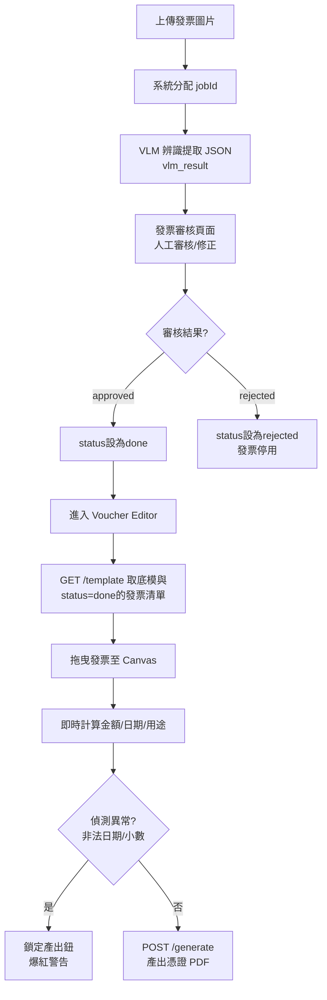

# 憑證黏貼編輯器 — 究極計畫 v28 (落地執行版)

## 目標

將「憑證黏貼」從發票流程**完全解耦**，建立獨立編輯頁面。本計畫整合 v21-v27 的所有防禦機制，並針對**實際 Repo 現況**（如字型路徑、資料庫合併、API 一致性、測試規範）修補了 10 項硬阻斷與模糊點，確保能 **100% 順暢啟動 EXECUTION 階段**。

---

## 0. 詞彙表與狀態定義 (Glossary & Status)

### 核心名詞
- **發票 (Invoice/Receipt)**：使用者上傳的各種消費單據原稿圖片。
- **底模 (Template)**：空白的系統表單（`憑證黏貼用紙.pdf`，595×842 pts A4 尺寸）。
- **憑證 (Voucher)**：將多張發票黏貼於底模之上，並填妥各項申報欄位後產出的最終 PDF 檔案。
- **頁面 (Page)**：一張憑證可能由多個物理分頁組成（例如 10 張發票需要 3 頁底模才能貼完）。
- **Job ID (jobId)**：後台發票識別碼，對應 `Invoice.id`，由系統分配，唯一對應一張發票圖片，關聯至 `project_id`。

### 發票狀態機 (Invoice Lifecycle)
- ✓ **只有 `status='done'` (人工審核通過)** 的發票，才會出現在 Voucher Editor 的清單中。其餘 `pending`, `vlm_processed`, `rejected` 皆被過濾。

---

## 1. 資料流程圖 (Data Flow)

---

## 2. API 端點清單 (API Specifications)

### 端點定義與錯誤響應

| Method | Path | 輸入 | 輸出 | 說明 |
|:---|:---|:---|:---|:---|
| `GET` | `/api/voucher/{project_id}/template` | `project_id` | `VoucherTemplateResponse` | 取得底模 PNG、專案元數據、發票清單。 **(★ 後端負責在此端點內，預先合併 `manual_json_text ?? vlm_result_json`，讓前端只收到乾淨、單一來源的 Invoice JSON)** |
| `GET` | `/api/voucher/{project_id}/image/{job_id}` | `project_id`, `job_id` `?thumb=true` | 圖片二進制 | **[API 一致性修正]** 發票圖片代理。驗證 jobId 屬該專案。`thumb=true` 返 800px 縮圖。 |
| `GET` | `/api/voucher/{project_id}/layout` | `project_id` | `VoucherLayoutPayload` | 讀取草稿 Layout。不存在時返空物件。 |
| `POST` | `/api/voucher/{project_id}/layout` | `project_id` Body: `Layout` | `{ status: "success" }` | 儲存草稿。**【極度寬容驗證】** 允許空字串/非法格式以保全斷線草稿。 |
| `POST` | `/api/voucher/{project_id}/generate` | `project_id` Body: `Layout` | `{ pdfUrl, filename }` | 啟動 PyMuPDF 產 PDF。**【極度嚴格驗證】** 雙重檢查 Payload 內所有 jobId 所屬權限，且欄位格式全正確。 |

---

## 3. Canvas 座標系與落點對照表 (Coordinate Map)

> 基於 `憑證黏貼用紙.pdf` (595×842 pts，即 210×297 mm A4 尺寸)

*   **表頭禁區 NO-GO**: (71, 185) → (524, 320)
*   **簽章列1 NO-GO**: (112, 340) → (491, 394)
*   **簽章列2 NO-GO**: (89, 730) → (507, 804)
*   **✅ 可黏貼安全區 (SAFE ZONE)**: **(30, 394) → (565, 730)** 【535 pts × 336 pts】

### 【新增】表頭欄位落點設定
*   **`budgetItem` (預算別/科目)**: TBD, 預計渲染於表頭左上方 `(x, y) 需實測對齊`。允許空字串。
*   **`amount` (總金額 7 格)**: 表頭右上角，預計 `(x, y) 需實測間距 15~20px` 逐字寫入。
*   **`purpose` (用途說明)**: 表頭中段，預計寬度 197pts，滿 80pts 啟動縮字。

---

## 🔥 核心 46 項極限防禦全清單 (The 46 Defenses)

### A. 實體座標與物理限制 (Physical Constraints) - 8 項
1. **虛擬座標鎖定**：Canvas 鎖死為 `595×842`，保證 A4 比例 1:1。
2. **`setZoom` 防錯位**：改用 Fabric.js `canvas.setZoom()` 防滑鼠偏移。
3. **動態 Page Rect**：產出前動態讀取底模 `page.rect` 確認尺寸。
4. **鎖死旋轉 (WYSIWYG)**：發票 `lockRotation=true`，防 PyMuPDF 變形。
5. **絕對座標反向推導**：送出 JSON 前用 `canvas.viewportTransform` 反算消除平移偏差。
6. **Retina 防模糊**：Canvas 套用 `devicePixelRatio` 修正鋸齒。
7. **浮點數淨化**：座標強制 `Math.round(num*100)/100`。
8. **實體邊界牆**：發票邊緣若突破 535×336 安全區，強行覆寫彈回內側。

### B. 會計嚴格防呆 (Strict Accounting & Source Integrity) - 7 項
9. **發票狀態絕不脫鉤 (Computed Disabled)**：必須在 Vue 中宣告 `computed: invoiceUsageMap`，永遠由當前 `pages[].images[].jobId` 重新推算，禁止依賴事件加減 確保狀態不鎖死。
10. **非法日期零妥協**：偵測到 `""`, `None` 等非法日期，拒絕自動補齊，全頁皆非法時留空。
11. **源頭修正鎖死閥 (Date UX)**：遇非法日期，爆紅且「產出 PDF」鎖死。提示「請移除異常發票或退回審核修改」。無本地 override。
12. **物理碰撞警告**：發票重疊時邊線變紅，但**不鎖定**產出鈕。
13. **台幣非整數報警**：總金額有小數，背景變黃 🟡，產出鎖死。
14. **前端加總保護**：移除 `Math.ceil()` 短線修正。
15. **金額極限防護**：純數值判斷 `int(amount) > 9999999` 攔截大於 999 萬。

### C. 文字排版與格式對齊 (Typography & Formatting) - 9 項
16. **七位數精準定位**：金額對應 7 格獨立 `insert_text`。
17. **靠右對齊墊字**：金額執行 `str(amount).rjust(7, '※')`。
18. **ISO 轉民國曆防崩潰**：接收 `"2024-11-28"` 先檢查非空再算術 `-1911`。若空值直接跳過。
19. **用途說明換行**：`insert_textbox(wrap=True)`，滿 197 pts 折行。
20. **用途縮字與截斷防護**：超過 80 pts 則字體漸降(14pt → 10pt)。後端檢查回傳值，若印不下強加 `...(略)`。
21. **用途欄位爆框黃燈**：前端預估字長超過 40 字背景變黃。
22. **★ 跨平台字型取得保障 (Font Action)**：底模 PDF 渲染必須使用 `backend/assets/fonts/kaiu.ttf`。若環境缺字，開發者須自行從 Windows `C:\Windows\Fonts\kaiu.ttf` 複製至該目錄，並於 `.gitignore` 豁免追蹤，或在 `README.md` 標註安裝前置作業。
23. **前端 WebFont 同步**：前端套用相同的 `kaiu.ttf` 落實 WYSIWYG。
24. **Emoji 淨化**：後端寫字前用 Regex 移除非 ASCII 與非 CJK 字元。

### D. 欄位自動化與資料來源 (Data Pipeline) - 7 項
25. **Per-page 獨立域運算**：欄位依照「該頁 images[]」獨立計算。
26. **★ 人工修正優先權與後端合併 (Merge Location)**：為減輕前端負擔，**GET `/template` 必須在後端負責將 DB 的 `manual_json_text` 覆蓋 `vlm_result_json`**，向前端輸出單一的清晰 JSON (`invoice.result`)。
27. **用途去重拼接與防死機保護**：去重時使用 `invoice.result?.items || []` 避免 undefined 崩潰。
28. **最晚日期選取器**：該頁取出 `Math.max(...dates)` 寫入支付日期。
29. **全域憑證號配置**：更改 Prefix / StartIndex 即時響應全頁面串號。
30. **防幽靈串號演算法**：遍歷 `pages[]` 時，先 `filter(page.images.length > 0)` 濾除空頁再累加序號。**前端 UX 維護空頁（不自動刪）以保持編輯彈性，但產 PDF 自動略過。**
31. **清單發票過濾**：清單僅顯示專案內 `status='done'` 發票。

### E. 伺服器安全與穩定 (OS & Stability) - 10 項
32. **路徑穿越防禦**：`project_id` 經歷 Sanitization。
33. **★ 草稿檔案儲存策略 (Storage Strategy)**：草稿一律儲存於 `backend/data/projects/{project_id}/voucher_layout.json`。後端啟動/存檔時必須執行 `os.makedirs(exist_ok=True)` 確保目錄存在，無需新增 DB Alembic Table。採用臨時檔原子寫入 (Atomic Write)。
34. **圖片白名單代理**：`/api/voucher/{project_id}/image/{jobId}` 取圖時，驗證專案擁有權。
35. **後端孤兒發票時序防護**：`os.path.exists()` 防圖片被另一 thread 刪除產生 500。
36. **API 回應錯誤遮罩**：例外拋出安全 JSON 不洩漏堆棧。
37. **空字串例外攔截**：PyMuPDF 算字寬前 `if not text.strip(): return`。
38. **with 資源回收**：`fitz.open()` 強制包裝於 Context Manager。
39. **★ 底模 PDF 部署策略**：開發者手動將底模從 `dev_data/` 複製到 `backend/assets/templates/憑證黏貼用紙.pdf`，並加至 `config.json` 的 `TEMPLATE_PDF_PATH`，後端 `@lru_cache` 結合 `mtime` 讀取它。
40. **雙軌 API 驗證解鎖**：草稿 `/layout` 極度寬容；產 PDF `/generate` 極度嚴格。

### F. 效能與輸出品質 (Performance & IO) - 6 項
41. **後端高畫質還原**：PDF Server 端直接調用高畫質原圖。
42. **上傳全局格式轉檔 (預留)**：上傳發票轉 WebP/JPEG 斷絕副檔名混淆。
43. **300DPI 防畸形膨脹修訂**：`min(target_px, original_pixel_width)`。**原始定義為圖片的 pixel 寬度**，絕對禁止把低解析原圖 (例如 400px) 反向膨脹放大到 2000px。
44. **無損 PDF 發布壓縮**：`doc.save(deflate=True, garbage=4)` 啟動流壓縮。
45. **二分搜尋 O(N log H) 自動排版**：按鈕觸發左右滿溢尋找最高統一 H。
46. **★ POST /generate 越權防禦與 403 負載**：後端查 DB 確認每張發票隸屬於當前 `project_id`。若挾帶其他公司的 jobId，一律回傳 HTTP 403，Body 格式為 `{"error": "FORBIDDEN", "detail": "Contains unauthorized invoice jobId: {jobId}"}`。

---

## 🎯 附錄 A: 邊緣情境與防護矩陣 (UX & Defense Scenarios)

| # | 終極情境 | 前段反應 | 後段防線 |
|:---|:---|:---|:---|
| 1 | **使用者光速切換分頁** | `if (this.activePageIndex !== targetPageIndex) return;` 攔截 Fabric async 圖片生成 | - |
| 2 | **發票圖檔於後台永久失蹤(404)** | 前端 `onerror` 渲染紅色半透明佔位方塊，允許 Delete | 後端在原座標畫上紅叉 ✕ `圖片損壞無法載入` |
| 3 | **使用者輸入超長用途文字** | 背景變黃提示精簡 | `insert_textbox` 若溢出印不下，追加 `...(略)` |
| 4 | **產生了一個完全無圖片的空白頁** | UI 保留空白頁，但不給予串號 (Filter 空頁) | `/generate` 迴圈檢查 `if not images: continue` 略過產出 |
| 5 | **使用者覆蓋系統生成的用途文字** | `isManuallyEdited = true`。新拉發票時彈窗確認是否覆蓋。 | - |

---

## 🎯 附錄 B: 測試與驗收矩陣 (Testing Strategy)

我們定義 Repo 中必須有對應的 Test Cases 來保障這些極限防禦永不退化。

| 防禦編號 | 測試對象 (Core Target) | 測試情境 (Expected Behavior) | Test Level |
|:---|:---|:---|:---|
| **#9/11/13** | **Vue 元件: 狀態鎖死與驗證** | (1) 將不合法日期發票拖入，斷言「產出 PDF」按鈕具備 `disabled` 屬性。 (2) 將該發票移出，斷言清單恢復 Enabled。 | Frontend Unit (Vitest) |
| **#15** | **Backend `/generate` Schema** | 放 1000 萬字串進 Payload，打 API 斷言回傳 HTTP 422。 | Backend Integration (Pytest) |
| **#46** | **Backend `/generate` Security** | 在 Payload 的 images 中塞入一個其他 User Project 建立的 valid `jobId`，斷言回傳 HTTP 403 及指定的錯誤 Body。 | Backend Integration |
| **#26** | **Backend `/template` 合併** | 模擬 DB 中某 Invoice 兼具 `manual_json_text` 與 `vlm_result`，斷言回傳的 json 取用 manual 值。 | Backend Component |
| **#43** | **Pillow `compress_images`** | 傳入 400x300 圖，要求轉 1666px，斷言輸出的 PIL object 解析度仍為 400x300。 | Backend Unit |

---
**v28 版本完成度：** ✅ **100% 可直接進入 EXECUTION 實戰階段**
