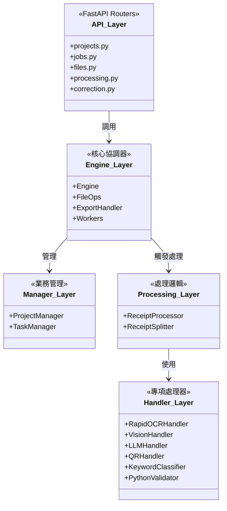
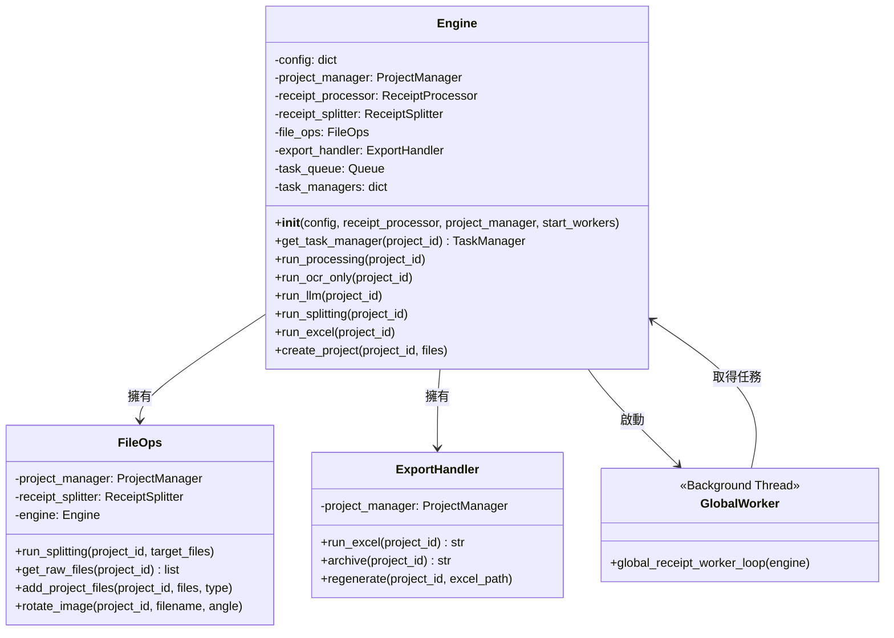
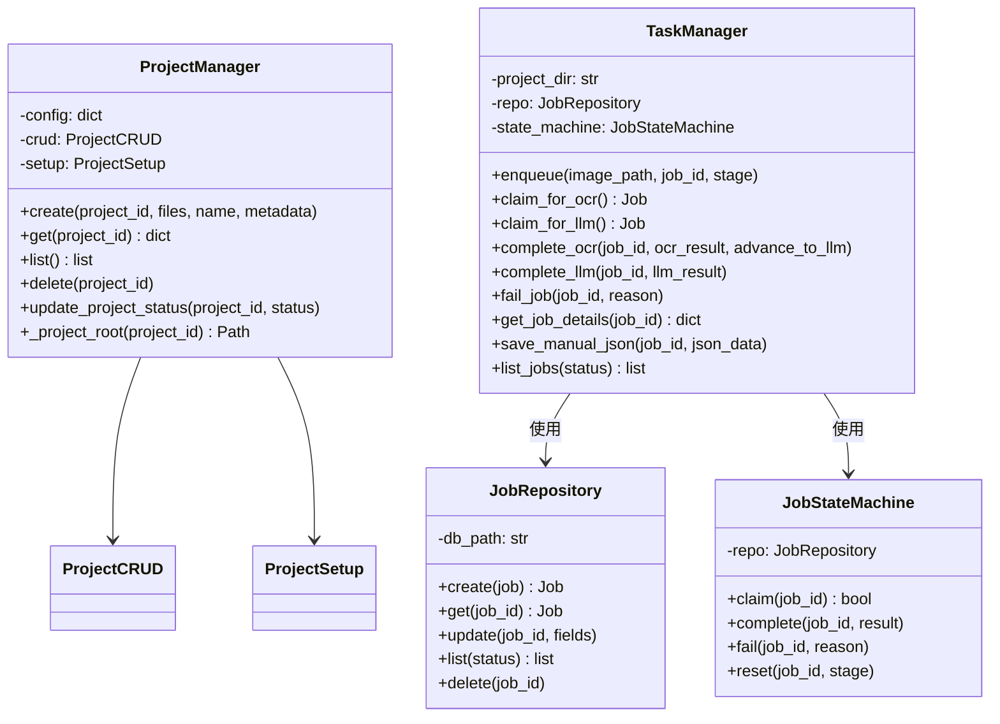
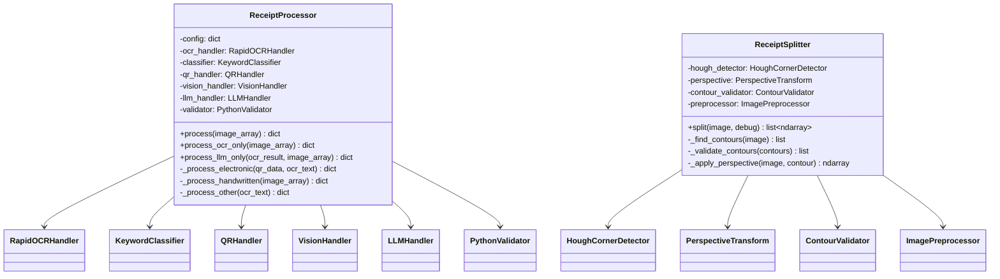
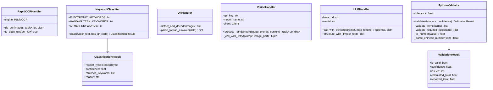
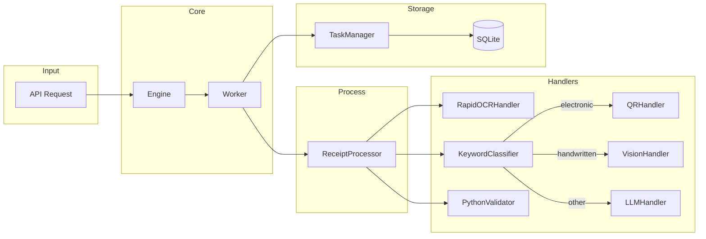

# 後端類別圖 (Backend Class Diagram)

> **狀態**: 正式版  
> **最後更新**: 2026-02-07  
> **依據**: 實際程式碼追蹤

---

## 1. 系統分層架構



---

## 2. Engine 模組 (核心)



---

## 3. Manager 模組 (業務管理)



---

## 4. Processing 模組 (核心處理)



---

## 5. Handler 模組 (專項處理器)



---

## 6. 資料流方向摘要



---

## 7. 介面契約 (Key Interfaces)

### ReceiptProcessor.process_ocr_only()
```python
def process_ocr_only(image_array: np.ndarray) -> dict:
    """
    Returns:
        {
            "success": bool,
            "invoice_type": "electronic" | "handwritten" | "other",
            "ocr_result": {"text": str, "type": str},
            "ocr_stats": {"total_time_s": float, ...}
        }
    """
```

### ReceiptProcessor.process_llm_only()
```python
def process_llm_only(ocr_result: dict, image_array: np.ndarray = None) -> dict:
    """
    Args:
        ocr_result: {"text": str, "type": "電子發票|免用統一發票收據|其他收據"}
    
    Returns:
        {
            "success": bool,
            "llm_result": {...},  # 結構化 JSON
            "llm_stats": [...],
            "confidence": float
        }
    """
```

### TaskManager State Flow
```
enqueue → pending → running → completed
                  ↘ failed
```

---

> **備註**: 此文件基於 2026-02-07 的程式碼追蹤。若程式碼有更新，請同步更新此文件。

---

## 8. PlantUML Source

```plantuml
@startuml
!theme plain
hide empty members
skinparam classAttributeIconSize 0

package "API Layer" {
    class API_Routers <<FastAPI>>
}

package "Engine Layer" {
    class Engine {
        -config: dict
        -project_manager: ProjectManager
        -receipt_processor: ReceiptProcessor
        -receipt_splitter: ReceiptSplitter
        -file_ops: FileOps
        -export_handler: ExportHandler
        -task_queue: Queue
        -task_managers: dict
        +__init__(config, receipt_processor, project_manager, start_workers)
        +get_task_manager(project_id): TaskManager
        +run_processing(project_id)
        +run_ocr_only(project_id)
        +run_llm(project_id)
        +run_splitting(project_id)
        +run_excel(project_id)
        +create_project(project_id, files)
    }

    class FileOps {
        -project_manager: ProjectManager
        -receipt_splitter: ReceiptSplitter
        -engine: Engine
        +run_splitting(project_id, target_files)
        +get_raw_files(project_id): list
        +add_project_files(project_id, files, type)
        +rotate_image(project_id, filename, angle)
    }

    class ExportHandler {
        -project_manager: ProjectManager
        +run_excel(project_id): str
        +archive(project_id): str
        +regenerate(project_id, excel_path)
    }

    class GlobalWorker <<Background Thread>> {
        +global_receipt_worker_loop(engine)
    }
}

package "Manager Layer" {
    class ProjectManager {
        -config: dict
        -crud: ProjectCRUD
        -setup: ProjectSetup
        +create(project_id, files, name, metadata)
        +get(project_id): dict
        +list(): list
        +delete(project_id)
        +update_project_status(project_id, status)
        +_project_root(project_id): Path
    }

    class TaskManager {
        -project_dir: str
        -repo: JobRepository
        -state_machine: JobStateMachine
        +enqueue(image_path, job_id, stage)
        +claim_for_ocr(): Job
        +claim_for_llm(): Job
        +complete_ocr(job_id, ocr_result, advance_to_llm)
        +complete_llm(job_id, llm_result)
        +fail_job(job_id, reason)
        +get_job_details(job_id): dict
        +save_manual_json(job_id, json_data)
        +list_jobs(status): list
    }

    class JobRepository {
        -db_path: str
        +create(job): Job
        +get(job_id): Job
        +update(job_id, fields)
        +list(status): list
        +delete(job_id)
    }

    class JobStateMachine {
        -repo: JobRepository
        +claim(job_id): bool
        +complete(job_id, result)
        +fail(job_id, reason)
        +reset(job_id, stage)
    }
}

package "Processing Layer" {
    class ReceiptProcessor {
        -config: dict
        -ocr_handler: RapidOCRHandler
        -classifier: KeywordClassifier
        -qr_handler: QRHandler
        -vision_handler: VisionHandler
        -llm_handler: LLMHandler
        -validator: PythonValidator
        +process(image_array): dict
        +process_ocr_only(image_array): dict
        +process_llm_only(ocr_result, image_array): dict
        -_process_electronic(qr_data, ocr_text): dict
        -_process_handwritten(image_array): dict
        -_process_other(ocr_text): dict
    }

    class ReceiptSplitter {
        -hough_detector: HoughCornerDetector
        -perspective: PerspectiveTransform
        -contour_validator: ContourValidator
        -preprocessor: ImagePreprocessor
        +split(image, debug): list<ndarray>
        -_find_contours(image): list
        -_validate_contours(contours): list
        -_apply_perspective(image, contour): ndarray
    }
}

package "Handler Layer" {
    class RapidOCRHandler {
        -engine: RapidOCR
        +do_ocr(image): tuple<list, dict>
        +to_plain_text(ocr_raw): str
    }

    class KeywordClassifier {
        +ELECTRONIC_KEYWORDS: list
        +HANDWRITTEN_KEYWORDS: list
        +OTHER_KEYWORDS: list
        +classify(ocr_text, has_qr_code): ClassificationResult
    }

    class ClassificationResult {
        +receipt_type: ReceiptType
        +confidence: float
        +matched_keywords: list
        +reason: str
    }

    class QRHandler {
        +detect_and_decode(image): dict
        +parse_taiwan_einvoice(data): dict
    }

    class VisionHandler {
        -api_key: str
        -model_name: str
        -client: Client
        +process_handwritten(image, prompt_context): tuple<str, dict>
        -_call_with_retry(prompt, image_part): tuple
    }

    class LLMHandler {
        -base_url: str
        -model: str
        +call_with_thinking(prompt, max_tokens): tuple<str, dict>
        +structure_with_llm(ocr_text): dict
    }

    class PythonValidator {
        +tolerance: float
        +validate(data, ocr_confidence): ValidationResult
        -_validate_items(items): list
        -_validate_required_fields(data): list
        -_to_number(value): float
        -_parse_chinese_number(text): float
    }

    class ValidationResult {
        +is_valid: bool
        +confidence: float
        +issues: list
        +calculated_total: float
        +reported_total: float
    }
}

' Relationships
API_Routers ..> Engine
Engine --> FileOps
Engine --> ExportHandler
Engine --> GlobalWorker
Engine --> ProjectManager
Engine --> ReceiptProcessor
Engine --> ReceiptSplitter

GlobalWorker --> Engine : uses
GlobalWorker --> ReceiptProcessor : uses
GlobalWorker --> TaskManager : updates

ProjectManager --> "ProjectCRUD"
ProjectManager --> "ProjectSetup"

TaskManager --> JobRepository
TaskManager --> JobStateMachine

ReceiptProcessor --> RapidOCRHandler
ReceiptProcessor --> KeywordClassifier
ReceiptProcessor --> QRHandler
ReceiptProcessor --> VisionHandler
ReceiptProcessor --> LLMHandler
ReceiptProcessor --> PythonValidator

KeywordClassifier ..> ClassificationResult
PythonValidator ..> ValidationResult

ReceiptSplitter --> "HoughCornerDetector"
ReceiptSplitter --> "PerspectiveTransform"
ReceiptSplitter --> "ContourValidator"
ReceiptSplitter --> "ImagePreprocessor"

@enduml
```


