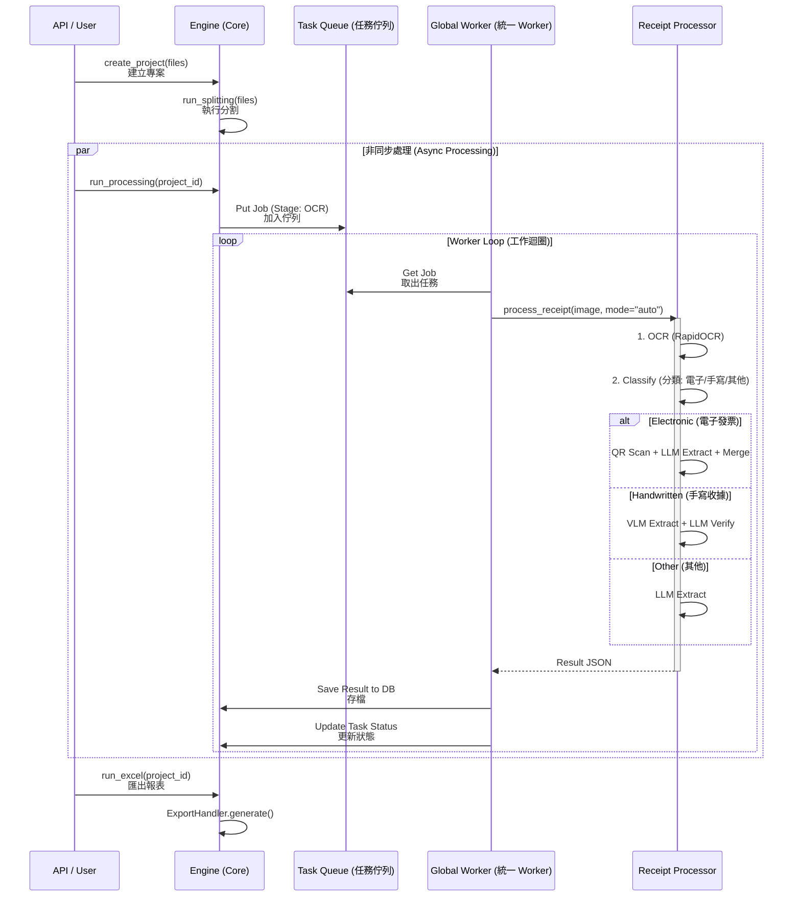
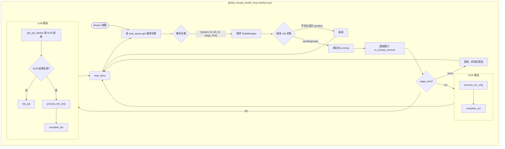
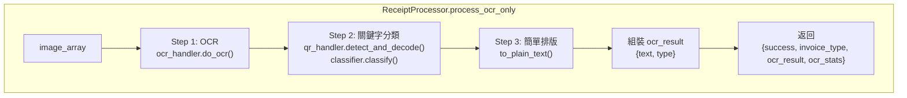
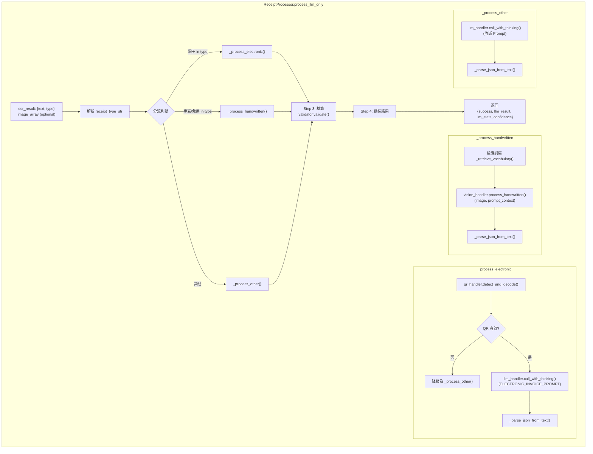
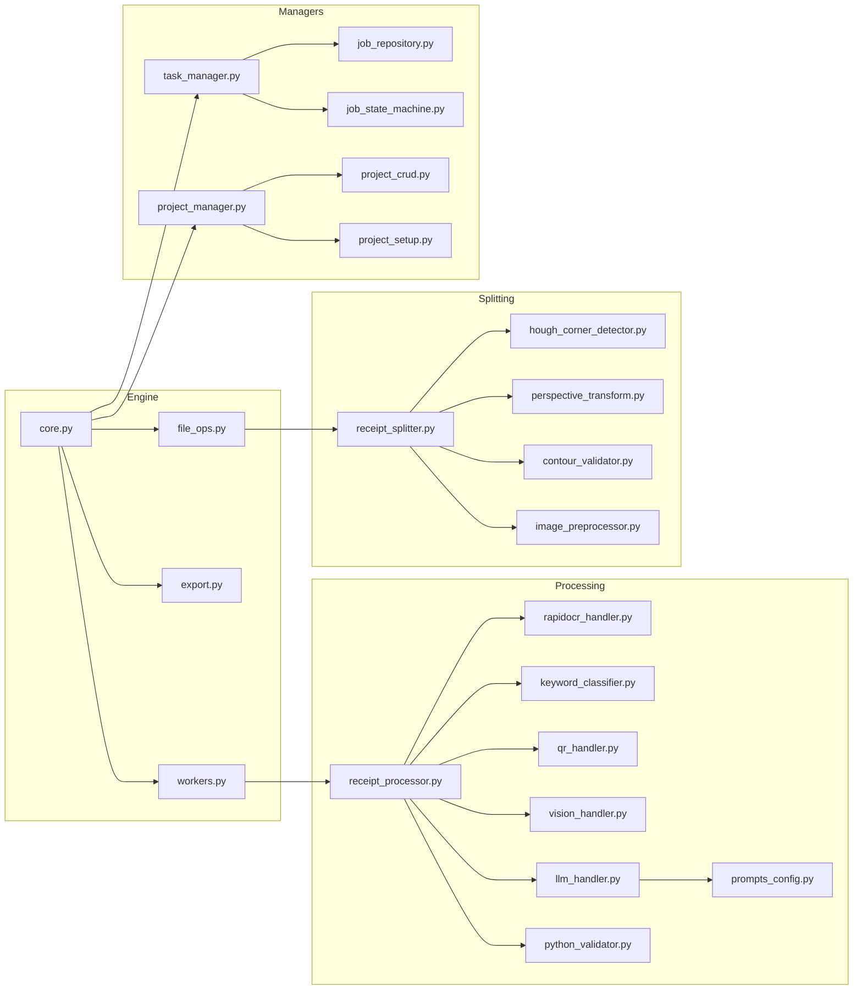
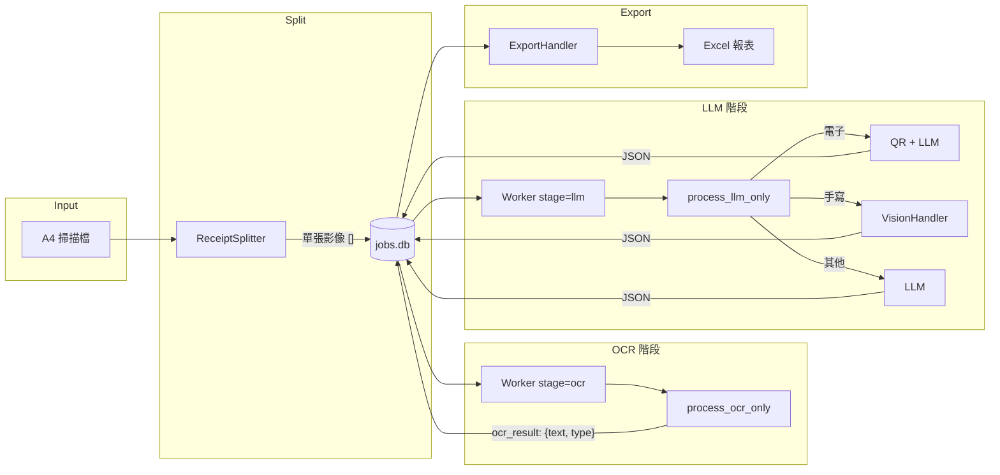

# 收據處理架構與流程規劃

> **狀態**: 草稿 / 規劃中
> **最後更新**: 2026-02-03
> **依據**: 使用者需求 & `docs/processing_pipeline.md`

## 1. 系統總覽 (System Overview)

本系統將上傳的收據影像（多為包含多張收據的A4掃描檔）處理為結構化資料 (JSON) 並匯出成 Excel。核心引擎管理著 分割 -> OCR -> 分流 -> 處理 -> 儲存 的流水線。

### 資料流向圖 (Data Flow Diagram)

```mermaid
graph TD
    Input[發票進來 Input] --> Split[切成單張 Split]
    Split --> OCR[OCR 識別]
    OCR --> Branch{分流 Branching}
    
    %% Branch 1: Electronic
    Branch -- 電子發票 --> Elec[電子式發票流程]
    Elec --> E_QR[掃 QR Code 拿資料]
    E_QR --> E_LLM[LLM 從 OCR 結果提資料]
    E_LLM --> E_Merge[對比合併 Merge]
    E_Merge --> DB_Save
    
    %% Branch 2: Handwritten
    Branch -- 手寫收據 --> Hand[手寫收據流程]
    Hand --> H_VLM[VisionHandler 提資料 (Visual Language Model)]
    H_VLM --> H_LLM[LLM 從 OCR 資料猜正不正確]
    H_LLM --> H_Merge[合併 Merge]
    H_Merge --> DB_Save
    
    %% Branch 3: Others
    Branch -- 其他影印收據 --> Other[其他收據流程]
    Other --> O_LLM[LLM 從 OCR 結果提資料]
    O_LLM --> DB_Save
    
    %% Storage & Export
    DB_Save[存入 DB] --> Export[匯出成 Excel]
```

---

## 2. 詳細處理流程 (Detailed Processing Flows)

每一步驟都對應特定的處理模組。

### 第一階段：前處理 (Phase 1: Pre-processing)

| 邏輯步驟 | 負責模組 / 類別 | 說明 |
| :--- | :--- | :--- |
| **輸入 (Input)** | `backend.managers.project_manager.ProjectManager` | 處理檔案上傳與專案建立。 |
| **分割 (Split)** | `backend.processing.receipt_splitter.ReceiptSplitter` |偵測 A4 上的收據輪廓並裁剪成單張影像。 |
| **OCR 識別** | `backend.processing.rapidocr_handler.RapidOCRHandler` | 對裁剪後的影像執行 OCR，獲取原始文字與座標 (Bounding Boxes)。 |

### 第二階段：分流與特定處理 (Phase 2: Branching & Specific Processing)

分流邏輯由 `backend.processing.receipt_processor.ReceiptProcessor` 管理。

#### A. 電子式發票 (Electronic Invoice)
*目標：標準台灣電子發票 (含 QR Code)。*

1.  **掃 QR Code 拿資料**
    *   **模組**: `backend.processing.qrcode_handler` (或 `ReceiptProcessor` 內部方法)
    *   **動作**: 解碼 QR Code 以獲取結構化資料（日期、金額、發票號碼）。
2.  **LLM 從 OCR 結果提資料**
    *   **模組**: `backend.processing.llm_handler.LLMHandler`
    *   **動作**: 使用 OCR 文字提取 QR Code 可能缺失的細節（例如 QR 內無詳細品項時）。
3.  **對比合併 (Merge & Validate)**
    *   **模組**: `backend.processing.receipt_processor.ReceiptProcessor` (邏輯層)
    *   **動作**: 比對 QR 資料與 LLM 提取資料。金額/日期以 QR 為準；LLM 負責填補缺漏。

#### B. 手寫收據 (Handwritten Receipt)
*目標：免用統一發票收據 (各類手寫格式)。*

1.  **VisionHandler 提資料 (Vision Extraction)**
    *   **模組**: `backend.processing.vision_handler.VisionHandler` (**新功能**)
    *   **動作**: 使用視覺語言模型 (Visual Language Model, 如 Qwen-VL) 直接「看」影像並提取欄位（手寫字對傳統 OCR 較困難）。
2.  **LLM 從 OCR 資料猜正不正確 (LLM Verification)**
    *   **模組**: `backend.processing.llm_handler.LLMHandler`
    *   **動作**: 將 VLM 的輸出與傳統 OCR 的輸出進行比對。利用 OCR 的文字結果來「或是」或「修正」VLM 的幻覺，或確認模糊的手寫字跡。
3.  **合併 (Merge)**
    *   **模組**: `backend.processing.receipt_processor.ReceiptProcessor`
    *   **動作**: 結合兩者的信心分數產出最終 JSON。

#### C. 其他影印收據 (Other Printed Receipts)
*目標：傳統長條發票、信用卡簽單、或其他印刷證明。*

1.  **LLM 從 OCR 結果提資料**
    *   **模組**: `backend.processing.llm_handler.LLMHandler`
    *   **動作**: 標準的 RAG/Extraction 流程，使用 OCR 文字填入 JSON Schema。

### 第三階段：收尾 (Phase 3: Post-processing)

| 邏輯步驟 | 負責模組 / 類別 | 說明 |
| :--- | :--- | :--- |
| **存入 DB** | `backend.database.DBManager` (及 `ProjectManager`) | 將結構化 JSON 與處理狀態存入資料庫。 |
| **匯出成 Excel** | `backend.engine.export.ExportHandler` | 從資料庫產生最終的 Excel 報表。 |

---

## 3. Engine 管理流程 (Engine Management Flow)

`backend.engine` 套件負責非同步地協調整個流程。



### Engine 關鍵組件

*   **`backend.engine.core.Engine`**: 中央控制器。負責初始化管理器與佇列。
*   **`backend.engine.workers.GlobalReceiptWorker`**: 持續運行的迴圈，從 `task_queue` 消化任務。
*   **`backend.engine.core.Engine.task_queue`**: 儲存等待處理的 Job ID。
*   **`backend.managers.task_manager.TaskManager`**: 管理個別 Job 的狀態 (Pending -> Running -> Completed)。

---

## 4. 下一步 (Next Steps)

*   [ ] 實作 `VisionHandler` 以支援手寫收據處理。
*   [ ] 驗證 `ReceiptProcessor` 中的分流邏輯。
*   [ ] 確保 `ExportHandler` 支援合併後的資料結構。

---

## 5. 後端檔案盤點 (Backend File Audit)

以下列出 `backend` 主要目錄下的檔案及其功能與引用狀態。

### `backend/managers`
| 檔案 | 說明 | 狀態 (引用/被引用) |
| :--- | :--- | :--- |
| `job_repository.py` | 負責 Job 資料的持久化存取。 | ✅ 被 `TaskManager` 引用 |
| `job_state_machine.py` | 管理 Job 的狀態流轉 (Pending -> Running -> ...)。 | ✅ 被 `TaskManager` 引用 |
| `project_crud.py` | 專案層級的 CRUD 操作。 | ✅ 被 `ProjectManager` 引用 |
| `project_manager.py` | 專案管理的主要入口，整合 CRUD 與 Setup。 | ✅ **核心組件**，被 Engine 引用 |
| `project_setup.py` | 專案初始化邏輯 (建立目錄、設定檔)。 | ✅ 被 `ProjectManager` 引用 |
| `suggestion_repository.py` | 管理自動完成建議 (店家名、品項等)。 | ❓ 需確認是否整合至 API |
| `task_manager.py` | 任務管理的 Facade，包裝 Repository 與 StateMachine。 | ✅ **核心組件**，被 Engine 引用 |

### `backend/engine`
| 檔案 | 說明 | 狀態 (引用/被引用) |
| :--- | :--- | :--- |
| `archive_handler.py` | 負責專案的封存與壓縮。 | ✅ 被 `ExportHandler` 引用 |
| `core.py` | **Engine (核心)**。系統的中央控制器。 | ✅ **核心入口** |
| `excel_exporter.py` | 執行 Excel 報表生成的實際邏輯。 | ✅ 被 `ExportHandler` 引用 |
| `export.py` | 匯出功能的 Facade (整合 Excel 與 Archive)。 | ✅ 被 Engine 引用 |
| `file_ops.py` | 處理檔案操作 (旋轉、刪除、列表)。 | ✅ 被 Engine 引用 |
| `regeneration_handler.py` | 從封存檔還原專案的邏輯。 | ✅ 被 `ExportHandler` 引用 |
| `workers.py` | 背景工作 (Background Workers) 的執行迴圈。 | ✅ 被 Engine 啟動 |

### `backend/processing`
| 檔案 | 說明 | 狀態 (引用/被引用) |
| :--- | :--- | :--- |
| `audit_handler.py` | 負責資料稽核或記錄變更 (?)。 | ❓ 需確認用途 |
| `contour_validator.py` | 驗證切割出的輪廓是否為有效收據。 | ✅ 被 `ReceiptSplitter` 引用 |
| `hough_corner_detector.py` | 基於 Hough Transform 的角點偵測 (用於切割)。 | ✅ 被 `ReceiptSplitter` 引用 |
| `image_preprocessor.py` | 影像前處理 (二值化、降噪等)。 | ✅ 被 `ReceiptSplitter` / OCR 引用 |
| `keyword_classifier.py` | 基於關鍵字對收據進行分類 (電子/手寫/其他)。 | ✅ 被 `ReceiptProcessor` 引用 |
| `llm_handler.py` | 封裝與 LLM (Local/Cloud) 的互動邏輯。 | ✅ 被 `ReceiptProcessor` 引用 |
| `perspective_transform.py` | 執行透視變換 (校正歪斜影像)。 | ✅ 被 `ReceiptSplitter` 引用 |
| `prompts_config.py` | 集中管理 LLM 的 Prompt Template。 | ✅ 被 `LLMHandler` 引用 |
| `python_validator.py` | 驗證或執行 Python 程式碼 (可能用於沙箱環境)。 | ❓ 需確認用途 |
| `qr_handler.py` | QR Code 掃描與解析。 | ✅ 被 `ReceiptProcessor` 引用 |
| `rapidocr_handler.py` | 封裝 RapidOCR 引擎。 | ✅ 被 `ReceiptProcessor` 引用 |
| `receipt_processor.py` | **處理核心**。管理 OCR/LLM/分流邏輯。 | ✅ 被 global worker 引用 |
| `receipt_splitter.py` | 負責將 A4 掃描檔切割為單張收據。 | ✅ 被 Engine 引用 |
| `receipt_virtual_ocr.py` | (舊版) 虛擬區域 OCR 邏輯。 | ❌ **已刪除 (Deleted)** |
| `vision_handler.py` | **VisionHandler** (VLM)。處理手寫收據。 | ✅ 被 `ReceiptProcessor` 引用 (規劃中) |

---

## 6. 程式碼追蹤流程圖 (Code-Traced Flow Diagrams)

以下流程圖基於 **實際程式碼** 追蹤繪製，反映目前的實作狀態。

### 6.1 Worker 主迴圈 (`global_receipt_worker_loop`)



### 6.2 OCR 階段處理 (`process_ocr_only`)



### 6.3 LLM 階段處理 (`process_llm_only`)



### 6.4 模組呼叫關係圖 (Module Call Graph)



### 6.5 資料流詳細圖 (Detailed Data Flow)



---

> **備註**: 上述流程圖基於 2026-02-04 的程式碼追蹤。若程式碼有更新，請同步更新此文件。


