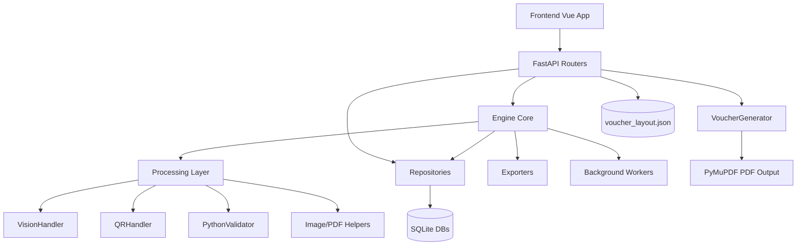

# 架構圖對照 (現況 vs 既有文件)

對照來源：

- `docs/backend_architecture.md` (VLM-First V2.1)
- `docs/pipeline.md` (VLM-First V2)
- 本次實際檔案與方法掃描結果

## 1) 目前掃描到的實作關係圖

## 2) 與既有文件是否對得上

| 對照項目 | 文件描述 | 掃描結果 | 結論 |
|---|---|---|---|
| API 層 (`backend/routers`) | 有多個路由模組 | 已掃描到 projects/files/jobs/processing/pdf/voucher/groups/config/suggestions/websocket 等 | 一致 |
| Engine 中樞 (`backend/engine/core.py`) | 有 Engine 協調流程 | 已掃描 `Engine` 類別與 worker、export、voucher 相關子模組 | 一致 |
| Processing 三段式 | VLM -> QR -> Validator | 已掃描 `VisionHandler`, `QRHandler`, `PythonValidator`, `ReceiptProcessor` | 一致 |
| Repository 層 | Project/Job/Suggestion/VoucherLayout | 已掃描四種 repository | 一致 |
| Voucher 支線流程 | API 直連 layout repo + voucher generator | 已掃描 `routers/voucher.py`, `voucher_layout_repo.py`, `voucher_generator.py` | 一致 |
| PDF 指令流程 | 有 PDF 引擎能力 | 已掃描 `processing/pdf_engine.py`、前端 `PdfWorkbench.vue` | 一致 |

## 3) 本次盤點觀察

- 架構主幹與現有文件描述高度一致。
- `frontend/node_modules` 佔多數檔案量，若只看業務程式應聚焦 `frontend/src`。
- voucher 流程在前後端都有明確模組分工，且與 `docs/pipeline.md` 中的子管線描述相符。

## 4) 建議的核對方式

1. 先看本資料夾 `module_method_inventory.md`。
2. 再對照 `docs/backend_architecture.md` 的分層圖。
3. 最後用 `python_symbols_inventory.txt` / `frontend_symbols_inventory.txt` 逐點抽查端點與方法名稱。
