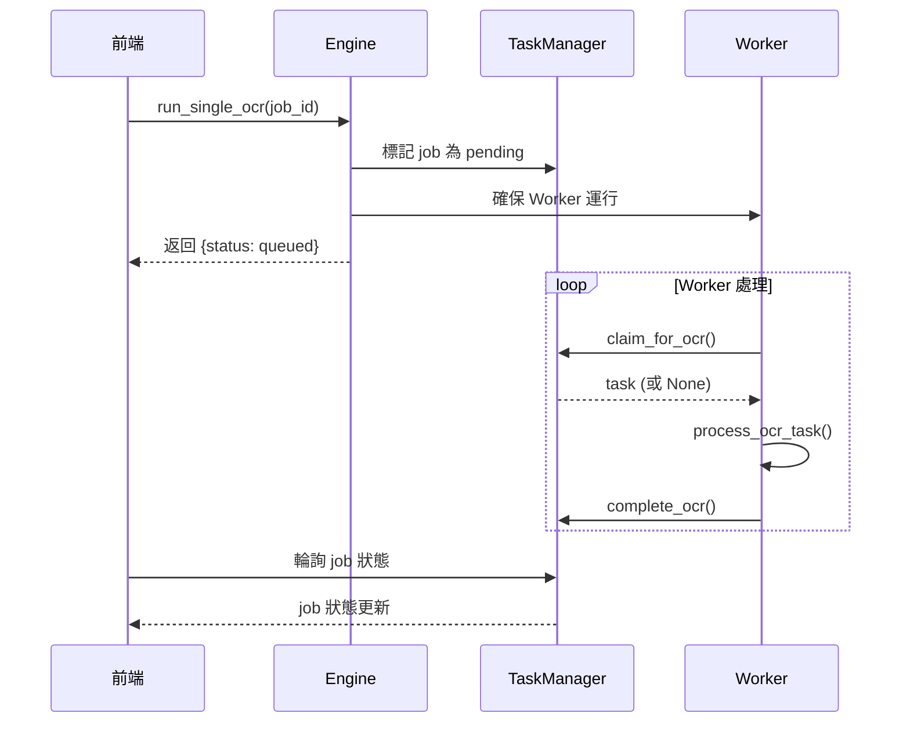
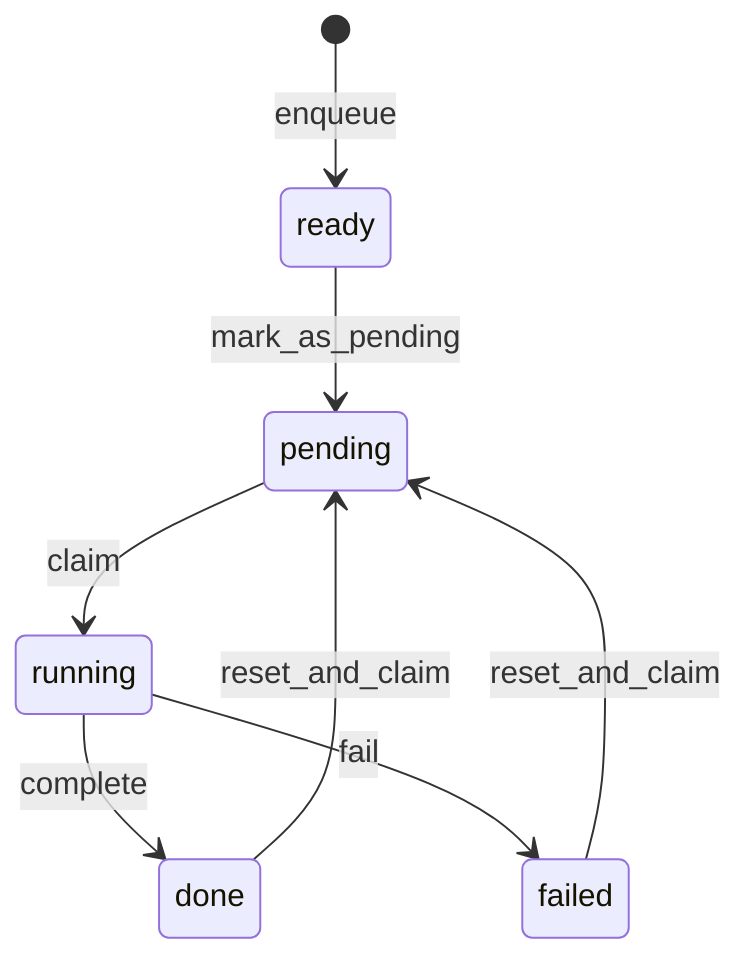

# Backend 架構分析報告

> **文檔版本**: 2024-12-14
> **目的**: 提供完整的後端架構分析，幫助開發者理解各模組功能與修改程式

## 目錄結構總覽

```
backend/
├── main.py                 # FastAPI 應用程式入口
├── engine/                 # 核心業務邏輯層
│   ├── core.py            # Engine 單例 - 系統核心協調器
│   ├── workers.py         # OCR/LLM 背景處理工作線程
│   ├── file_ops.py        # 檔案操作（分割、上傳、旋轉）
│   └── export.py          # 匯出功能 Facade
├── managers/              # 專案與任務管理層
│   ├── task_manager.py    # TaskManager Facade
│   ├── job_repository.py  # Job 資料存取層 (SQLite)
│   ├── job_state_machine.py # Job 狀態機邏輯
│   ├── project_manager.py # ProjectManager Facade
│   ├── project_crud.py    # 專案 CRUD 操作
│   └── project_setup.py   # 專案初始化設定
├── processing/            # 影像與文字處理層
│   ├── ocr_handler.py     # 基本 PaddleOCR 處理器
│   ├── ppstructure_handler.py # 增強型 OCR 處理器
│   ├── llm_handler.py     # LLM 文字校正與資料擷取
│   ├── receipt_splitter.py # 發票分割 Facade
│   ├── image_preprocessor.py # 影像預處理
│   ├── contour_validator.py # 輪廓驗證
│   └── perspective_transform.py # 透視變換
├── routers/               # API 路由層
│   ├── projects.py        # 專案相關 API
│   ├── files.py           # 檔案操作 API
│   ├── processing.py      # OCR/LLM 處理 API
│   ├── jobs.py            # Job 查詢 API
│   ├── correction.py      # 人工修正 API
│   └── groups.py          # 群組管理 API
└── utils/                 # 工具函數
    └── logger.py          # 日誌配置
```

---

## 1. Engine 層（核心業務邏輯）

### 1.1 core.py - Engine 單例

**設計模式**: Singleton + Facade

**職責**:
- 系統核心協調器，管理所有子系統
- 提供統一的 API 給 routers 調用
- 管理 OCR/LLM 工作線程的生命週期

**關鍵屬性**:
```python
class Engine:
    _instance = None  # 單例實例
    
    # 核心組件
    self.ocr_handler      # OCRHandler 或 PPStructureHandler
    self.llm_handler      # LLMHandler
    self.project_manager  # ProjectManager
    self.file_ops         # FileOps
    self.export_handler   # ExportHandler
    
    # 狀態管理
    self.task_managers: Dict[str, TaskManager]  # 每個專案一個
    self.tm_lock          # TaskManager 快取鎖
    self.ocr_worker_lock  # 全局 OCR 處理鎖
    self.llm_worker_lock  # 全局 LLM 處理鎖
```

**關鍵方法**:
| 方法 | 說明 |
|------|------|
| `get_task_manager(project_id)` | 取得專案的 TaskManager（單例快取） |
| `run_ocr(project_id)` | 啟動批次 OCR 處理 |
| `run_llm(project_id)` | 啟動批次 LLM 處理 |
| `run_single_ocr(project_id, job_id)` | 單一 Job OCR 處理 |
| `run_single_llm(project_id, job_id)` | 單一 Job LLM 處理 |
| `run_splitting(project_id)` | 執行發票分割 |

> [!IMPORTANT]
> **OCR 線程安全問題**：PaddleOCR 不是線程安全的。目前使用 `ocr_worker_lock` 確保跨專案也只有一個 OCR 任務同時處理。

---

### 1.2 workers.py - 背景工作線程

**職責**: 實際執行 OCR 和 LLM 處理的背景線程

**核心函數**:

#### `start_cpu_worker(tm, project_id, ocr_handler, global_lock)`
```
Worker 主迴圈:
while True:
    task = tm.claim_for_ocr()  ← 從佇列獲取任務
    if not task: break         ← 沒任務就結束
    process_ocr_task(...)      ← 處理任務
```

#### `process_ocr_task(tm, task, ocr_handler, global_lock)`
```
1. 讀取圖片
2. with global_lock:          ← 全局鎖確保線程安全
       執行 OCR 
3. tm.complete_ocr(...)       ← 回報完成
```

**重要設計決策**:
- Worker 通過 `claim_for_ocr()` 獲取任務（原子操作）
- 處理完成後通過 `complete_ocr()` 更新狀態
- Worker 結束條件：沒有可處理的任務

---

### 1.3 Single OCR/LLM 流程

> [!WARNING]
> **當前問題**: `run_single_ocr` 的實作可能存在問題，需要仔細驗證 Worker 是否正確啟動。

**預期流程**:


---

## 2. Managers 層（專案與任務管理）

### 2.1 TaskManager - Facade 模式

**設計模式**: Facade

**職責**: 整合 JobRepository 和 JobStateMachine 的功能

**組成**:
```python
class TaskManager:
    self._repository     # JobRepository - 資料存取
    self._state_machine  # JobStateMachine - 狀態轉換
    self.lock            # threading.Lock() - 線程安全
```

**關鍵方法分類**:

| 類別 | 方法 | 說明 |
|------|------|------|
| 佇列操作 | `enqueue()` | 新增 Job |
| | `claim_for_ocr()` | 獲取 OCR 任務 |
| | `claim_for_llm()` | 獲取 LLM 任務 |
| 狀態更新 | `complete_ocr()` | 完成 OCR |
| | `complete_llm()` | 完成 LLM |
| | `fail_job()` | 標記失敗 |
| 查詢 | `get_job()` | 取得單一 Job |
| | `list_jobs()` | 列出所有 Jobs |
| | `count_jobs()` | 統計 Jobs |

---

### 2.2 JobStateMachine - 狀態機

**職責**: 管理 Job 的狀態轉換邏輯

**狀態流程**:


**狀態定義**:
| 狀態 | 說明 |
|------|------|
| `ready` | 初始狀態，等待處理 |
| `pending` | 已排入佇列，等待 Worker |
| `running` | Worker 正在處理 |
| `done` | 處理完成 |
| `failed` | 處理失敗 |

**階段 (stage)**:
- `ocr`: OCR 處理階段
- `llm`: LLM 處理階段

---

### 2.3 JobRepository - 資料存取層

**職責**: 所有 SQLite CRUD 操作

**資料庫**: `{project_dir}/jobs.db`

**Jobs 表結構**:
```sql
CREATE TABLE jobs (
    job_id TEXT PRIMARY KEY,
    image_path TEXT,
    status TEXT,           -- ready/pending/running/done/failed
    stage TEXT,            -- ocr/llm
    ocr_result_json TEXT,  -- OCR 結果 JSON
    llm_result_json TEXT,  -- LLM 結果 JSON
    manual_ocr_text TEXT,  -- 人工修正文字
    created_at INTEGER,
    updated_at INTEGER,
    ocr_start_at INTEGER,
    ocr_done_at INTEGER,
    llm_start_at INTEGER,
    llm_done_at INTEGER,
    ...
);
```

---

## 3. Processing 層（影像與文字處理）

### 3.1 OCR Handler 比較

| 特性 | OCRHandler | PPStructureHandler |
|------|------------|-------------------|
| 套件 | PaddleOCR | PaddleOCR (增強配置) |
| 主方法 | `do_paddleocr()` | `process_receipt()` |
| 版面重建 | `reconstruct_layout()` | `ppstructure_to_markdown()` |
| 繁簡轉換 | ❌ | ✅ (OpenCC) |
| 表格識別 | ❌ | ⚠️ (API 不可用) |

**配置切換** (`config.json`):
```json
{
  "ocr_settings": {
    "engine": "ppstructure"  // 或 "basic"
  }
}
```

---

### 3.2 LLMHandler - LLM 處理器

**職責**: 使用 Ollama LLM 進行文字校正和資料擷取

**處理流程**:
```
input (OCR 文字)
    ↓
_correct_text()     ← 修正 OCR 錯誤、簡繁轉換
    ↓
_extract_data()     ← 提取結構化資料 (JSON)
    ↓
output {
    corrected_full_text: "...",
    structured_data: { supplier, invoice_id, items, ... }
}
```

**依賴**: Ollama 服務必須運行

---

### 3.3 ReceiptSplitter - 發票分割

**設計模式**: Facade

**子模組**:
- `ImagePreprocessor`: 灰階、濾波、Canny 邊緣檢測
- `ContourValidator`: 輪廓面積、形狀驗證
- `PerspectiveTransformer`: 透視變換校正

---

## 4. Routers 層（API 路由）

### 4.1 路由總覽

| 路由檔案 | 路徑前綴 | 說明 |
|---------|---------|------|
| `projects.py` | `/api/projects` | 專案 CRUD |
| `files.py` | `/api/projects/{id}/...` | 檔案操作 |
| `processing.py` | `/api/projects/{id}/...` | OCR/LLM 觸發 |
| `jobs.py` | `/api/projects/{id}/jobs` | Job 查詢 |
| `correction.py` | `/api/projects/{id}/jobs/{job_id}` | 人工修正 |
| `groups.py` | `/api/groups` | 群組管理 |

### 4.2 關鍵 API

```
POST /api/projects/{id}/split           → 分割發票
POST /api/projects/{id}/ocr             → 批次 OCR
POST /api/projects/{id}/llm             → 批次 LLM
POST /api/projects/{id}/jobs/{job_id}/ocr   → 單一 OCR
POST /api/projects/{id}/jobs/{job_id}/llm   → 單一 LLM
GET  /api/projects/{id}/jobs            → 列出 Jobs
```

---

## 5. 已知問題與待修復項目

### 5.1 Single OCR Worker 問題

> [!CAUTION]
> **問題描述**: 按下單一 OCR 按鈕後，前端沒有顯示狀態變化，後端日誌也沒有執行記錄。

**可能原因**:
1. `run_single_ocr` 中的 `tm._repository.update_job()` 可能沒有正確更新狀態
2. Worker 線程可能沒有正確啟動
3. `claim_for_ocr()` 可能因為狀態不符而無法獲取任務

**建議檢查點**:
```python
# core.py - run_single_ocr
with tm.lock:
    job = tm.get_job(job_id)  # ← 確認 job 存在
    tm._repository.update_job(...)  # ← 確認更新成功
    
# 確保啟動 Worker
thread_name = f"ocr-{project_id}"
if not any(t.name == thread_name ...):
    # ← 這裡應該啟動 worker
```

### 5.2 PaddleOCR 線程安全

目前解決方案：使用 `ocr_worker_lock` 全局鎖

但需確保：
1. 所有調用 `start_cpu_worker` 的地方都傳遞了這個鎖
2. 鎖不會導致死鎖

---

## 6. 修改指南

### 6.1 新增 OCR 引擎

1. 在 `processing/` 創建新的 handler 類
2. 實作 `process_receipt(image_array)` 方法
3. 在 `core.py` 的 `__init__` 中添加條件判斷
4. 更新 `config.json` 配置

### 6.2 新增 Job 狀態

1. 修改 `job_state_machine.py` 添加新的狀態轉換
2. 必要時修改 `job_repository.py` 的資料庫 schema
3. 更新前端對應的狀態顯示

### 6.3 新增 API

1. 在 `routers/` 中新增或修改路由檔案
2. 從 Engine 調用相應的方法
3. 在 `routers/__init__.py` 中 include 新路由

---

## 7. 測試建議

### 7.1 單元測試

```bash
cd backend
pytest tests/ -v
```

### 7.2 手動測試 OCR 流程

```python
# 直接測試 OCR handler
from backend.processing.ocr_handler import OCRHandler
from backend.utils.utils import cv_imread_chinese

handler = OCRHandler(config)
image = cv_imread_chinese("path/to/image.png")
result = handler.do_paddleocr(image)
text = handler.reconstruct_layout(result)
print(text)
```

### 7.3 驗證 Worker 執行

在 `workers.py` 中添加日誌：
```python
def start_cpu_worker(...):
    logger.info(f"[CPU Worker] 開始運行: {project_id}")  # ← 確認看到這行
```

---

## 附錄：配置檔案說明

### config.json

```json
{
  "project_manager_settings": {
    "global_db_path": "~/.ai_agent_lab/global_projects.db",
    "workspace_root": "~/.ai_agent_lab/projects"
  },
  "ocr_settings": {
    "engine": "ppstructure",  // "basic" 或 "ppstructure"
    "language": "chinese_cht",
    "use_angle_cls": true
  },
  "llm_settings": {
    "model_name": "qwen3:1.7b"
  },
  "text_processing": {
    "opencc_config": "s2twp"  // 簡體轉繁體(台灣)
  }
}
```
