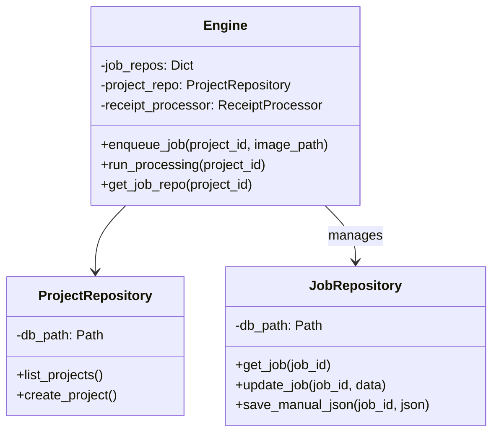
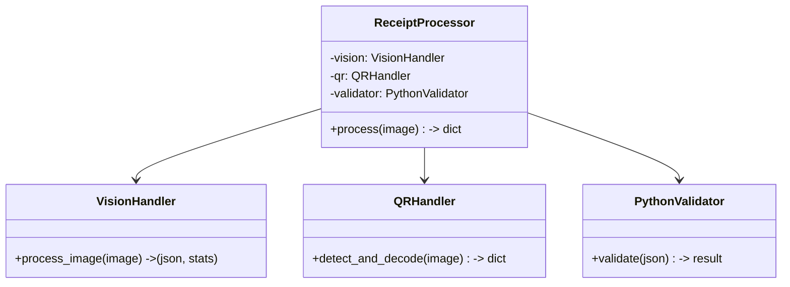

# 後端系統架構 (Backend Architecture)

> **版本**: VLM-First V2
> **更新日期**: 2026-02-17
> **狀態**: 已實作 (Implemented)

本文件描述 AI Agent Lab 的後端架構設計。系統採用 **VLM-First** 策略，以 LLM/VLM 為核心處理單元，大幅簡化傳統 OCR 流水線。

## 1. 系統分層 (Layered Architecture)

系統由上而下分為四層，各層職責分離，僅允許上層呼叫下層。

```mermaid
graph TD
    Client[Frontend / API Client] --> API[API Layer (FastAPI)]
    
    subgraph "Backend Core"
        API --> Engine[Engine Layer (Orchestrator)]
        
        Engine --> Repo[Repository Layer (Data Access)]
        Engine --> Proc[Processing Layer (Business Logic)]
        
        Proc --> Utils[Handlers (VLM/QR/Validator)]
    end
    
    Repo --> DB[(SQLite Databases)]
```

### 1.1 API Layer (`backend/routers/`)
- **職責**: 處理 HTTP 請求、參數驗證、權限控管。
- **主要模組**:
  - `projects.py`: 專案 CRUD。
  - `jobs.py`: 任務管理與狀態查詢。
  - `processing.py`: 觸發長時間運算。
  - `suggestions.py`, `config.py`: 輔助功能。

### 1.2 Engine Layer (`backend/engine/`)
- **職責**: 系統中樞，協調資源、管理佇列 (Queue)、並發控制。
- **核心元件**:
  - `Engine`: 單例模式 (Singleton)，持有所有 Repository 與 Processor 實例。
  - `Task Queue`: 記憶體中的任務佇列 (FIFO)。
  - `Global Worker`: 背景執行緒，負責從 Queue 取出任務並執行。

### 1.3 Repository Layer (`backend/repositories/`)
- **職責**: 資料持久化，隔離資料庫操作。
- **核心元件**:
  - `ProjectRepository`: 管理 `global_projects.db` (專案列表)。
  - `JobRepository`: 管理 `{project}/jobs.db` (單一專案的任務資料)。
  - `SuggestionRepository`: 管理 `backend/data/global.db` (建議詞庫)。

### 1.4 Processing Layer (`backend/processing/`)
- **職責**: 執行具體的影像處理與邏輯運算。
- **核心元件**:
  - `ReceiptProcessor`: 統一入口，串接 VLM -> QR -> Validator。
  - `VisionHandler`: 封裝 OpenAI Compatible API (Gemini/OpenRouter)。
  - `QRHandler`: 封裝 QReader 與 ZXing。
  - `PythonValidator`: 純程式邏輯驗算。

---

## 2. 核心類別設計 (Class Design)

### 2.1 Engine 與 Repository


### 2.2 Processing Pipeline


---

## 3. 資料流 (Data Flow)

### 3.1 任務處理流程
當使用者上傳圖片並啟動處理時：

1. **API**: 接收 `POST /run_processing`，呼叫 `Engine.run_processing()`。
2. **Engine**: 掃描專案下所有 `ready` 或 `failed` 的 Job，將其加入 `TaskQueue`。
3. **Worker**: 
   - 從 Queue 取出 `(project_id, job_id)`。
   - 透過 `JobRepo` 讀取圖片路徑。
   - 呼叫 `ReceiptProcessor.process(image)`。
4. **Processor**:
   - 呼叫 `VisionHandler` 取得初步 JSON。
   - 呼叫 `QRHandler` 嘗試讀取 QR (若有則覆蓋 JSON)。
   - 呼叫 `PythonValidator` 計算信心度。
5. **Worker**: 將最終結果寫回 `JobRepo` (更新 `jobs.db`)，並透過 `Engine` 發送 WebSocket 通知 (若有)。

---

## 4. 關鍵設計決策

| 決策 | 說明 | 優點 |
|---|---|---|
| **VLM-First** | 移除 OCR 前處理，直接送圖給 VLM | 簡化流程、提高模糊字跡辨識率、支援多語言。 |
| **分散式 DB** | 每個專案一個 SQLite (`jobs.db`) | 避免單一大檔鎖定、方便專案攜帶/封存。 |
| **Global Worker** | 單一執行緒處理所有專案任務 | 避免 API Rate Limit (Gemini 免費版限制)、降低記憶體消耗。 |
| **Hybrid Validation** | 結合 QR Code (絕對準確) 與 VLM (模糊推論) | 在保證電子發票準確度的同時，保留處理手寫收據的彈性。 |
