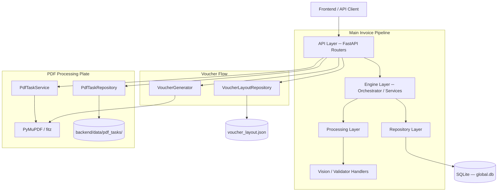
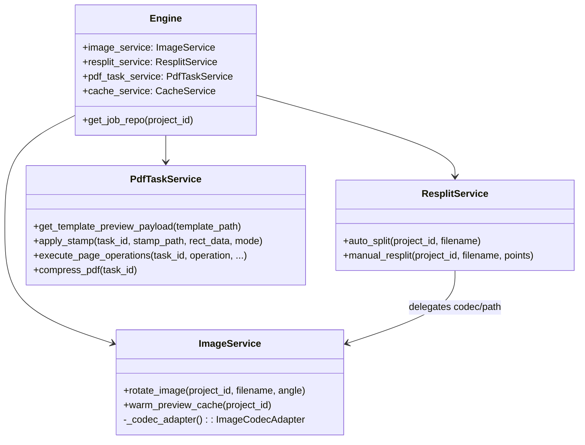
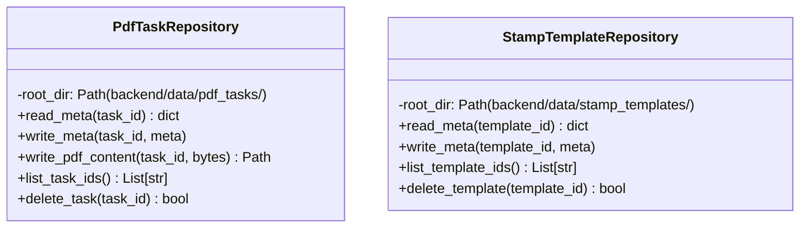
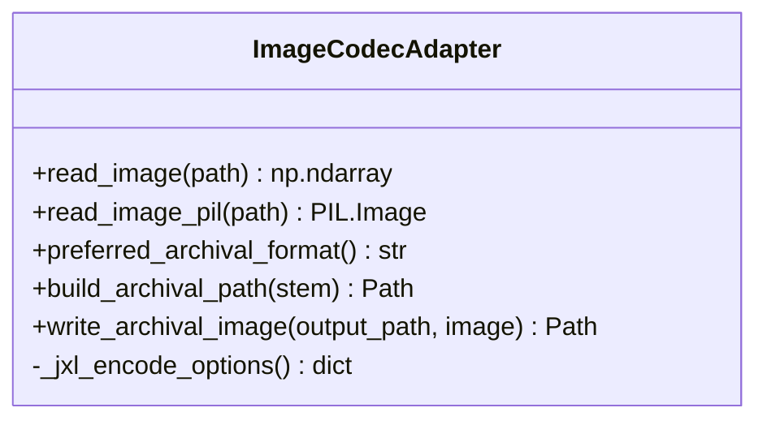

# 後端系統架構 (Backend Architecture)

> **版本**: VLM-First V2.5 (v0.0.25 Architecture Redesign)
> **更新日期**: 2026-05-23
> **狀態**: 已實作 (Implemented)

本文件描述 AI Agent Lab 的後端架構設計。v0.0.25 完成了 **嚴格 3 層邊界強制**重構，消除所有 `cv2`/`numpy`/`fitz` 從 Router 層的直接引用，並建立專職服務類別。

---

## 1. 系統分層 (Layered Architecture)



### 1.1 API Layer (`backend/routers/`)
**職責**: 處理 HTTP 請求、參數驗證、回應序列化。**不得**直接引用 `cv2`、`numpy`、`fitz`。

| 模組 | 用途 |
|---|---|
| `projects.py` | 專案 CRUD、metadata 更新 |
| `files.py` | 原始檔增刪、旋轉 preview；透過 `ImageService` |
| `jobs.py` | Job 查詢、刪除、人工 JSON 儲存、單筆重跑 |
| `processing.py` | split、VLM 處理、Excel/Word 匯出、封存 |
| `pdf_tasks.py` | PDF 上傳/蓋章/頁面操作；**透過 `PdfTaskService`** |
| `voucher.py` | 模板、草稿、圖片 & PDF 產出；PyMuPDF 呼叫下移至 `PdfTaskService` |
| `stamps.py` | 印章人員 CRUD |
| `groups.py` | 群組 CRUD（舊版相容保留）|
| `suggestions.py` | Autocomplete 詞彙庫 |
| `config.py` | 系統設定讀寫 |
| `websocket.py` | 即時狀態推播 |

### 1.2 Engine Layer (`backend/engine/`)
**職責**: 系統中樞，協調資源、管理佇列、背景處理、影像轉碼與 PDF 業務邏輯。

| 元件 | 說明 |
|---|---|
| `core.py` — `Engine` | 單例，持有 repository、processor、及所有 Service 實例 |
| `image_service.py` — `ImageService` | 旋轉、預覽快取 warm-up；**不含分割邏輯** |
| `resplit_service.py` — `ResplitService` | 自動分割 & 手動二切邏輯 (≤500 行) |
| `image_codec_adapter.py` — `ImageCodecAdapter` | JXL/JPG/PNG 轉碼選擇器（已從 `processing/` 移入本層）|
| `pdf_task_service.py` — `PdfTaskService` | 所有 PDF 業務邏輯：頁面操作、蓋章、壓縮 |
| `cache_service.py` — `CacheService` | 預覽快取生命週期管理 |
| `voucher_generator.py` — `VoucherGenerator` | 憑證 PDF 合成（PyMuPDF）|
| `excel_exporter.py` | openpyxl 匯出（已移除 pandas/xlsxwriter）|
| `word_exporter.py` | docx 報表產出 |
| `workers.py` | 背景 worker loop |
| `archive_handler.py` | 封存邏輯 |

### 1.3 Repository Layer (`backend/repositories/`)
**職責**: 資料持久化，隔離資料庫與 JSON 檔案系統操作。

| 元件 | 儲存媒介 |
|---|---|
| `project_repository.py` — `ProjectRepository` | SQLite `global.db` |
| `job_repository.py` — `JobRepository` | SQLite `global.db`（`flattened_data` 欄位已移除）|
| `voucher_layout_repo.py` — `VoucherLayoutRepository` | `voucher_layout.json` |
| `pdf_task_repo.py` — `PdfTaskRepository` | `backend/data/pdf_tasks/<id>/` JSON + PDF |
| `stamp_template_repo.py` — `StampTemplateRepository` | `backend/data/stamp_templates/<id>/` JSON |
| `stamp_repository.py` | SQLite `global.db` Stamp 表 |
| `person_repository.py` | SQLite `global.db` Person 表 |
| `suggestion_repository.py` | SQLite `global.db` Suggestion 表 |

### 1.4 Processing Layer (`backend/processing/`)
**職責**: 執行收據辨識與驗證業務邏輯。**不得**包含 file I/O 或服務協調邏輯。

| 元件 | 說明 |
|---|---|
| `ReceiptProcessor` | 統一入口：VLM → Validator |
| `VisionHandler` | 封裝 Gemini / OpenAI Compatible API |
| `PythonValidator` | 純程式邏輯驗算 |
| `jxl_encoder_backend.py` | JXL bytes 編碼（已去除 file write，回傳 raw bytes）|

> [!IMPORTANT]
> `image_codec_adapter.py` 已從 `backend/processing/` **移至** `backend/engine/`，因為它含有 file write 行為，屬於 Service 層職責。

---

## 2. 前端視圖板塊分組 (Frontend Plates)

v0.0.25 將前端視圖重組為兩大板塊，消除孤立的設定頁面：

### 2.1 發票板塊 (Invoice Plate)
- `LandingView` → `HomeView` → `CreateProjectView`
- `ProjectDetailView`（含內嵌 `ProjectSettingsModal`）
- `VoucherEditorView`（含右側 Metadata 修改 Sidebar）
- `StampsManagementView`（含內嵌 StampAssignDialog）

### 2.2 PDF 處理板塊 (PDF Processing Plate)
- `PdfTasksView`
- `PdfTaskEditorView`
- `SettingsView`

### 2.3 已刪除的孤立視圖
下列視圖已整合進主視圖並刪除：

| 已刪除視圖 | 整合去向 |
|---|---|
| `StampSourceUploadView.vue` | → `StampsManagementView` 內嵌 Modal |
| `StampZoneConfigView.vue` | → `StampsManagementView` 內嵌 Zone 設定 |
| `EditProjectView.vue` | → `ProjectDetailView` + `ProjectSettingsModal` |
| `VoucherTemplateConfigView.vue` | → `SettingsView` 整合 |
| `JobEditorView.vue` | → `VoucherEditorView` 右側 Sidebar |

---

## 3. 核心類別設計 (Class Design)

### 3.1 Engine 與 Service 層關係


### 3.2 Repository 層 — 新增 JSON 倉庫


### 3.3 ImageCodecAdapter（已移至 engine 層）


---

## 4. 資料流 (Data Flow)

### 4.1 發票處理主線
```
Upload → [files.py] → engine.ingest()
Split  → [processing.py] → ResplitService.auto_split()
VLM    → [processing.py] → ReceiptProcessor.process()
Export → [processing.py] → ExcelExporter / WordExporter
Voucher→ [voucher.py] → VoucherGenerator.generate_from_layout()
```

### 4.2 PDF 處理支線
```
Upload  → [pdf_tasks.py] → PdfTaskRepository.write_pdf_content()
Stamp   → [pdf_tasks.py] → PdfTaskService.apply_stamp()
Pages   → [pdf_tasks.py] → PdfTaskService.execute_page_operations()
Download→ [pdf_tasks.py] → FileResponse from PdfTaskRepository
```

### 4.3 憑證 Sidebar 快速修改流程（v0.0.25 新增）
```
ProjectDetailView → editJob(job) → navigate(/voucher-editor?editJobId=xxx)
VoucherEditorView.onMounted → route.query.editJobId
    → openMetadataEditor(invoice)   // 自動開啟右側 Sidebar
    → 切換至含該 job 的頁面
```

---

## 5. 邊界守則 (Layer Boundary Rules)

| 層 | 允許 import | 禁止 import |
|---|---|---|
| `routers/` | `engine.*`, `repositories.*`, `dependencies.*`, `models.*` | `cv2`, `numpy`, `fitz`, `PIL` |
| `engine/` | `repositories.*`, `processing.*`, `utils.*` | `routers.*` |
| `processing/` | `utils.*` | `engine.*`, `repositories.*`, `routers.*` |
| `repositories/` | `database.*`, standard library | `engine.*`, `routers.*`, `processing.*` |

---

## 6. 關鍵設計決策

| 決策 | 說明 | 優點 |
|---|---|---|
| **VLM-First** | 移除 OCR 前處理，直接送圖給 VLM | 簡化流程、支援模糊字跡與多語言 |
| **嚴格 3 層邊界** | Router 零 cv2/numpy/fitz | 可測試性 ↑、維護成本 ↓ |
| **ResplitService** | 分割邏輯從 ImageService 獨立 | 職責單一、\<500 行 |
| **PdfTaskService** | PDF 操作集中於 Engine 層 | Router 不再 import fitz |
| **ImageCodecAdapter 移位** | 從 processing/ → engine/ | file write 行為歸屬正確層次 |
| **JXL encode → raw bytes** | jxl_encoder_backend 只回傳 bytes | 無副作用、易測試 |
| **openpyxl 取代 pandas** | excel_exporter 改純原生 | 移除 pandas/xlsxwriter 重依賴 |
| **前端板塊整合** | 5 個孤立視圖合入主視圖 | 減少頁面切換、UX 一致性 ↑ |
| **Voucher Draft as JSON** | 草稿獨立存成 `voucher_layout.json` | autosave 簡單、可人工檢查 |
| **分散式 DB** | 每個專案一個 SQLite | 降低鎖定風險、方便封存 |
