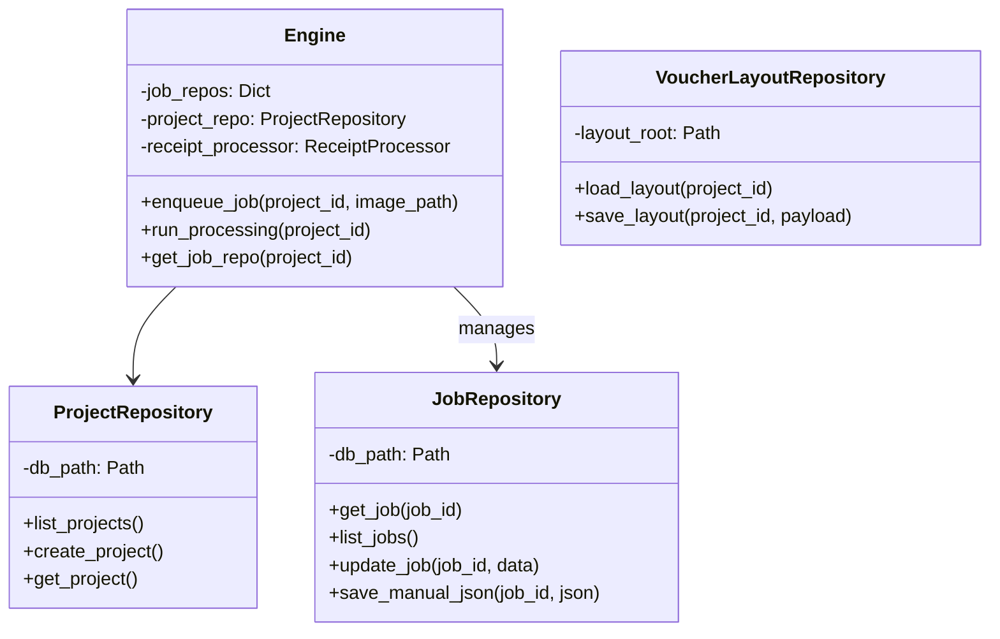
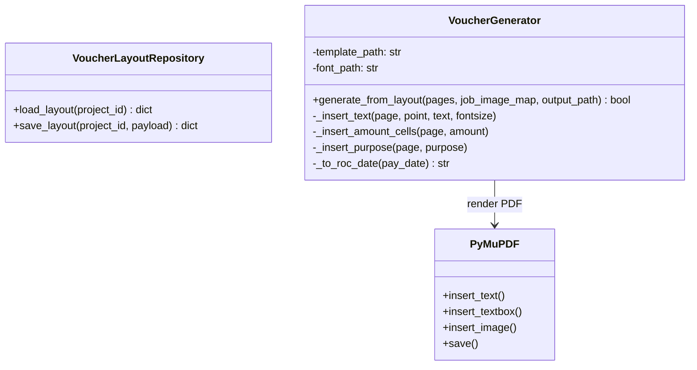

# 後端系統架構 (Backend Architecture)

> **版本**: VLM-First V2.1
> **更新日期**: 2026-03-07
> **狀態**: 已實作 (Implemented)

本文件描述 AI Agent Lab 的後端架構設計。系統目前除了主線 VLM 流水線，也包含 PDF 處理、Voucher Editor 排版草稿與憑證 PDF 產出能力。

## 1. 系統分層 (Layered Architecture)

系統由上而下分為四層；其中 Voucher Editor 是一條偏向「API 直連 repository / renderer」的支線，因為它主要處理草稿儲存與靜態 PDF 生成，而非背景佇列任務。

```mermaid
graph TD
    Client[Frontend / API Client] --> API[API Layer (FastAPI)]

    subgraph "Main Pipeline"
        API --> Engine[Engine Layer (Orchestrator)]
        Engine --> Repo[Repository Layer]
        Engine --> Proc[Processing Layer]
        Proc --> Utils[Vision / QR / Validator Handlers]
    end

    subgraph "Voucher Flow"
        API --> VoucherRepo[VoucherLayoutRepository]
        API --> VoucherGen[VoucherGenerator]
        VoucherGen --> PyMuPDF[PyMuPDF / fitz]
    end

    Repo --> DB[(SQLite Databases)]
    VoucherRepo --> LayoutJson[(voucher_layout.json)]
```

### 1.1 API Layer (`backend/routers/`)
- **職責**: 處理 HTTP 請求、參數驗證、權限控管、序列化回應。
- **主要模組**:
  - `projects.py`: 專案 CRUD、metadata、舊版 voucher PDF 下載。
  - `files.py`: 原始檔增刪、旋轉、列舉。
  - `jobs.py`: Job 查詢、刪除、人工 JSON 儲存、單筆重跑。
  - `processing.py`: split、VLM 處理、Excel/Word 匯出、封存。
  - `groups.py`: 群組 CRUD。
  - `correction.py`: 人工文字修正。
  - `pdf.py`: PDF 上傳、命令式 PDF 重組、下載。
  - `voucher.py`: 模板、草稿、字型、圖片與 PDF 產出。
  - `suggestions.py`, `config.py`: 輔助功能。
  - `websocket.py`: 即時專案狀態推播。

### 1.2 Engine Layer (`backend/engine/`)
- **職責**: 系統中樞，協調資源、管理佇列、背景處理與跨模組調度。
- **核心元件**:
  - `Engine`: 單例模式，持有 repository、processor、匯出與 PDF 相關能力。
  - `Task Queue`: 記憶體中的任務佇列 (FIFO)。
  - `Global Worker`: 背景工作執行緒，負責處理長任務。
  - `VoucherGenerator`: 位於 `engine/`，但由 `voucher.py` 直接呼叫，負責 PyMuPDF PDF 合成。

### 1.3 Repository Layer (`backend/repositories/`)
- **職責**: 資料持久化，隔離資料庫與檔案系統操作。
- **核心元件**:
  - `ProjectRepository`: 管理 `global_projects.db`。
  - `JobRepository`: 管理各專案 `jobs.db`。
  - `SuggestionRepository`: 管理建議詞庫。
  - `VoucherLayoutRepository`: 管理 `voucher_layout.json` 草稿檔。

### 1.4 Processing Layer (`backend/processing/`)
- **職責**: 執行收據辨識與驗證業務邏輯。
- **核心元件**:
  - `ReceiptProcessor`: 統一入口，串接 VLM -> QR -> Validator。
  - `VisionHandler`: 封裝 OpenAI Compatible API。
  - `QRHandler`: 處理 QR 解碼。
  - `PythonValidator`: 純程式邏輯驗算。

---

## 2. 核心類別設計 (Class Design)

### 2.1 Engine 與 Repository


### 2.2 Processing Pipeline


### 2.3 Voucher 生成類別圖


---

## 3. 資料流 (Data Flow)

### 3.1 任務處理流程
當使用者上傳圖片並啟動 VLM 處理時：

1. **API**: 接收 `POST /projects/{project_id}/run_processing`。
2. **Engine**: 掃描專案下 `ready` 或 `failed` 的 Job，加入 `TaskQueue`。
3. **Worker**:
   - 從 Queue 取出 `(project_id, job_id)`。
   - 透過 `JobRepository` 讀取圖片與任務資訊。
   - 呼叫 `ReceiptProcessor.process(image)`。
4. **Processing Layer**:
   - `VisionHandler` 產出初步 JSON。
   - `QRHandler` 覆蓋可驗證欄位。
   - `PythonValidator` 計算驗證結果與 confidence。
5. **Engine / Repo**: 寫回 `jobs.db`，並提供 WebSocket 輪詢讀取。

### 3.2 Voucher 生成流程
當使用者在 Voucher Editor 儲存草稿或產出 PDF 時：

1. **Frontend** 以 `/api/voucher/{project_id}/layout` autosave 草稿。
2. **VoucherLayoutRepository** 將 payload 寫入 `voucher_layout.json`。
3. **Frontend** 點擊產出後，以 `/api/voucher/{project_id}/generate` 送出 strict payload。
4. **voucher.py**:
   - 透過 `Engine.get_job_repo()` 驗證 `jobId` 是否屬於該專案。
   - 建立 `job_image_map`。
   - 呼叫 `VoucherGenerator.generate_from_layout()`。
5. **VoucherGenerator** 以 PyMuPDF 將模板、欄位文字與發票圖片合成為 PDF。
6. **API** 直接回傳 `FileResponse`，由瀏覽器下載。

---

## 4. 關鍵設計決策

| 決策 | 說明 | 優點 |
|---|---|---|
| **VLM-First** | 移除 OCR 前處理，直接送圖給 VLM | 簡化流程、提高模糊字跡辨識率、支援多語言 |
| **分散式 DB** | 每個專案一個 SQLite (`jobs.db`) | 降低鎖定風險、方便專案封存 |
| **Global Worker** | 單一背景 worker 處理多專案任務 | 降低 API rate limit 風險與記憶體壓力 |
| **Hybrid Validation** | 結合 QR 與 VLM | 電子發票準確度與手寫收據彈性兼具 |
| **Voucher Draft as JSON** | 憑證排版草稿獨立存成 `voucher_layout.json` | 前端 autosave 簡單、可直接人工檢查與回溯 |
| **Voucher PDF by PyMuPDF** | 以模板 PDF + 座標式文字/圖片合成 | 可穩定控制欄位落點，與前端 Canvas 預覽對齊 |
