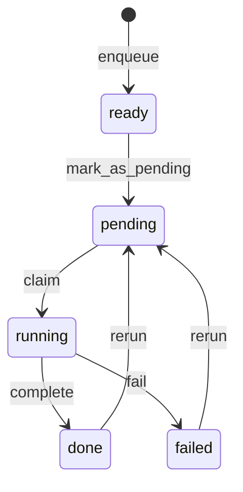

# 資料庫結構說明

> 更新日期: 2024-12-19

## 概述

每個專案目錄下有獨立的 `jobs.db` SQLite 資料庫，用於追蹤所有處理任務。

---

## jobs 表

| 欄位 | 型別 | 說明 |
|------|------|------|
| `job_id` | TEXT PK | 任務唯一識別碼 |
| `image_path` | TEXT NOT NULL | 發票圖片路徑 |
| `status` | TEXT NOT NULL | 狀態：`ready` / `pending` / `running` / `done` / `failed` |
| `stage` | TEXT NOT NULL | 階段：`ocr` / `llm` |
| `ocr_result_json` | TEXT | OCR 處理結果（JSON） |
| `llm_result_json` | TEXT | LLM 處理結果（JSON） |
| `ocr_stats` | TEXT | OCR 效能統計（JSON） |
| `llm_stats` | TEXT | LLM 效能統計（JSON 陣列） |
| `manual_ocr_text` | TEXT | 人工修正文字 |
| `manual_updated_at` | REAL | 人工修正時間戳 |
| `created_at` | REAL | 建立時間 |
| `updated_at` | REAL | 更新時間 |

### 狀態流程

---

## events 表

| 欄位 | 型別 | 說明 |
|------|------|------|
| `id` | INTEGER PK | 自增主鍵 |
| `job_id` | TEXT | 關聯的 job_id |
| `event_type` | TEXT | 事件類型 |
| `ts` | REAL | 時間戳 |
| `payload` | TEXT | 事件附加資料（JSON） |

---

## 索引

- `idx_jobs_status` ON jobs(status)
- `idx_events_job` ON events(job_id)
