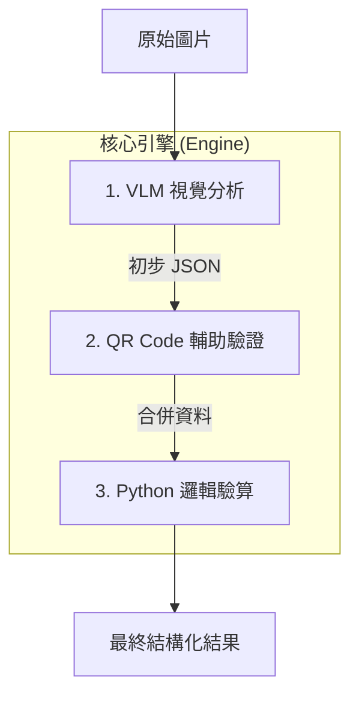
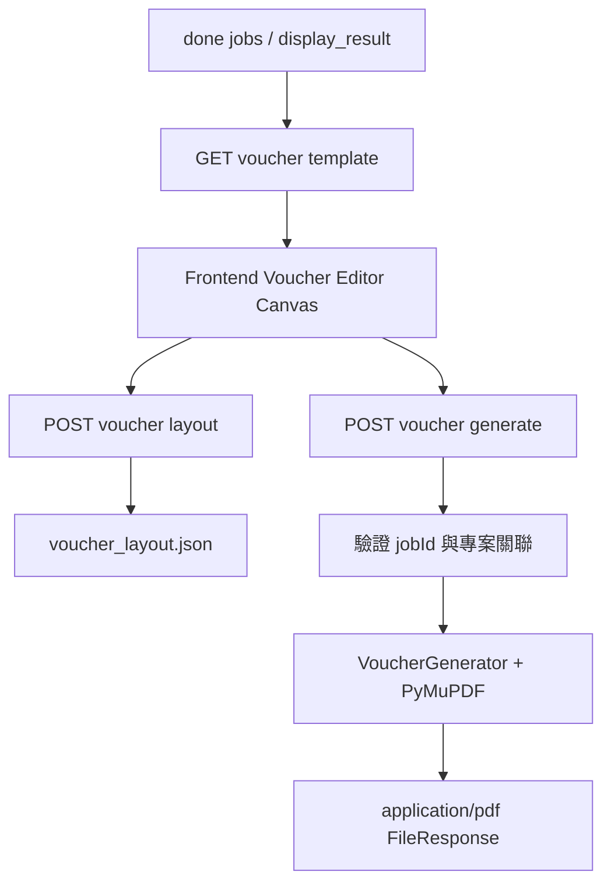

# 收據處理流程 (Processing Pipeline)

> **版本**: VLM-First V2
> **策略**: High Trust, Verify Later

本專案採用 **VLM-First** 架構，核心理念是利用大型視覺語言模型 (如 Gemini 2.5 Flash Lite) 的強大理解能力，一次性完成 OCR、版面分析與語意理解，再透過傳統程式碼進行邏輯驗證。

---

## 1. 流程總覽

處理流程已從過去複雜的分流架構大幅簡化為 **單一直線流程**：

---

## 2. 詳細步驟

### Step 1: VLM 視覺分析 (VisionHandler)
**核心處理器**。直接將整張收據圖片送入 VLM 模型。

- **輸入**: 原始圖片 (Base64 編碼)
- **Prompt**: 要求模型識別 Header, Items, Summary，並輸出標準 JSON。
- **模型**: 預設使用 `gemini-2.5-flash-lite` (速度快、成本低、支援繁體中文)。
- **輸出**: 包含收據類型、日期、統編、品項明細的初步 JSON。

> **Thinking Mode**: 針對字跡潦草的手寫收據，可透過設定 `reasoning_effort` 開啟模型的思考模式，增強辨識率。

### Step 2: QR Code 輔助驗證 (QRHandler)
**輔助校正**。針對電子發票，利用 QR Code 的高可靠性來校正 VLM 可能的幻覺。

- **觸發條件**: 全面掃描 (即使 VLM 判斷非電子發票也會嘗試掃描)。
- **邏輯**:
  - 若偵測到 QR Code，將解碼出的 **發票號碼**、**日期**、**總金額** 視為「絕對真理」。
  - 強制覆蓋 VLM 輸出的對應欄位。
  - 標記 `qr_verified: true`。

### Step 3: Python 邏輯驗算 (PythonValidator)
**品質把關**。使用純程式邏輯對最終 JSON 進行評分。

- **驗算項目**:
  1. **數學恆等式**: `Items 加總` 是否等於 `Summary 總金額`？
  2. **必填欄位**: 日期、發票號碼、商家名稱是否存在？
  3. **格式檢查**: 日期格式是否為 YYYY-MM-DD？
- **信心度評分 (Confidence Score)**:
  - 綜合考量：欄位完整性 (30%) + 數學正確性 (30%) + 格式 (10%) + OCR/來源 (30%)。
  - 分數 < 0.6 或發現邏輯矛盾時，會在 UI 標示警告。

---

## 3. 處理狀態 (Running States)

任務 (Job) 在系統中會經歷以下狀態：

| 狀態 | 說明 |
|---|---|
| `ready` | 圖片已上傳，等待處理 (佇列中) |
| `running` | Worker 正在執行上述三步驟 |
| `done` | 處理成功，已產生 JSON 與驗算報告 |
| `failed` | 處理過程發生例外 (如 VLM API 逾時、圖片損壞) |
| `human_correct` | 經人工在前端介面確認或修正過 |

---

## 4. 錯誤處理與重試

- **VLM 失敗**: 若 API 呼叫失敗，系統會自動重試 (預設 3 次)，若仍失敗則標記 Job 為 `failed` 並記錄錯誤訊息。
- **QR 失敗**: 若無法讀取 QR Code，僅會在 Log 顯示警告，**不會** 中斷流程，系統將退回純 VLM 模式。
- **驗算失敗**: 即使邏輯驗算發現錯誤 (如金額不符)，Job 狀態仍會是 `done`，但在前端會顯示 **紅色警告** 提示人工介入。

---

## 5. 憑證黏貼管線 (Voucher Pipeline)

Voucher Editor 是建立在主處理流程完成之後的後段子管線，負責把已完成辨識的發票排入憑證模板，並產出正式 PDF。

### 5.1 流程步驟

1. **載入模板與發票來源**
  - 前端呼叫 `GET /api/voucher/{project_id}/template`。
  - 後端回傳模板 PNG 預覽與所有 `done` 狀態發票。

2. **前端排版與欄位計算**
  - 使用者在 Canvas 放置發票圖片。
  - 前端依發票資料自動計算 `amount`、`payDate`、`purpose`、`receiptCount`、`voucherNo`。
  - 文字預覽以 KaiU 字型與 PDF 座標對齊。

3. **草稿儲存**
  - 前端透過 `POST /api/voucher/{project_id}/layout` autosave。
  - 後端把草稿存到 `voucher_layout.json`。

4. **PDF 產出**
  - 前端送出 `VoucherLayoutPayloadStrict` 到 `POST /api/voucher/{project_id}/generate`。
  - 後端驗證每個 `jobId` 屬於該專案，並把空白頁排除在外。
  - `VoucherGenerator` 將模板、字型、欄位文字與發票圖片合成 PDF。

5. **下載與人工核對**
  - API 回傳 `application/pdf` 檔案串流。
  - 使用者在瀏覽器下載檔案，並比對 Canvas 預覽與實際輸出。

### 5.2 子管線的設計重點

| 設計點 | 說明 |
|---|---|
| **模板來源** | 固定使用 `backend/assets/templates/憑證黏貼用紙.pdf` |
| **字型一致性** | 前後端共用 `kaiu.ttf`，避免預覽與輸出字寬不同 |
| **草稿與正式輸出分離** | layout autosave 可接受空欄位；generate 則走 strict 驗證 |
| **專案授權檢查** | `generate` 會重新確認每個 `jobId` 是否屬於該專案 |
| **輸出方式** | 直接回傳 PDF `FileResponse`，不再依賴 JSON 檔名回應 |
