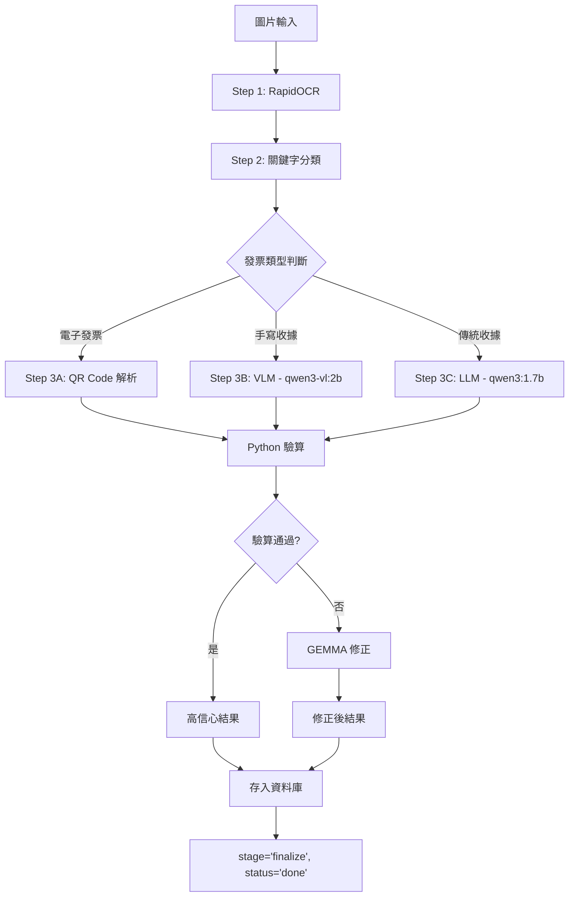
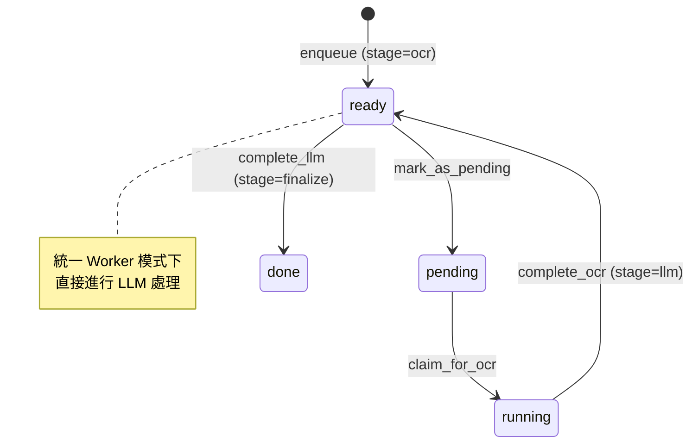
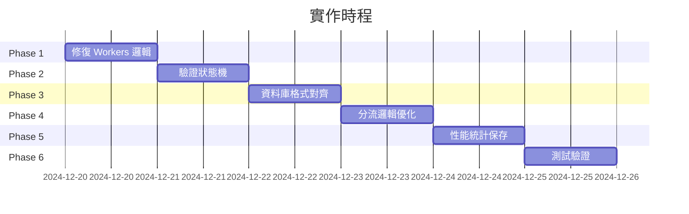

# 收據管線改進計畫

> 更新日期: 2024-12-20
> 狀態: 待執行

## 問題摘要

經過分析 `docs` 和 `backend` 目錄，發現以下問題需要解決：

| 問題 | 位置 | 影響 |
|------|------|------|
| **Workers 資料檢查錯誤** | `workers.py:94` | 檢查 `data` 而非 `llm_result`，導致有效結果被判定為空 |
| **狀態機未正確推進** | `workers.py` | OCR 完成後 stage 停留在 `ocr`，未進入 `llm` |
| **資料庫儲存不符規範** | 多處 | `llm_result_json` 包含不符合 `json_schema.md` 的欄位 |
| **信心值未正確保存** | `receipt_processor.py` | `audit.confidence` 未正確傳遞到資料庫 |

---

## 目標架構



---

## 詳細修改方案

### Phase 1: 修復 Workers 資料處理邏輯

> [!CAUTION]
> 這是最關鍵的問題，導致所有處理結果被判定為失敗

#### 1.1 修正 `workers.py` 空結果檢查

**問題**: 第 94 行檢查 `result.get("data")` 但新格式使用 `result.get("llm_result")`

**當前代碼**:
```python
# workers.py:94
if not result.get("data") or result.get("data") == {}:
    # 記錄 OCR 結果
    ...
    tm.fail_job(job_id, "VLM 識別結果為空")
```

**修正為**:
```python
# 檢查 llm_result 而非 data
llm_result = result.get("llm_result", {})
if not llm_result or llm_result == {}:
    # 只有真的沒有 llm_result 時才失敗
    ...
```

#### [MODIFY] [workers.py](file:///c:/Users/tange/OneDrive/Desktop/all%20project/py%20for%20NKNU%20GA/AI_AGENT_LAB/backend/engine/workers.py)

- 修正第 80-104 行的結果檢查邏輯
- 使用 `llm_result` 判斷處理成功與否
- 確保 `ocr_result` 和 `llm_result` 都正確傳遞

---

### Phase 2: 修復狀態機流程

> [!IMPORTANT]
> 確保 OCR 完成後正確推進到 LLM 階段

#### 2.1 驗證 `complete_ocr()` 行為

**當前行為**: `complete_ocr()` 正確設定 `stage='llm'`, `status='ready'`

**驗證點**:
- 確認 `advance_to_stage_llm=True` 時 stage 改為 `llm`
- 確認 status 改為 `ready` 等待下一階段

#### 2.2 驗證 `complete_llm()` 行為

**當前行為**: `complete_llm()` 設定 `stage='finalize'`, `status='done'`

**驗證點**:
- 確認 `mark_final=True` 時 status 改為 `done`
- 確認 stage 改為 `finalize`

#### 狀態流程圖（應當）:



---

### Phase 3: 資料庫儲存規範對齊

#### 3.1 `ocr_result_json` 格式

根據 `json_schema.md` 規範：

```typescript
interface OcrResult {
    text: string;    // reconstruct_layout 後的純文字
    type: string;    // 收據類型：電子發票 | 免用統一發票收據 | 其他收據
}
```

**當前問題**: 目前儲存了 `blocks`, `block_count`, `char_count` 等額外欄位

**修正**: 簡化 `ocr_result` 只包含 `text` 和 `type`

#### [MODIFY] [receipt_processor.py](file:///c:/Users/tange/OneDrive/Desktop/all%20project/py%20for%20NKNU%20GA/AI_AGENT_LAB/backend/processing/receipt_processor.py)

修改 `_create_success_result()`:

```python
# 精簡 OCR result 符合 json_schema.md
ocr_result = {
    "text": self.ocr_handler.to_plain_text(ocr_raw) if ocr_raw else "",
    "type": receipt_type.value  # electronic | handwritten | other
}
```

#### 3.2 `llm_result_json` 格式

根據 `json_schema.md` 規範：

```typescript
interface LlmResult {
    receipt_type: "電子發票" | "免用統一發票收據" | "其他收據";
    qr_decode?: { ... };  // 電子發票專用
    header: { supplier?, buyer?, invoice_id?, date? };
    items: Array<{ name, qty, price, total }>;
    summary: { total };
    verification?: { handwritten_total_chinese?, stamp_shop_name? };
    audit: {
        confidence: number;  // 0-1
        issues: string[];
        corrections: Array<{ source, timestamp, description? }>;
    };
}
```

**修正點**:
- 確保 `receipt_type` 使用中文值
- 確保 `audit.confidence` 正確保存
- 移除不在規範中的欄位

---

### Phase 4: 分流邏輯優化

#### 4.1 處理器對照表

| 收據類型 | 判斷條件 | 處理器 | 模型 |
|----------|----------|--------|------|
| 電子發票 | QR Code 存在 | `QRHandler` | - |
| 手寫收據 | 免用統一發票、大寫中文數字 | `VisionHandler` | qwen3-vl:2b |
| 傳統收據 | 統一發票、統一編號 | `LLMHandler` | qwen3:1.7b |

#### 4.2 分類優先級

```python
# keyword_classifier.py 優先級
1. 電子發票（有 QR Code）→ QR 解析
2. 手寫收據（免用統一發票）→ VLM
3. 其他收據 → LLM
```

---

### Phase 5: 性能統計保存

#### 5.1 `ocr_stats` 格式

```json
{
    "engine": "rapidocr",
    "language": "chinese_cht",
    "total_time_s": 2.505,
    "text_blocks_count": 28,
    "started_at": 1703001234,
    "completed_at": 1703001236
}
```

#### 5.2 `llm_stats` 格式（陣列）

```json
[
    {
        "stage": "primary",
        "processor": "VLM",
        "model": "qwen3-vl:2b",
        "total_time_s": 22.92,
        "ttft_s": 8.08,
        "prompt_tokens": 2294,
        "prompt_time_s": 3.95,
        "prompt_speed_tps": 580.4,
        "generation_tokens": 1573,
        "generation_time_s": 14.44,
        "generation_speed_tps": 108.9,
        "started_at": 1703001236,
        "completed_at": 1703001259
    },
    {
        "stage": "correction",
        "processor": "GEMMA",
        "model": "gemma3:4b",
        "total_time_s": 16.3,
        "issues_count": 2,
        "started_at": 1703001259,
        "completed_at": 1703001275
    }
]
```

---

## 實作順序



---

## TODO 詳細清單

### Phase 1: 修復 Workers 資料處理邏輯

- [ ] **1.1** 修正 `workers.py:94` 的 `data` 檢查為 `llm_result` 檢查
- [ ] **1.2** 修正 `workers.py:80` 的 `success` 檢查邏輯
- [ ] **1.3** 確保失敗時也正確記錄 OCR 結果

### Phase 2: 修復狀態機流程

- [ ] **2.1** 驗證 `complete_ocr(advance_to_stage_llm=True)` 正確運作
- [ ] **2.2** 驗證 `complete_llm(mark_final=True)` 正確運作
- [ ] **2.3** 添加日誌追蹤狀態轉換

### Phase 3: 資料庫儲存規範對齊

- [ ] **3.1** 修改 `ocr_result` 格式：只保留 `{text, type}`
- [ ] **3.2** 確保 `llm_result` 的 `receipt_type` 使用中文值
- [ ] **3.3** 確保 `audit.confidence` 正確保存（0-1 範圍）
- [ ] **3.4** 移除 `blocks`, `block_count`, `char_count` 等額外欄位

### Phase 4: 分流邏輯優化

- [ ] **4.1** 驗證 QR Code 偵測優先級
- [ ] **4.2** 驗證手寫收據分類準確度
- [ ] **4.3** 驗證傳統收據分類準確度

### Phase 5: 性能統計保存

- [ ] **5.1** 確保 `ocr_stats` 包含所有必要欄位
- [ ] **5.2** 確保 `llm_stats` 為陣列格式
- [ ] **5.3** 包含 GEMMA 修正階段統計

### Phase 6: 測試驗證

- [ ] **6.1** 手寫收據完整流程測試
- [ ] **6.2** 傳統發票完整流程測試
- [ ] **6.3** 電子發票完整流程測試
- [ ] **6.4** 資料庫欄位驗證
- [ ] **6.5** 狀態機流程驗證

---

## 驗證方式

### 資料庫驗證 SQL

```sql
-- 驗證 OCR 結果格式
SELECT job_id, 
       json_extract(ocr_result_json, '$.text') as ocr_text,
       json_extract(ocr_result_json, '$.type') as ocr_type
FROM jobs WHERE status = 'done' LIMIT 5;

-- 驗證 LLM 結果格式
SELECT job_id,
       json_extract(llm_result_json, '$.receipt_type') as type,
       json_extract(llm_result_json, '$.audit.confidence') as confidence,
       json_extract(llm_result_json, '$.summary.total') as total
FROM jobs WHERE status = 'done' LIMIT 5;

-- 驗證狀態和階段
SELECT job_id, status, stage, 
       created_at, updated_at
FROM jobs ORDER BY updated_at DESC LIMIT 10;
```

### 日誌驗證

確認以下日誌序列：
1. `[Pipeline] 開始收據處理流程`
2. `[Step 1] OCR 完成`
3. `[Step 2] 分類結果: handwritten/electronic/other`
4. `[Step 3] 分流處理`
5. `[Step 4] Python 驗算`
6. `[Step 5] 返回結果`
7. `[GlobalReceiptWorker] ✓ 完成`

---

## 風險評估

| 風險 | 影響 | 緩解措施 |
|------|------|----------|
| 修改 `ocr_result` 格式 | 前端可能報錯 | 前端添加兼容處理 |
| 修改 `llm_result` 格式 | 舊資料不兼容 | 添加資料遷移腳本 |
| GEMMA 不支援 thinking | 修正功能失效 | 禁用 GEMMA thinking 模式 |

---

## 相關文件

- [json_schema.md](file:///c:/Users/tange/OneDrive/Desktop/all%20project/py%20for%20NKNU%20GA/AI_AGENT_LAB/docs/json_schema.md) - JSON 欄位規範
- [backend_architecture.md](file:///c:/Users/tange/OneDrive/Desktop/all%20project/py%20for%20NKNU%20GA/AI_AGENT_LAB/docs/backend_architecture.md) - 後端架構
- [receipt_pipeline_v2.md](file:///c:/Users/tange/OneDrive/Desktop/all%20project/py%20for%20NKNU%20GA/AI_AGENT_LAB/docs/receipt_pipeline_v2.md) - 管線 v2 設計
- [資料庫遷移修復計畫.md](file:///c:/Users/tange/OneDrive/Desktop/all%20project/py%20for%20NKNU%20GA/AI_AGENT_LAB/docs/%E8%B3%87%E6%96%99%E5%BA%AB%E9%81%B7%E7%A7%BB%E4%BF%AE%E5%BE%A9%E8%A8%88%E7%95%AB.md) - 遷移計畫
