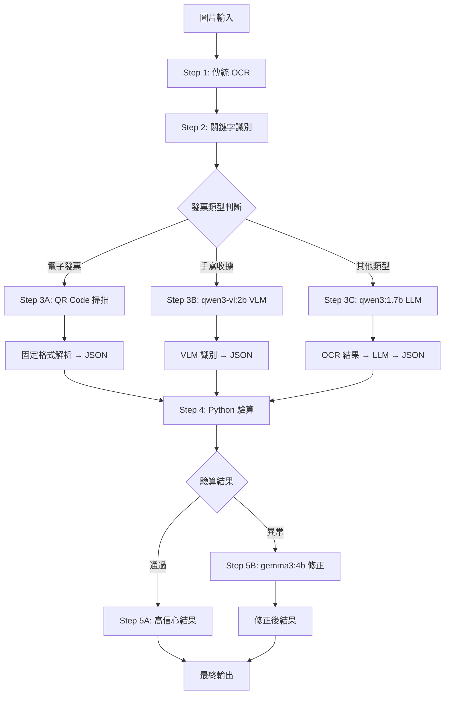

# 收據處理管線架構 v2

> 更新日期: 2024-12-17

## 流程架構



---

## 關鍵字識別規則 (Step 2)

| 關鍵字 | 類型 | 說明 |
|--------|------|------|
| `電子發票`, `QR Code`, `**` | 電子發票 | 含有 QR Code 的現代發票 |
| `免用統一發票`, `收據`, 手寫特徵 | 手寫收據 | 傳統手寫收據 |
| `發票`, `統一編號`, `乘車證明`, `計程車` | 其他收據 | 傳統發票、計程車證明等 |

---

## 模型配置

### qwen3-vl:2b (手寫收據 VLM)
```python
options = {
    "temperature": 0.0,
    "num_predict": 4096,
    "num_ctx": 8192,
    "repeat_penalty": 1.2,
    "top_p": 0.3
}
think = True  # 啟用思考模式
```

### qwen3:1.7b (OCR 後處理 LLM)
```python
options = {
    "temperature": 0.0,
    "num_predict": 2048
}
think = True  # 啟用思考模式，小模型需要思考才準
# 不強制 JSON，而是後處理解析
```

### gemma3:4b (修正用 VLM)
```python
options = {
    "temperature": 0.1,
    "num_predict": 4096,
    "num_ctx": 8192
}
```

---

## JSON 輸出格式

```json
{
    "receipt_type": "電子發票 | 免用統一發票收據 | 其他收據",
    "header": {
        "supplier": "商家名稱",
        "buyer": "買受人（如有）",
        "invoice_id": "發票號碼",
        "date": "YYYY-MM-DD",
        "tax_id": "統一編號"
    },
    "items": [
        { "name": "品名", "qty": 1, "price": 100, "total": 100 }
    ],
    "summary": {
        "total": 100
    },
    "verification": {
        "handwritten_total_chinese": "壹佰元",
        "stamp_shop_name": "店章店名",
        "stamp_tax_id": "店章統編"
    },
    "confidence": 0.95,
    "validation_notes": []
}
```

---

## 處理器模組

| 模組 | 用途 |
|------|------|
| `keyword_classifier.py` | 關鍵字識別，判斷收據類型 |
| `python_validator.py` | 驗算 items 總和，檢查數值合理性 |
| `gemma_corrector.py` | gemma3:4b VLM 修正處理器 |
| `receipt_processor.py` | 主流程整合 |
| `vision_handler.py` | 手寫收據 VLM 處理 |
| `qr_handler.py` | 電子發票 QR Code 解析 |

---

## 驗算邏輯 (Step 4)

```python
def validate_receipt(data: dict) -> tuple[bool, list[str]]:
    """驗算收據數據"""
    issues = []
    
    # 1. 檢查 items 總和
    calculated_total = sum(item.get("total", 0) for item in data.get("items", []))
    reported_total = data.get("summary", {}).get("total", 0)
    
    if abs(calculated_total - reported_total) > 1:
        issues.append(f"總額不符: 計算={calculated_total}, 申報={reported_total}")
    
    # 2. 檢查單項計算
    for i, item in enumerate(data.get("items", [])):
        expected = item.get("qty", 1) * item.get("price", 0)
        actual = item.get("total", 0)
        if abs(expected - actual) > 1:
            issues.append(f"品項 {i+1} 計算錯誤: {item.get('name')}")
    
    is_valid = len(issues) == 0
    return is_valid, issues
```
