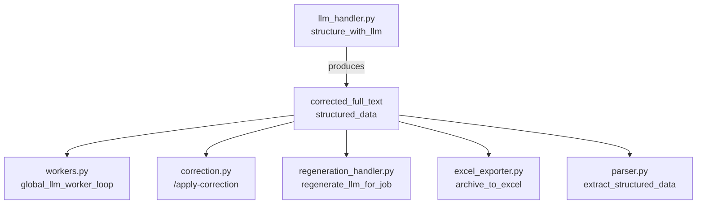

# 資料庫轉換計畫 B

> 更新日期: 2024-12-19  
> 前置計畫: [資料庫轉換計畫A.md](./資料庫轉換計畫A.md)

本計畫延續 Plan A 的建議，提供完整的 Phase 2-4 遷移策略。

## ✅ Phase 2 已完成

**移除舊格式 `corrected_full_text` 和 `structured_data` 包裝，改用扁平結構。**

### 已修改檔案

| 檔案 | 修改內容 |
|------|----------|
| [llm_handler.py](file:///c:/Users/tange/OneDrive/Desktop/all%20project/py%20for%20NKNU%20GA/AI_AGENT_LAB/backend/processing/llm_handler.py) | `structure_with_llm` 直接返回扁平結構 |
| [parser.py](file:///c:/Users/tange/OneDrive/Desktop/all%20project/py%20for%20NKNU%20GA/AI_AGENT_LAB/backend/utils/parser.py) | 從 header/items/summary 提取資料 |
| [receipt_processor.py](file:///c:/Users/tange/OneDrive/Desktop/all%20project/py%20for%20NKNU%20GA/AI_AGENT_LAB/backend/processing/receipt_processor.py) | llm_result 輸出符合 json_schema.md |
| [excel_exporter.py](file:///c:/Users/tange/OneDrive/Desktop/all%20project/py%20for%20NKNU%20GA/AI_AGENT_LAB/backend/engine/excel_exporter.py) | 新增 `_generate_text_from_llm_result` |
| [regeneration_handler.py](file:///c:/Users/tange/OneDrive/Desktop/all%20project/py%20for%20NKNU%20GA/AI_AGENT_LAB/backend/engine/regeneration_handler.py) | 輸出扁平結構 + audit.corrections |

---

## 一、依賴分析

### 1.1 `corrected_full_text` 依賴圖



### 1.2 各檔案用途

| 檔案 | 用途 | 依賴欄位 |
|------|------|----------|
| `workers.py:270` | 調用 `structure_with_llm`，存入 `llm_result_json` | `structured_data` |
| `correction.py:45` | 人工修正後重新結構化 | `corrected_full_text`, `structured_data` |
| `regeneration_handler.py:86` | 從人工文字重建結構 | `corrected_full_text` |
| `excel_exporter.py:124` | 匯出主表的 LLM 本文欄位 | `corrected_full_text` |
| `parser.py:32` | 解析 JSON 提取結構化資料 | `structured_data` |

---

## 二、遷移策略

### 策略：雙層兼容 → 漸進遷移

**階段 1**: 新增扁平欄位，保留舊欄位  
**階段 2**: 所有讀取點切換到新欄位  
**階段 3**: 移除舊欄位

### 2.1 修改 `llm_handler.py` 輸出格式

```python
# structure_with_llm 返回值（兼容模式）
{
    # 新扁平結構（目標格式）
    "receipt_type": "...",
    "header": { "supplier": "...", "invoice_id": "...", "date": "...", "tax_id": "..." },
    "items": [{ "name": "...", "qty": 1, "price": 100, "total": 100 }],
    "summary": { "total": 100 },
    "audit": { "confidence": 0.95, "issues": [], "corrections": [] },
    
    # 舊格式（向後兼容，最終移除）
    "corrected_full_text": "...",
    "structured_data": { ... }
}
```

### 2.2 修改 `parser.py` 支援新結構

```python
def extract_structured_data(raw_text_or_json):
    # 優先使用新扁平結構
    if "header" in parsed and "items" in parsed:
        return {
            "supplier": parsed.get("header", {}).get("supplier"),
            "invoice_id": parsed.get("header", {}).get("invoice_id"),
            "date": parsed.get("header", {}).get("date"),
            "items": [
                {"description": i.get("name"), "quantity": i.get("qty"), "price": i.get("price")}
                for i in parsed.get("items", [])
            ],
            "total_amount": parsed.get("summary", {}).get("total")
        }
    
    # 降級到舊格式
    sd = parsed.get("structured_data")
    ...
```

---

## 三、Phase 2 詳細步驟

### Step 2.1: 更新 `llm_handler.py`

1. 修改 `_extract_data` 返回新結構 ✅ (已完成 prompt 更新)
2. 修改 `structure_with_llm` 返回雙層格式

```python
def structure_with_llm(self, pre_formatted_text: str) -> dict:
    corrected_text = self._correct_text(pre_formatted_text)
    extracted = self._extract_data(corrected_text)
    
    # 新格式作為主體
    result = extracted.copy()
    
    # 添加向後兼容欄位
    result["corrected_full_text"] = corrected_text
    result["structured_data"] = self._convert_to_old_format(extracted)
    
    return result
```

### Step 2.2: 更新 `parser.py`

支援新舊兩種格式，優先使用新格式。

### Step 2.3: 更新 `excel_exporter.py`

```python
# 從新結構提取
llm_body_text = parsed_llm.get("corrected_full_text")  # 舊方式
if not llm_body_text:
    # 嘗試從新結構生成 markdown
    llm_body_text = generate_markdown_from_data(parsed_llm)
```

### Step 2.4: 更新 `receipt_processor.py`

移除 `_create_success_result` 中的舊格式包裝。

---

## 四、Phase 3: 效能統計收集

### 4.1 修改 OCR Handler 返回 tuple

```python
# rapidocr_handler.py
def do_ocr(self, image_array) -> Tuple[list, dict]:
    start = time.time()
    result = self._ocr(image_array)
    
    stats = {
        "engine": "rapidocr",
        "total_time_s": time.time() - start,
        "text_blocks_count": len(result),
        "started_at": start,
        "completed_at": time.time()
    }
    
    return result, stats
```

### 4.2 修改 VLM Handler 返回 stats

`vision_handler.py` 已有 `_log_final_stats`，修改為返回 dict。

### 4.3 修改 Workers 傳遞 stats

```python
# workers.py
ocr_result, ocr_stats = engine.ocr_handler.do_ocr(image)
tm.complete_ocr(job_id, ocr_result, stats=ocr_stats)

llm_result, llm_stats = engine.receipt_processor.process(image)
tm.complete_llm(job_id, llm_result, stats=llm_stats)
```

---

## 五、Phase 4: Audit 結構升級

### 5.1 新增 corrections 陣列

```python
# receipt_processor.py _create_success_result
"audit": {
    "confidence": confidence,
    "issues": issues,
    "corrections": [
        {
            "source": "py_validator" if was_corrected else None,
            "timestamp": int(time.time()),
            "description": "自動修正"
        }
    ] if was_corrected else []
}
```

### 5.2 人工修正記錄

```python
# correction.py
corrections.append({
    "source": "human",
    "timestamp": int(time.time()),
    "description": "用戶手動修正"
})
```

---

## 六、TODO List

### Phase 2: 結構遷移（中等風險）

- [ ] `llm_handler.py`: `structure_with_llm` 返回雙層格式
- [ ] `llm_handler.py`: 新增 `_convert_to_old_format` 輔助方法
- [ ] `parser.py`: 支援新扁平結構
- [ ] `excel_exporter.py`: 嘗試從新結構提取
- [ ] `receipt_processor.py`: 輸出新結構 + 舊包裝
- [ ] 測試: 確保現有功能不中斷

### Phase 3: Stats 收集（高複雜度）

- [ ] `rapidocr_handler.py`: 返回 `(result, stats)` tuple
- [ ] `ocr_handler.py`: 返回 `(result, stats)` tuple
- [ ] `vision_handler.py`: `process_handwritten` 返回 `(result, stats)`
- [ ] `llm_handler.py`: 返回 `(result, stats)` 
- [ ] `receipt_processor.py`: 聚合 OCR + LLM stats
- [ ] `workers.py`: 傳遞 stats 到 `complete_ocr`/`complete_llm`

### Phase 4: Audit 升級（低風險）

- [ ] `receipt_processor.py`: 新增 corrections 陣列
- [ ] `correction.py`: 記錄 human 修正
- [ ] `gemma_corrector.py`: 記錄 gemma 修正

### 最終清理

- [ ] 移除 `corrected_full_text` 舊欄位
- [ ] 移除 `structured_data` 包裝層
- [ ] 更新 `json_schema.md` 文檔

---

## 七、風險評估

| Phase | 風險 | 影響 | 緩解措施 |
|-------|------|------|----------|
| 2 | 中 | Excel 匯出可能失敗 | 保留舊格式兼容 |
| 3 | 高 | 返回值改變破壞調用者 | 使用 optional unpacking |
| 4 | 低 | 僅新增欄位 | 無破壞性變更 |

---

## 八、建議執行順序

1. ✅ Phase 1 (QR fields) - 已完成
2. ✅ Phase 5 (VLM prompt) - 已完成
3. ⏳ **Phase 4** (Audit) - 低風險，先做
4. ⏳ **Phase 2** (結構遷移) - 需仔細測試
5. ⏳ **Phase 3** (Stats) - 最後做，影響最大
