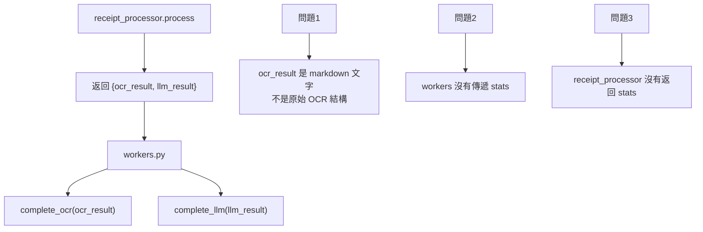

# 資料庫遷移修復計畫

> 更新日期: 2024-12-20
> 狀態: 待執行

## 問題描述

目前資料庫中 `ocr_result_json` 和 `ocr_stats` 欄位為空，原因如下：

### 根本原因分析



| 問題 | 位置 | 說明 |
|------|------|------|
| **OCR 結果格式錯誤** | `receipt_processor._create_success_result` | `ocr_result.text` 是 markdown 而非原始 OCR 資料 |
| **OCR Stats 未返回** | `receipt_processor.process()` | 沒有把 `ocr_stats` 包含在返回值中 |
| **Workers 沒傳 Stats** | `workers.py` line 100 | `complete_ocr()` 沒有 `stats=` 參數 |

---

## 預期資料結構

### jobs.ocr_result_json

```json
{
    "text": "OCR 原始純文字...",
    "blocks": [
        {"text": "文字", "box": [[x1,y1]...], "confidence": 0.95}
    ],
    "block_count": 26,
    "char_count": 295
}
```

### jobs.ocr_stats

```json
{
    "engine": "rapidocr",
    "total_time_s": 2.4,
    "text_blocks_count": 26,
    "started_at": 1703001234.567,
    "completed_at": 1703001236.967
}
```

### jobs.llm_result_json

符合 `json_schema.md` 的扁平結構：

```json
{
    "receipt_type": "handwritten",
    "header": {"supplier": "...", "date": "...", ...},
    "items": [...],
    "summary": {"total": 100},
    "audit": {"confidence": 0.95, "issues": [], "corrections": []}
}
```

### jobs.llm_stats

```json
[
    {
        "processor": "qwen3-vl:2b",
        "stage": "vlm_extraction",
        "time_s": 27.5,
        "ttft_s": 11.67,
        "tokens": 1546,
        "tokens_per_s": 74.4
    },
    {
        "processor": "gemma3:4b",
        "stage": "correction",
        "time_s": 16.3,
        "skipped": false
    }
]
```

---

## TODO 修復清單

### Phase 1: 修正 receipt_processor.py 返回值

- [x] **1.1** 修改 `process()` 返回值，增加 `ocr_raw` 和 `ocr_stats` 欄位
- [x] **1.2** 修改 `_create_success_result()` 接收 `ocr_raw` 和 `ocr_stats` 參數
- [x] **1.3** 修改 `_create_error_result()` 也要返回 `ocr_result` 和 `ocr_stats`

### Phase 2: 修正 workers.py 傳遞 Stats

- [x] **2.1** 從 `result` 中提取 `ocr_stats` 並傳給 `complete_ocr()`
- [x] **2.2** 收集 LLM stats（VLM + GEMMA）並傳給 `complete_llm()`
- [x] **2.3** 確保失敗時也記錄已完成的 OCR 結果

### Phase 3: 修正 VLM/LLM Handler 返回 Stats

- [x] **3.1** `vision_handler.process_handwritten()` 返回 `(result, stats)` tuple
- [ ] **3.2** `llm_handler.structure_with_llm()` 返回 `(result, stats)` tuple（延後）
- [x] **3.3** `gemma_corrector.correct()` 返回 stats 在結果中

### Phase 4: 調整前端顯示

- [ ] **4.1** `JobEditorView` 顯示 OCR 原始結果
- [ ] **4.2** 增加 Stats 顯示區域（處理時間等）

---

## 詳細修改方案

### 1. receipt_processor.py

```python
def process(self, image_array: np.ndarray) -> dict:
    # Step 1: OCR
    ocr_result, ocr_stats = self.ocr_handler.do_ocr(image_array)
    ocr_text = self.ocr_handler.to_plain_text(ocr_result)
    
    # ... 分類和處理邏輯 ...
    
    # 最後返回時包含原始 OCR
    return self._create_success_result(
        receipt_type=receipt_type,
        data=extracted_data,
        confidence=validation.confidence,
        issues=[],
        ocr_raw=ocr_result,      # ← 新增
        ocr_stats=ocr_stats,     # ← 新增
        llm_stats=llm_stats      # ← 新增
    )
```

### 2. _create_success_result() 修改

```python
def _create_success_result(
    self, receipt_type, data, confidence, issues,
    ocr_raw: list = None,      # 新增
    ocr_stats: dict = None,    # 新增
    llm_stats: list = None,    # 新增：多階段 stats 陣列
    was_corrected: bool = False,
    ...
) -> dict:
    return {
        "success": True,
        "invoice_type": receipt_type.value,
        
        # OCR 結果（給 complete_ocr 用）
        "ocr_result": {
            "text": self.ocr_handler.to_plain_text(ocr_raw) if ocr_raw else "",
            "blocks": ocr_raw or [],
            "block_count": len(ocr_raw) if ocr_raw else 0
        },
        "ocr_stats": ocr_stats,
        
        # LLM 結果
        "llm_result": llm_result,  # 扁平結構
        "llm_stats": llm_stats or [],
        
        # ...
    }
```

### 3. workers.py 修改

```python
result = engine.receipt_processor.process(image)

# 提取各部分
ocr_result = result.get("ocr_result", {})
ocr_stats = result.get("ocr_stats")
llm_result = result.get("llm_result", {})
llm_stats = result.get("llm_stats")

# 完成 OCR（包含 stats）
tm.complete_ocr(job_id, ocr_result, advance_to_stage_llm=True, stats=ocr_stats)

# 完成 LLM（包含 stats）
tm.complete_llm(job_id, llm_result, mark_final=True, stats=llm_stats)
```

---

## 執行順序

1. ✅ 確認現有資料庫 schema 正確
2. ✅ **Phase 1**: 修改 receipt_processor.py
3. ✅ **Phase 2**: 修改 workers.py  
4. ⏳ **Phase 3**: 修改各 Handler 返回 stats
5. ⏳ **Phase 4**: 前端調整
6. ⏳ 測試完整流程

---

## 風險評估

| 風險 | 影響 | 緩解措施 |
|------|------|----------|
| 返回值結構變更 | Workers 需同步更新 | 同時修改，保持兼容 |
| Stats 為 None | DB 可接受 NULL | 檢查 None 再序列化 |
| 舊資料格式 | 前端可能報錯 | Parser 做向後兼容 |

---

## 驗證方式

1. 上傳一張收據
2. 處理完成後查詢資料庫：
   
   ```sql
   SELECT job_id, ocr_result_json, ocr_stats, llm_result_json, llm_stats
   FROM jobs WHERE job_id = 'xxx';
   ```

3. 確認各欄位都有值
4. 前端 Edit 頁面顯示正確

---

## 工作紀錄

### 2024-12-20 00:35 - Phase 1 & 2 完成

**修改文件：**
- `backend/processing/receipt_processor.py`
- `backend/engine/workers.py`

**主要變更：**

1. **receipt_processor.py** (Phase 1)
   - ✅ `process()` 方法新增 `llm_stats = []` 收集處理統計
   - ✅ 在各處理分支記錄 VLM/LLM 處理時間
   - ✅ 所有 `_create_success_result()` 調用增加 `ocr_raw`, `ocr_stats`, `llm_stats` 參數
   - ✅ `_create_success_result()` 構建正確的 OCR 結構：`{text, blocks, block_count, char_count}`
   - ✅ `_create_error_result()` 也返回 OCR 資料以便失敗時仍可查看

2. **workers.py** (Phase 2)
   - ✅ 提取 `ocr_stats` 和 `llm_stats` 從處理結果
   - ✅ `complete_ocr(job_id, ocr_result, stats=ocr_stats)` 傳遞統計
   - ✅ `complete_llm(job_id, llm_result, stats=llm_stats)` 傳遞統計
   - ✅ 失敗時也記錄已完成的 OCR 結果（`advance_to_stage_llm=False`）

**測試狀態：** ✅ 導入測試通過

**下一步：** Phase 3 - 修改 Handler 返回詳細 stats

### 2024-12-20 00:47 - Phase 3 完成（部分）

**修改文件：**
- `backend/processing/vision_handler.py`
- `backend/processing/receipt_processor.py`

**主要變更：**

1. **vision_handler.py** (Phase 3.1)
   - ✅ `_call_with_streaming()` 現在返回 `(result, stats)` tuple
   - ✅ `_call_without_streaming()` 現在返回 `(result, stats)` tuple
   - ✅ `process_handwritten()` 現在返回 `(result, stats)` tuple
   - ✅ `image_to_markdown()` 現在返回 `(result, stats)` tuple
   - ✅ `stats_dict` 包含：`processor`, `model`, `total_time_s`, `ttft_s`, `gen_tokens`, `gen_speed_tps`

2. **receipt_processor.py** (Phase 3 整合)
   - ✅ `_process_handwritten()` 現在返回 `(data, vlm_stats)` tuple
   - ✅ 從 VLM 返回的 stats 直接添加到 `llm_stats` 陣列

3. **gemma_corrector.py** (Phase 3.3 - 已有)
   - ✅ `correct()` 已經返回 `correction_time` 在結果中
   - ✅ receipt_processor 已正確使用此值

**延後項目：**
- ⏳ **3.2** `llm_handler.structure_with_llm()` 返回 stats（影響較小，可未來添加）

**測試狀態：** ✅ 全部導入測試通過
